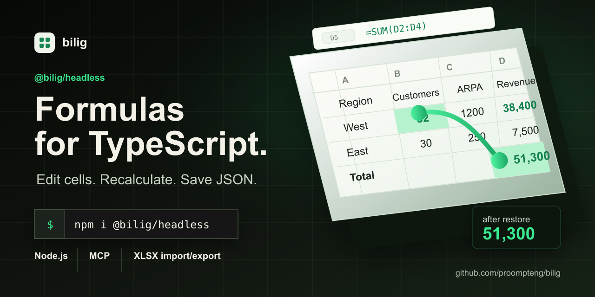

# bilig

[](https://github.com/proompteng/bilig/actions/workflows/ci.yml)
[](https://github.com/proompteng/bilig/stargazers)
[](https://www.npmjs.com/package/@bilig/workpaper)
[](https://www.npmjs.com/package/@bilig/xlsx-formula-recalc)
[](https://www.npmjs.com/package/@bilig/headless)
[](https://github.com/proompteng/bilig/actions/workflows/codeql.yml)
[](https://scorecard.dev/viewer/?uri=github.com/proompteng/bilig)
[](LICENSE)

**Formula workbooks for Node services and agent tools.**

Use [`@bilig/workpaper`](https://www.npmjs.com/package/@bilig/workpaper) when a
calculation is easiest to review as cells and formulas, but it has to run in a
Node service, queue worker, serverless route, test, or coding-agent tool. Use
[`@bilig/xlsx-formula-recalc`](https://www.npmjs.com/package/@bilig/xlsx-formula-recalc)
when the immediate problem is "I changed XLSX inputs in Node and need the
formula results now," including SheetJS / `xlsx` pipelines that already produce
XLSX bytes. Use
[`@bilig/exceljs-formula-recalc`](https://www.npmjs.com/package/@bilig/exceljs-formula-recalc)
when the workbook is already moving through ExcelJS.

[`@bilig/headless`](https://www.npmjs.com/package/@bilig/headless) remains the
full lower-level runtime package with bundled agent metadata. The unscoped
packages remain published as compatibility and search aliases, but scoped
`@bilig/*` packages are the canonical install path.

It gives you a `WorkPaper`: build sheets, write inputs, recalculate, read the
cell value, and save the workbook as JSON. No browser grid is involved.
The published package also carries `AGENTS.md` and `SKILL.md` so coding agents
inspecting `node_modules/@bilig/workpaper` can find the write/read/persist loop
locally. The public docs expose the same path through
[`AGENTS.md`](docs/AGENTS.md), [`skill.md`](docs/skill.md),
[`docs/.well-known/agent.json`](docs/.well-known/agent.json),
[`AI spreadsheet agent tool`](docs/ai-agent-spreadsheet-tool-node.md), and
[`llms-full.txt`](docs/llms-full.txt).

Good fits: pricing rules, budget checks, payout models, import validation, and
agent tools that need read-after-write proof. Bad fits: manual spreadsheet
editing, Office macros, desktop Excel automation, or one-off arithmetic where a
workbook would be ceremony.

Project site: <https://proompteng.github.io/bilig/>

## Which Package Should I Install?

| Problem you have right now                                                                      | Install                                      | First proof                                                                                  |
| ----------------------------------------------------------------------------------------------- | -------------------------------------------- | -------------------------------------------------------------------------------------------- |
| Formula workbook state inside a Node service or agent tool                                      | `npm install @bilig/workpaper`                       | [90-second Node quickstart](docs/try-bilig-headless-in-node.md)                        |
| AI agent needs to edit workbook inputs and verify formula readback                              | `npm create @bilig/workpaper@latest pricing-agent -- --agent` | [AI spreadsheet agent tool](docs/ai-agent-spreadsheet-tool-node.md)    |
| SheetJS / `xlsx` pipeline returns stale formula values after input edits                        | `npm install @bilig/sheetjs-formula-recalc`          | [SheetJS formula result not updating](docs/sheetjs-formula-result-not-updating-node.md) |
| Generic XLSX bytes changed in Node; formula outputs must refresh before returning               | `npm install @bilig/xlsx-formula-recalc`             | [XLSX formula recalculation in Node.js](docs/xlsx-formula-recalculation-node.md)       |
| Existing ExcelJS workflow needs recalculated values, not stale cached results                   | `npm install exceljs @bilig/exceljs-formula-recalc`  | [ExcelJS formula recalculation in Node.js](docs/exceljs-formula-recalculation-node.md) |
| Full runtime package with agent metadata, MCP binary, provenance docs, and lower-level subpaths | `npm install @bilig/headless`                        | [npm provenance and package trust](docs/npm-provenance-package-trust.md)               |

### Stale XLSX Formula Values? Run This First

If a Node job already has an XLSX file and only needs fresh formula values
before returning, use the file-level recalculation package before evaluating
the broader WorkPaper runtime:

```sh
npx --package @bilig/sheetjs-formula-recalc sheetjs-recalc --demo --json

npx --package @bilig/xlsx-formula-recalc xlsx-recalc --demo --json

npx --package @bilig/xlsx-formula-recalc xlsx-recalc quote.xlsx \
  --set Inputs!B2=42 \
  --read Summary!B7 \
  --out quote.recalculated.xlsx \
  --json
```

If the workbook is already in ExcelJS, keep that boundary and add
`@bilig/exceljs-formula-recalc`:

```sh
npm install exceljs @bilig/exceljs-formula-recalc
npx --package @bilig/exceljs-formula-recalc exceljs-recalc --demo --json
```

For one checkout proof across SheetJS/`xlsx`, `xlsx-populate`, and ExcelJS:

```sh
npm --prefix examples/recalc-bridge-workflows install
npm --prefix examples/recalc-bridge-workflows run smoke
```

## Choose An Evaluation Path

| If you are evaluating...      | Start here                                                                                                                                                                                                                | What should be true before you star, watch, or adopt                                                   |
| ----------------------------- | ------------------------------------------------------------------------------------------------------------------------------------------------------------------------------------------------------------------------- | ------------------------------------------------------------------------------------------------------ |
| Basic fit                     | [Why use Bilig?](docs/why-use-bilig.md)                                                                                                                                                                                   | The problem is workbook-shaped business logic that needs API readback and persistence.                 |
| Published npm package         | [90-second Node quickstart](docs/try-bilig-headless-in-node.md)                                                                                                                                                           | `@bilig/workpaper` edits one input, recalculates, persists JSON, restores, and prints `verified: true`. |
| XLSX or ExcelJS recalculation | [XLSX formula recalculation](docs/xlsx-formula-recalculation-node.md) and [ExcelJS formula recalculation](docs/exceljs-formula-recalculation-node.md)                                                                     | The package updates inputs, reads recalculated values, and exports or mutates the workbook boundary.   |
| Backend service shape         | [Quote approval WorkPaper API](docs/quote-approval-workpaper-api.md)                                                                                                                                                      | A realistic route-style workflow returns formula readback and `restoredMatchesAfter: true`.            |
| Agent or MCP tools            | [Headless WorkPaper agent handbook](docs/headless-workpaper-agent-handbook.md), [MCP spreadsheet tool server](docs/mcp-workpaper-tool-server.md), and [Claude Desktop MCPB bundle](docs/claude-desktop-mcpb-workpaper.md) | The agent installs a tool path, gets a copy-paste handoff prompt, then proves write/readback/persist.  |
| Agent-owned XLSX files        | [Agent XLSX recalculation without LibreOffice](docs/agent-xlsx-formula-recalculation-without-libreoffice.md)                                                                                                              | A tool can edit XLSX inputs, recalculate, export, reimport, and return `verified: true`.               |
| Public technical review       | [Show HN maintainer note](docs/show-hn-formula-workbooks-node-services.md)                                                                                                                                                | One shareable page has the npm check, benchmark caveat, known limits, and feedback ask.                |
| Trust and performance         | [npm provenance](docs/npm-provenance-package-trust.md) and [benchmark evidence](docs/what-workpaper-benchmark-proves.md)                                                                                                  | npm shows SLSA provenance, and benchmark claims match the checked artifact.                            |
| Almost a fit                  | [adoption blocker form](https://github.com/proompteng/bilig/discussions/new?category=general)                                                                                                                             | Name the formula, import/export, persistence, framework, MCP, package, or benchmark gap.               |
| Formula or XLSX bug           | [formula bug clinic](docs/formula-bug-clinic.md)                                                                                                                                                                          | Share a reduced public case that can become a test, example, corpus fixture, or docs proof.            |
| Real workbook blocked         | [submit a workbook fixture](docs/submit-workbook-fixture.md)                                                                                                                                                              | Use the structured form when a reduced workbook is ready.                                              |

Reduced workbook already in hand? Generate the paste-ready fixture report in
one command:

```sh
npm exec --package @bilig/headless@0.40.31 -- bilig-formula-clinic ./reduced.xlsx --cells "Summary!B7,Inputs!B2"
```

Handing a spreadsheet task to another coding agent? Start with the
[agent handoff prompt](docs/headless-workpaper-agent-handbook.md#copy-paste-prompt-for-another-agent)
before opening Excel, LibreOffice, Google Sheets, or a screenshot UI.
To prove the package-owned agent loop without cloning the repo or downloading a
TypeScript file:

```sh
npm exec --package @bilig/headless@0.40.31 -- bilig-agent-challenge
npm exec --package @bilig/headless@0.40.31 -- bilig-mcp-challenge
```

Agent tools that support skill manifests can start from
[`skill.md`](docs/skill.md) or the well-known index at
[`docs/.well-known/agent-skills/index.json`](docs/.well-known/agent-skills/index.json).
Claude Desktop users can also install the released MCPB bundle directly:
<https://github.com/proompteng/bilig/releases/download/libraries-v0.40.31/bilig-workpaper.mcpb>.
If you need a copy-paste eval for another tool host, use the
[agent workbook challenge](docs/agent-workbook-challenge.md): one input edit,
one dependent formula readback, one serialized restore, and a `verified: true`
proof object.

<p align="center">
  
</p>

## Try It In 90 Seconds

This uses the published npm package. It builds a workbook, changes one input,
reads the calculated value, saves JSON, restores the workbook, and prints the
same value again.

```sh
mkdir bilig-headless-eval
cd bilig-headless-eval
npm init -y
npm pkg set type=module
npm install @bilig/workpaper
npm install -D tsx typescript @types/node
curl -fsSLo quickstart.ts https://proompteng.github.io/bilig/npm-eval.ts
npx tsx quickstart.ts
```

Expected output:

```json
{
  "before": 24000,
  "after": 38400,
  "afterRestore": 38400,
  "sheets": ["Inputs", "Summary"],
  "bytes": 999,
  "verified": true,
  "nextStep": "If this proof matches your service or agent workflow, star or bookmark Bilig: https://github.com/proompteng/bilig/stargazers"
}
```

The TypeScript file is maintained in
[`examples/headless-workpaper/npm-eval.ts`](examples/headless-workpaper/npm-eval.ts).
The exact byte count can change between package versions; `verified: true` and
matching `after`/`afterRestore` values are the check.

For a route-shaped quote approval API today, run the maintained example:

```sh
git clone --depth 1 https://github.com/proompteng/bilig.git
cd bilig
pnpm --dir examples/serverless-workpaper-api install --ignore-workspace
pnpm --dir examples/serverless-workpaper-api run smoke
```

For a generated project from a blank directory, run
`npm create @bilig/workpaper@latest pricing-workpaper` through the
`@bilig/create-workpaper` package. The package source lives in
[`packages/create-workpaper`](packages/create-workpaper), and the publish gate
is documented in [create a Bilig WorkPaper starter](docs/create-bilig-workpaper.md).
For an agent-ready project with `AGENTS.md`, MCP client configs, and an
`agent:verify` script, run
`npm create @bilig/workpaper@latest pricing-agent -- --agent`.

If that proof matches a service or agent workflow you maintain, the useful next
step is concrete feedback: [star or bookmark the repo](https://github.com/proompteng/bilig/stargazers),
then open or answer one adoption blocker in
[Discussions](https://github.com/proompteng/bilig/discussions/new?category=general):
formula coverage, stale XLSX cached values, persistence shape, MCP/agent
writeback, or benchmark coverage.

## TypeScript API Shape

Most integrations are just this: build a workbook, write an input, read the
calculated value, and save the workbook state.

```ts
import { WorkPaper, exportWorkPaperDocument, serializeWorkPaperDocument } from '@bilig/workpaper'

const workbook = WorkPaper.buildFromSheets({
  Inputs: [
    ['Metric', 'Value'],
    ['Customers', 20],
    ['Average revenue', 1200],
  ],
  Summary: [
    ['Metric', 'Value'],
    ['Revenue', '=Inputs!B2*Inputs!B3'],
  ],
})

const inputs = workbook.getSheetId('Inputs')
const summary = workbook.getSheetId('Summary')
if (inputs === undefined || summary === undefined) {
  throw new Error('Workbook is missing required sheets')
}

workbook.setCellContents({ sheet: inputs, row: 1, col: 1 }, 32)

const revenue = workbook.getCellDisplayValue({ sheet: summary, row: 1, col: 1 })
const saved = serializeWorkPaperDocument(exportWorkPaperDocument(workbook, { includeConfig: true }))

console.log({ revenue, savedBytes: saved.length })
```

## When To Reach For It

Use `@bilig/workpaper` when:

- a Node service owns a workbook-shaped calculation;
- an agent needs tools such as `readRange` and `setInputCell`, with computed
  before/after values instead of screenshots;
- tests need deterministic spreadsheet state and formula readback;
- a workflow needs to save the edited workbook as JSON and restore it later.

Use something else when you need a visual spreadsheet grid, Office macros,
desktop Excel automation, or a one-off arithmetic helper. Do not treat embedded
XLSX cached formula values as truth; use the Excel oracle workflow when accuracy
matters.

## Package Boundary

<!-- headless-package-footprint:start -->

Current checked npm footprint for `@bilig/headless@0.40.31`:

- Pack dry run: `668 kB` tarball, `4.10 MB` unpacked, `690` package entries.
- Boundary: the main import is the WorkPaper formula/JSON runtime; XLSX
  import/export stays behind the `@bilig/headless/xlsx` subpath; MCP is the
  `bilig-workpaper-mcp` binary wrapper; reduced workbook reports use the
  `bilig-formula-clinic` binary.
- Cold-start gate: Node imports the main entrypoint, builds a two-sheet
  WorkPaper, and reads `24000` under `1000 ms` without importing
  the XLSX subpath.
- Runtime: Node `>=22.0.0`; Node 22 compatibility is covered by the runtime package workflow.
<!-- headless-package-footprint:end -->

## Published Package Trust

`@bilig/headless` is published with npm registry signatures and SLSA provenance
attestations. Verify the package version you are about to adopt:

```sh
npm view @bilig/headless@latest version dist.attestations dist.signatures --json
```

After installing, npm can verify the current dependency tree:

```sh
npm audit signatures
```

The current package trust path is documented in
[npm provenance and package trust](docs/npm-provenance-package-trust.md).
Repository security posture is tracked by
[OpenSSF Scorecard](https://scorecard.dev/viewer/?uri=github.com/proompteng/bilig)
and uploaded to GitHub code scanning on every `main` update.

## Start Here

Use the shortest path that proves the package against a real job.

1. Run the [90-second npm eval](#try-it-in-90-seconds) in a blank project.
2. Run the flagship
   [serverless WorkPaper API](examples/serverless-workpaper-api) example:
   `npm run quote-approval-api`.
3. If the workflow starts with an XLSX file, run the
   [XLSX formula recalculation in Node](examples/xlsx-recalculation-node):
   `npm start`.
4. If an agent needs workbook tools, start with the
   [headless WorkPaper agent handbook](docs/headless-workpaper-agent-handbook.md),
   then use the [MCP server guide](docs/mcp-workpaper-tool-server.md) when the
   caller is an MCP client.
5. If a real workbook almost works, start with the
   [formula bug clinic](docs/formula-bug-clinic.md). Then submit a
   [reduced public fixture](docs/submit-workbook-fixture.md) so the blocker can
   become a test, example, or corpus case instead of private feedback.
   Form:
   <https://github.com/proompteng/bilig/issues/new?template=workbook_fixture.yml>.
   Discussion:
   <https://github.com/proompteng/bilig/discussions/414>.

The rest of the docs are an index, not a prerequisite.

For comparison and integration details, use the
[plain-language fit guide](docs/why-use-bilig.md),
[screenshot automation boundary](docs/stop-driving-spreadsheets-with-screenshots.md),
[Google Sheets API boundary](docs/google-sheets-api-alternative-node-workpaper.md),
[workbook automation examples](docs/workbook-automation-examples-node.md),
the [formula workbooks proof page](docs/formula-workbooks-node-services-agent-tools.md),
the [Node spreadsheet formula engine guide](docs/node-spreadsheet-formula-engine.md),
[server-side spreadsheet automation](docs/server-side-spreadsheet-automation-node.md),
[framework adapters](docs/node-framework-workpaper-adapters.md),
[formula bug clinic](docs/formula-bug-clinic.md),
[workbook fixture submissions](docs/submit-workbook-fixture.md),
[OpenAI Agents SDK tools](docs/openai-agents-sdk-workpaper-tool.md),
[AI SDK and LangChain tools](docs/vercel-ai-sdk-langchain-spreadsheet-tool.md),
[CrewAI adapter](docs/crewai-workpaper-spreadsheet-tool.md),
the [headless WorkPaper agent handbook](docs/headless-workpaper-agent-handbook.md),
the [MCP server guide](docs/mcp-workpaper-tool-server.md),
[spreadsheet MCP server comparison](docs/spreadsheet-mcp-server-comparison.md),
[MCP directory status](docs/mcp-spreadsheet-server-directory.md),
[MCP client setup](docs/mcp-client-setup.md),
[Claude Desktop MCPB bundle](docs/claude-desktop-mcpb-workpaper.md),
[npm provenance and package trust](docs/npm-provenance-package-trust.md),
[JavaScript library comparison](docs/javascript-spreadsheet-library-headless-node.md),
[headless spreadsheet engine for Node services and agents](docs/headless-spreadsheet-engine-node-services-agents.md),
[XLSX formula recalculation in Node.js](docs/xlsx-formula-recalculation-node.md),
[agent XLSX formula recalculation without LibreOffice](docs/agent-xlsx-formula-recalculation-without-libreoffice.md),
[Excel file as a Node calculation engine](docs/excel-file-calculation-engine-node.md),
[stale XLSX formula cache in Node.js](docs/stale-xlsx-formula-cache-node.md),
[SheetJS formula result not updating in Node.js](docs/sheetjs-formula-result-not-updating-node.md),
[Microsoft Graph Excel recalculation in Node.js](docs/microsoft-graph-excel-recalculation-node.md),
[xlsx-calc alternative for Node workbook recalculation](docs/xlsx-calc-alternative-node-workbook-recalculation.md),
[ExcelJS formula recalculation in Node.js](docs/exceljs-formula-recalculation-node.md),
[ExcelJS shared formulas in Node.js](docs/exceljs-shared-formula-recalculation-node.md),
[SheetJS/ExcelJS boundary](docs/sheetjs-exceljs-alternative-formula-workbook-api.md),
and [headless engine comparison](docs/headless-spreadsheet-engine-comparison.md).

Useful deeper examples: [invoice totals](examples/headless-workpaper#invoice-totals),
[budget variance alerts](examples/headless-workpaper#budget-variance-alerts),
[fulfillment capacity plan](examples/headless-workpaper#fulfillment-capacity-plan),
[quote approval threshold](examples/headless-workpaper#quote-approval-threshold),
[subscription MRR forecast](examples/headless-workpaper#subscription-mrr-forecast),
[agent framework adapters](examples/headless-workpaper#agent-framework-adapters),
[MCP tool server shape](examples/headless-workpaper#mcp-tool-server-shape),
[XLSX formula recalculation in Node](examples/xlsx-recalculation-node),
and [serverless quote approval](examples/serverless-workpaper-api). Run
`npm run quote-approval-api`, `npm run agent:openai-agents-sdk`,
`npm run agent:framework-adapters`,
`npm run agent:mcp-tools`, `npm run agent:mcp-transcript`,
`npm run agent:mcp-file-transcript`, `npm run agent:mcp-stdio`, or
`npm exec --package @bilig/headless@0.40.31 -- bilig-workpaper-mcp` when that is the
path you are evaluating.

The serverless example also includes `npm run next-route-handler`,
`npm run next-server-action`, `npm run next-server-action-formdata`,
`npm run framework-adapters`, and `npm run persistence-adapters` for
framework-specific boundary checks.

The MCP server is also listed in the official registry:
<https://registry.modelcontextprotocol.io/v0.1/servers?search=io.github.proompteng%2Fbilig-workpaper>.
Clients that support Streamable HTTP MCP can also smoke-test the stateless
hosted endpoint at `https://bilig.proompteng.ai/mcp`; use the local stdio server
when the agent needs to persist a project WorkPaper JSON file.

## Examples You Can Run

The runnable examples are TypeScript files. Some source imports end in `.js`
because Node ESM resolves compiled package output that way; the files you edit
and run are still `.ts`.

From a cloned checkout:

```sh
pnpm --dir examples/headless-workpaper install --ignore-workspace
pnpm --dir examples/headless-workpaper run start
pnpm --dir examples/headless-workpaper run json-records
pnpm --dir examples/headless-workpaper run csv-shaped
pnpm --dir examples/headless-workpaper run invoice-totals
pnpm --dir examples/headless-workpaper run budget-variance
pnpm --dir examples/headless-workpaper run fulfillment-capacity
pnpm --dir examples/headless-workpaper run quote-approval
pnpm --dir examples/headless-workpaper run subscription-mrr
pnpm --dir examples/headless-workpaper run persistence
```

The most useful entry points:

- [JSON records input](examples/headless-workpaper#json-records-input)
- [CSV shaped input](examples/headless-workpaper#csv-shaped-input)
- [invoice totals](examples/headless-workpaper#invoice-totals)
- [budget variance alerts](examples/headless-workpaper#budget-variance-alerts)
- [fulfillment capacity plan](examples/headless-workpaper#fulfillment-capacity-plan)
- [quote approval threshold](examples/headless-workpaper#quote-approval-threshold)
- [subscription MRR forecast](examples/headless-workpaper#subscription-mrr-forecast)
- [SheetJS, xlsx-populate, and ExcelJS recalculation bridge](examples/recalc-bridge-workflows)

For agent tools:

```sh
pnpm --dir examples/headless-workpaper run agent:verify
pnpm --dir examples/headless-workpaper run agent:tool-call
pnpm --dir examples/headless-workpaper run agent:openai-agents-sdk
pnpm --dir examples/headless-workpaper run agent:openai-responses
pnpm --dir examples/headless-workpaper run agent:ai-sdk-generate-text
pnpm --dir examples/headless-workpaper run agent:ai-sdk-stream-text
pnpm --dir examples/headless-workpaper run agent:framework-adapters
pnpm --dir examples/headless-workpaper run agent:mcp-tools
pnpm --dir examples/headless-workpaper run agent:mcp-file-transcript
pnpm --dir examples/headless-workpaper run agent:mcp-stdio
```

The AI SDK example uses
[`ai-sdk-generate-text-tool-smoke.ts`](examples/headless-workpaper/ai-sdk-generate-text-tool-smoke.ts).
The OpenAI Agents SDK guide is
[`docs/openai-agents-sdk-workpaper-tool.md`](docs/openai-agents-sdk-workpaper-tool.md).
The OpenAI Responses guide is
[`docs/openai-responses-workpaper-tool-call.md`](docs/openai-responses-workpaper-tool-call.md).
The agent framework guide is
[`docs/vercel-ai-sdk-langchain-spreadsheet-tool.md`](docs/vercel-ai-sdk-langchain-spreadsheet-tool.md).

The package also ships the MCP stdio binary:

```sh
npm exec --package @bilig/headless@0.40.31 -- bilig-agent-challenge
npm exec --package @bilig/headless@0.40.31 -- bilig-formula-clinic ./reduced.xlsx --cells "Summary!B7,Inputs!B2"
npm exec --package @bilig/headless@0.40.31 -- bilig-mcp-challenge
npm exec --package @bilig/headless@0.40.31 -- bilig-workpaper-mcp
npm exec --package @bilig/headless@0.40.31 -- bilig-workpaper-mcp --workpaper ./pricing.workpaper.json --init-demo-workpaper --writable
docker build --target bilig-workpaper-mcp -t bilig-workpaper-mcp:local .
```

`bilig-agent-challenge` prints the same edit, formula readback, WorkPaper JSON
export, restore, and `verified: true` proof object used by the agent workbook
challenge page.

`bilig-mcp-challenge` proves the file-backed MCP path end to end: initialize
JSON-RPC, list tools/resources/prompts, edit `Inputs!B3`, read recalculated
`Summary!B3`, export the WorkPaper JSON, restart from disk, and return
`verified: true`.

`bilig-formula-clinic` imports a reduced XLSX locally, samples formulas, reads
requested cells through WorkPaper, and prints a Markdown issue body. It does not
upload workbook contents.

Without `--workpaper`, the binary starts the built-in demo workbook. With
`--workpaper`, it loads your persisted WorkPaper JSON and exposes
`list_sheets`, `read_range`, `read_cell`, `set_cell_contents`,
`get_cell_display_value`, `export_workpaper_document`, and `validate_formula`;
`--writable` persists `set_cell_contents` edits back to the same file. It also
exposes MCP resources and prompts for `bilig://workpaper/agent-handoff`,
`bilig://workpaper/current-document`, `edit_and_verify_workpaper`, and
`debug_workpaper_formula`, so capable clients can discover the workflow before
calling tools.
The Docker target is for MCP directory scanners: it seeds a demo WorkPaper JSON
inside the image and starts the file-backed `--writable` tool surface so
`tools/list`, `resources/list`, and `prompts/list` return the general WorkPaper
agent surface without cloning this monorepo. For remote MCP clients, the app
runtime exposes `https://bilig.proompteng.ai/mcp` as a stateless JSON-only
Streamable HTTP endpoint for tool discovery and write/readback smoke tests.

It is published in the official MCP Registry as
`io.github.proompteng/bilig-workpaper`:
<https://registry.modelcontextprotocol.io/v0.1/servers?search=io.github.proompteng%2Fbilig-workpaper>.
It is also live on Glama with `Try in Browser`, A-grade tool pages, and all
seven file-backed WorkPaper tools:
<https://glama.ai/mcp/servers/proompteng/bilig>.

## Proof You Can Reproduce

- The 90-second TypeScript check above edits one input, restores the saved JSON
  document, and verifies the dependent formula result.
- For a production-shaped evaluator path, run the
  [quote approval WorkPaper API proof](docs/quote-approval-workpaper-api.md).
  It starts from an empty Node directory, downloads one maintained TypeScript
  route smoke, writes quote inputs, recalculates an approval decision, persists
  JSON, and verifies restored readback.
- For an XLSX formula recalculation example, run
  [`examples/xlsx-recalculation-node`](examples/xlsx-recalculation-node). It
  imports a generated XLSX pricing workbook, edits input cells, reads the
  recalculated approval decision, exports XLSX, reimports it, and verifies the
  formulas survived the round trip. The public decision page is
  [XLSX formula recalculation in Node.js](docs/xlsx-formula-recalculation-node.md).
- For a shorter public decision page, read
  [formula workbooks for Node services and agent tools](docs/formula-workbooks-node-services-agent-tools.md).
  It compresses the WorkPaper boundary, MCP file-backed mode, benchmark caveat,
  and alternative-tool guidance into one shareable evaluator path.
- For HN, Lobsters, Reddit, or newsletter review, use the
  [Show HN maintainer note](docs/show-hn-formula-workbooks-node-services.md).
  It keeps the empty npm-project command, `verified: true` output, benchmark
  caveat, known limits, and feedback ask together.
- Run `pnpm workpaper:bench:competitive:check`. The checked-in artifact shows
  [`100/100` comparable WorkPaper mean wins](docs/what-workpaper-benchmark-proves.md)
  and no p95 holdouts; the narrowest p95 win is
  `aggregate-overlapping-sliding-window-wide` at `0.946x`.
- The benchmark card is generated from that artifact:
  [`docs/assets/workpaper-benchmark-card.png`](docs/assets/workpaper-benchmark-card.png).
- Read the [compatibility limits](docs/where-bilig-is-not-excel-compatible-yet.md)
  before importing real Excel workbooks.
- Use the
  [production adoption checklist](docs/production-adoption-checklist-headless-workpaper.md)
  before promoting a WorkPaper-backed workflow beyond evaluation.
- For XLSX accuracy audits, use the
  [Excel oracle harness](docs/xlsx-corpus-verifier-walkthrough.md#run-the-excel-oracle-harness).
  It separates import success, timeouts, stale cached formula values, and fresh
  Microsoft Excel recalculation results.
- The WorkPaper MCP server is listed in the
  [official MCP Registry](https://registry.modelcontextprotocol.io/v0.1/servers?search=io.github.proompteng%2Fbilig-workpaper)
  and on [Glama](https://glama.ai/mcp/servers/proompteng/bilig). The
  [directory status page](docs/mcp-spreadsheet-server-directory.md) keeps the
  npm command, remote endpoint, static MCP server card, and directory evidence
  in one place.
- Public feedback threads:
  [workflow questions](https://github.com/proompteng/bilig/discussions/157),
  [service examples](https://github.com/proompteng/bilig/discussions/213),
  [persistence adapters](https://github.com/proompteng/bilig/discussions/307),
  [JavaScript spreadsheet library guide](https://github.com/proompteng/bilig/discussions/308),
  [OpenAI Responses tool calls](https://github.com/proompteng/bilig/discussions/335),
  and [benchmark critique](https://github.com/proompteng/bilig/discussions/340).

If the 90-second check matches a problem you have, star or bookmark the repo:
<https://github.com/proompteng/bilig/stargazers>.
If you are evaluating `@bilig/headless` for production and want release
notifications, watch releases:
<https://github.com/proompteng/bilig/subscription>.

## XLSX Accuracy Policy

Cached formula values embedded in `.xlsx` files are cache diagnostics, not an
accuracy verdict. A Bilig correctness bug should only be claimed when the
expected value came from a fresh Excel recalculation oracle.

```sh
OUT=.cache/excel-oracle-evaluation
pnpm workpaper:xlsx-oracle -- prepare-oracle /path/to/xlsx-corpus "$OUT"
pnpm workpaper:xlsx-oracle -- evaluate-cache /path/to/xlsx-corpus "$OUT"
pnpm workpaper:xlsx-oracle -- evaluate-oracle /path/to/xlsx-corpus "$OUT/recalculated" "$OUT"
pnpm workpaper:xlsx-oracle -- summarize "$OUT"
```

`evaluate-cache` writes `cache-diagnostic.json` and stays non-authoritative.
`evaluate-oracle` writes `excel-oracle-report.json`, and `summarize` writes
`summary.md`. If Excel automation is unavailable, cells are classified as
`missing_excel_oracle` instead of being promoted to bugs.

## What Is In This Repo

- `packages/headless`: WorkPaper runtime and npm package.
- `packages/excel-import`: XLSX import/export boundary. Install both packages
  with `pnpm add @bilig/headless @bilig/excel-import` when you need file import
  and export.
- `packages/formula`: formula parser, binder, compiler, and evaluator.
- `packages/core`: workbook engine, snapshots, mutation flow, and scheduler.
- `packages/grid` and `apps/web`: browser spreadsheet shell.
- `apps/bilig`: fullstack monolith runtime, API surface, and static asset
  server.
- `packages/renderer`: React workbook renderer.
- `packages/protocol`, `packages/binary-protocol`, `packages/agent-api`, and
  `packages/worker-transport`: protocol and integration boundaries.
- `packages/wasm-kernel`: AssemblyScript/WASM numeric fast path.
- `packages/benchmarks`: benchmark harness and performance contracts.

For XLSX import/export from TypeScript:

```ts
import { WorkPaper } from '@bilig/headless'
import { exportXlsx, importXlsx } from '@bilig/excel-import'
```

Use `WorkPaper.buildFromSnapshot(imported.snapshot)` after import and
`workbook.exportSnapshot()` before `exportXlsx()`.

## Local Development

Use Node `24+`, Bun, and `pnpm@10.32.1`.

```sh
pnpm install
pnpm dev:web
pnpm dev:web-local
pnpm dev:sync
```

For a full local preflight:

```sh
pnpm lint
pnpm typecheck
pnpm test
pnpm test:browser
pnpm run ci
```

Generated sources and public evidence are checked:

```sh
pnpm protocol:check
pnpm formula-inventory:check
pnpm workspace-resolution:check
pnpm workpaper:bench:competitive:check
pnpm docs:discovery:check
```

## For Coding Agents

Start with the public package boundary unless the task is explicitly engine
work.

1. Read `packages/headless/README.md` before touching WorkPaper behavior.
2. Read `docs/AGENTS.md`, `docs/skill.md`, or `docs/llms-full.txt` when
   building an agent-facing integration from outside the repo.
3. Use public exports from `@bilig/headless`; do not reach into `src/` or
   `dist/` when writing consumer examples.
4. Keep examples TypeScript-first.
5. Do not call stale XLSX cached formula values an accuracy oracle.
6. Add focused tests before changing formulas, persistence, range bounds,
   config rebuilds, events, row/column moves, or sheet lifecycle.
7. Run the focused package tests first, then broaden to `pnpm run ci`.

## Contributing

Read [CONTRIBUTING.md](CONTRIBUTING.md) before opening a PR. If this is your
first patch, start with the
[new contributor guide](docs/new-contributor-guide.md) and then claim a scoped
starter issue.

Good first patches usually fit one of these shapes:

- formula fixtures with clear expected behavior;
- small WorkPaper examples that prove a real service or agent workflow;
- focused correctness fixes with regression tests;
- grid accessibility and keyboard-behavior improvements;
- docs that turn an existing architecture note into a runnable command.

The shortest public on-ramp is the
[`starter issues`](docs/starter-issues.md) queue. It keeps code/test picks,
example tasks, adapters, and focused docs work in one current list, with small
acceptance commands for first patches.

If this is your first contribution to `bilig`, use the
[`first-timers-only`](https://github.com/proompteng/bilig/issues?q=is%3Aissue%20state%3Aopen%20label%3Afirst-timers-only)
filter.

## Security And Support

Read [SECURITY.md](SECURITY.md) before sharing vulnerability details, private
workbook data, tokens, credentials, or exploit reproductions. Security reports
should use GitHub private vulnerability reporting when available, or
<security@proompteng.ai> when the private flow is not visible.

Use [SUPPORT.md](SUPPORT.md) for the fastest public support path. Good reports
include the package version, Node version, OS, exact formula or workbook input,
expected value, actual value, and the smallest command or script that reproduces
the issue.

## CI

Forgejo Actions is the primary CI surface via
`.forgejo/workflows/forgejo-ci.yml`. GitHub Actions mirrors the verification
contract in `.github/workflows/ci.yml`.

The strict gate includes frozen lockfile install, full `pnpm run ci`, artifact
budget checks, browser smoke, and tracked-file cleanliness checks.

## License

MIT.
