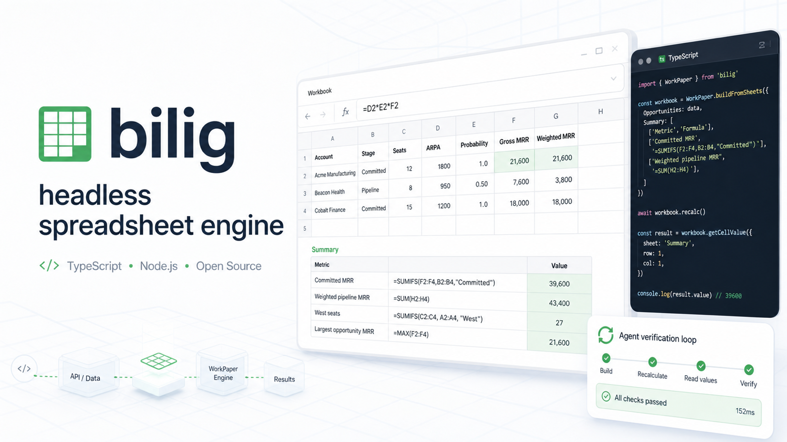

# Bilig

[](https://github.com/proompteng/bilig/actions/workflows/ci.yml)
[](https://www.npmjs.com/package/@bilig/workpaper)
[](packages/workpaper/package.json)
[](https://scorecard.dev/viewer/?uri=github.com/proompteng/bilig)
[](LICENSE)

**Keep the workbook model. Run the rule in Node.**

Bilig is a TypeScript-native, headless WorkPaper runtime for Node.js services,
tests, and AI agents. Set inputs, recalculate formulas, read computed outputs,
persist WorkPaper JSON, restore it, and verify the result—without driving Excel
or a browser grid.

[Docs](https://proompteng.github.io/bilig/) ·
[Quick start](#quick-start) ·
[TypeScript API](#use-it-from-typescript) ·
[MCP](#agents-and-mcp) ·
[Examples](#examples-and-deeper-guides) ·
[Discussions](https://github.com/proompteng/bilig/discussions)

<p align="center">
  
</p>

> [!NOTE]
> Bilig is a headless workbook runtime, not a visual spreadsheet app or a claim
> of full Excel compatibility. If an `.xlsx` file is your contract, start with
> the [compatibility report](docs/workbook-compatibility-report.md).

## Quick Start

Prove the published package before installing it:

```sh
npm exec --yes --package @bilig/workpaper@latest -- bilig-evaluate --door workpaper-service --json
```

The evaluator edits `Inputs!B2`, recalculates `Summary!B2`, saves the WorkPaper,
restores it, and compares the restored value:

```json
{
  "schemaVersion": "bilig-evaluator.v1",
  "door": "workpaper-service",
  "evidence": {
    "editedCell": "Inputs!B2",
    "dependentCell": "Summary!B2",
    "before": 24000,
    "after": 38400,
    "afterRestore": 38400
  },
  "verified": true
}
```

`verified: true` means the write, formula readback, JSON export, and restored
readback all passed. It is stronger evidence than a successful write call.

## Use It From TypeScript

```sh
npm install @bilig/workpaper
```

```ts
import { buildA1WorkPaper } from "@bilig/workpaper";

const pricing = buildA1WorkPaper({
  Inputs: [
    ["Metric", "Value"],
    ["Units", 20],
    ["Price", 1200],
  ],
  Summary: [
    ["Metric", "Value"],
    ["Revenue", "=Inputs!B2*Inputs!B3"],
  ],
});

const proof = pricing.editAndReadback("Inputs!B2", 32, {
  readbackRange: "Summary!B2",
});

console.log(proof.afterReadback.displayValues[0]?.[0]); // 38400
console.log(proof.verified); // true

pricing.dispose();
```

For ordinary operations, use `set()`, `setMany()`, `readMany()`, `display()`,
and `saveJson()`. Use `editManyAndReadback()` when multiple inputs must be
committed and verified as one edit. The complete public API is documented in
[`packages/workpaper/README.md`](packages/workpaper/README.md).

The lifecycle is deliberately small:

`inputs → formula recalculation → typed readback → JSON persistence → restore verification`

## Why Bilig

| Capability | What it gives you |
| --- | --- |
| Workbook-shaped models | Sheets, A1 addresses, formulas, ranges, and named expressions without a spreadsheet UI. |
| Verified mutations | Before/after computed values plus persistence and restore checks. |
| Service-owned state | Portable WorkPaper JSON for routes, queues, tests, tools, and audit trails. |
| Agent-safe tools | Narrow read/write tools with exact cells, computed readback, and writable-sheet boundaries. |
| Explicit file boundaries | Separate XLSX import, export, risk inspection, and Excel-oracle workflows. |

Use Bilig for pricing, quote approval, payouts, forecasts, validation rules,
formula-backed workflows, and tests where a service or tool should own the
model. Choose a spreadsheet application or hosted spreadsheet API when you
need visual editing, collaboration, macros, interactive pivots or charts, or
desktop fidelity.

## Agents And MCP

Agents should first ask which system owns state, then run the smallest matching
proof. For a tool host or MCP client:

```sh
npm exec --yes --package @bilig/workpaper@latest -- bilig-agent-start --json
npm exec --yes --package @bilig/workpaper@latest -- bilig-evaluate --door agent-mcp --json
```

The MCP evaluator proves tool discovery, mutation, recalculated readback, JSON
export, disk persistence, process restart, and restored readback. For a local,
writable WorkPaper:

```sh
npm exec --yes --package @bilig/workpaper@latest -- bilig-workpaper-mcp --workpaper ./pricing.workpaper.json --init-demo-workpaper --writable
```

Use that local stdio path for private or persistent project state. The hosted
`https://bilig.proompteng.ai/mcp` endpoint is request-local and only intended
for stateless connector discovery and smoke tests; do not send private workbook
data to it.

The server exposes `list_sheets`, `read_range`, `read_cell`,
`set_cell_contents`, `set_cell_contents_and_readback`,
`get_cell_display_value`, `export_workpaper_document`, and `validate_formula`.
It also publishes MCP resources and prompts so capable hosts can discover the
workflow before editing cells.

Machine-readable entry points:

| Need | Entry point |
| --- | --- |
| A compact routing card | [`docs/agent-start.txt`](docs/agent-start.txt) |
| A concise model index | [`docs/llms.txt`](docs/llms.txt) |
| Full agent documentation | [`docs/llms-full.txt`](docs/llms-full.txt) |
| Installation context | [`docs/llms-install.md`](docs/llms-install.md) |
| Structured capabilities | [`docs/agent.json`](docs/agent.json) |
| Reusable skill | [`skills/bilig-workpaper/SKILL.md`](skills/bilig-workpaper/SKILL.md) |
| Proof and host matrix | [`docs/agent-adoption-kit.md`](docs/agent-adoption-kit.md) |

The published package also carries `AGENTS.md` and `SKILL.md`, so an agent can
discover the same proof contract from `node_modules`. Install or inspect the
public skill with either source:

```sh
npx --yes skills@latest add https://bilig.proompteng.ai --list
npx --yes skills@latest add proompteng/bilig --skill bilig-workpaper --list
```

<details>
<summary>Host-specific project files</summary>

Use the [agent rule chooser](docs/agent-rule-chooser.md) or the
[host handoff prompt](docs/headless-workpaper-agent-handbook.md#copy-paste-prompt-for-another-agent).
The repository includes `CLAUDE.md`,
`.claude/skills/bilig-workpaper/SKILL.md`,
`.claude/commands/bilig-workpaper-proof.md`,
`.cursor/rules/bilig-workpaper.mdc`, `.devin/rules/bilig-workpaper.md`,
`.windsurf/rules/bilig-workpaper.md`, `.clinerules/bilig-workpaper.md`,
`.continue/rules/bilig-workpaper.md`, `.zed/settings.json`, `opencode.jsonc`,
and `.opencode/agents/bilig-workpaper.md`.

</details>

## Integration Recipes After The Proof

Run an evaluator first, then use the recipe owned by your host:

- [OpenAI Agents SDK](https://proompteng.github.io/bilig/openai-agents-sdk-workpaper-tool.html): direct tools, `MCPServerStdio`, and `MCPServerStreamableHttp`.
- [OpenAI Responses API](https://proompteng.github.io/bilig/openai-responses-workpaper-tool-call.html): function-call readback with explicit before/after evidence.
- [Vercel AI SDK](https://proompteng.github.io/bilig/vercel-ai-sdk-langchain-spreadsheet-tool.html): `generateText()` and `streamText()` tool loops.
- [Open WebUI](https://proompteng.github.io/bilig/open-webui-workpaper-mcp.html): local or hosted MCP discovery.
- [n8n](https://proompteng.github.io/bilig/n8n-workpaper-formula-readback.html): the `@bilig/n8n-nodes-workpaper` community node.

## Choose An Evaluation Path

| Your state owner | Start here | Evidence to require |
| --- | --- | --- |
| TypeScript application | `npm install @bilig/workpaper` | direct A1 API and focused application tests |
| Node service, route, queue, or test | `bilig-evaluate --door workpaper-service --json` | edit, recalculation, JSON export, restore, `verified: true` |
| MCP client or tool host | `bilig-evaluate --door agent-mcp --json` | discovery, readback, disk persistence, restart |
| Imported `.xlsx` is the contract | `workbook-compatibility-report workbook.xlsx --json` | unsupported formulas and workbook risk reasons for that file |
| Cached `.xlsx` values look stale | `xlsx-cache-doctor workbook.xlsx --json` | stale-cache diagnosis, recalculation, and readback for that file |

The `workbook-compatibility` and `xlsx-cache` evaluator doors use bundled demo
workbooks to smoke-test the published package; they do not inspect your file.
Do not treat any evaluator as proof of desktop Excel parity.

## Examples And Deeper Guides

Start with one maintained example, not the whole monorepo:

- [`examples/headless-workpaper`](examples/headless-workpaper): pricing,
  invoice, budget, fulfillment, subscription, persistence, and agent examples.
- [`examples/serverless-workpaper-api`](examples/serverless-workpaper-api):
  quote approval through Hono, Next.js, and persistence adapters.
- [`examples/xlsx-recalculation-node`](examples/xlsx-recalculation-node): import,
  recalculate, export, reimport, and verify an XLSX workbook.
- [`examples/recalc-bridge-workflows`](examples/recalc-bridge-workflows): focused
  bridges for existing SheetJS, xlsx-populate, and ExcelJS workflows.

Useful decision guides:

- [Formula workbooks proof page](docs/formula-workbooks-node-services-agent-tools.md)
- [Agent evaluator matrix](docs/agent-proof-matrix.md)
- [MCP spreadsheet server for coding agents](docs/mcp-spreadsheet-formula-server-for-coding-agents.md)
- [Vercel AI SDK formula readback](docs/vercel-ai-sdk-spreadsheet-tool-formula-readback.md)
- [OpenAI Responses tool calls](docs/openai-responses-workpaper-tool-call.md)
- [ExcelJS formula result boundary](docs/exceljs-formula-result-not-updating-after-node-edits.md)
- [Google Sheets `QUERY` and `SORTN`](docs/google-sheets-query-sortn-node-workpaper.md)
- [Microsoft Graph Excel boundary](docs/microsoft-graph-excel-recalculation-node.md)
- [XLSX formula support answers](docs/xlsx-formula-support-answers.md)
- [Production adoption checklist](docs/production-adoption-checklist-headless-workpaper.md)

<details>
<summary>Runnable integration and diagnostic commands</summary>

```sh
pnpm --dir examples/headless-workpaper run agent:ai-sdk-generate-text
pnpm --dir examples/headless-workpaper run agent:ai-sdk-stream-text
pnpm --dir examples/headless-workpaper run agent:openai-responses
pnpm --dir examples/headless-workpaper run agent:mcp-xlsx-risk-preflight
pnpm --dir examples/serverless-workpaper-api run hono-route
pnpm --dir examples/serverless-workpaper-api run next-server-action
pnpm --dir examples/serverless-workpaper-api run next-server-action-formdata
```

The AI SDK `generateText()` smoke lives at
[`ai-sdk-generate-text-tool-smoke.ts`](examples/headless-workpaper/ai-sdk-generate-text-tool-smoke.ts).
The OpenAI example is documented in
[`openai-responses-workpaper-tool-call`](docs/openai-responses-workpaper-tool-call.md).

For a reduced formula or import bug:

```sh
npm exec --yes --package @bilig/workpaper@latest -- bilig-formula-clinic ./reduced.xlsx --cells "Summary!B7,Inputs!B2"
```

</details>

## XLSX And Excel Compatibility

Bilig can import and export workbook files, but cached formula values inside an
`.xlsx` are diagnostics—not an accuracy oracle. Inspect the file before trusting
it:

```sh
npm exec --yes --package @bilig/xlsx-formula-recalc@latest -- bilig-evaluate --door workbook-compatibility --json
npm exec --yes --package @bilig/xlsx-formula-recalc@latest -- workbook-compatibility-report workbook.xlsx --json
npm exec --yes --package @bilig/xlsx-formula-recalc@latest -- xlsx-cache-doctor workbook.xlsx --json
```

The first command is a package smoke test over a bundled demo. The next two
inspect the named file. The compatibility report identifies unsupported
functions, external links, macros, pivots, volatile formulas, and other risks;
it does not certify Excel compatibility. When correctness matters, compare
against a workbook freshly recalculated by Excel. See the
[compatibility limits](docs/where-bilig-is-not-excel-compatible-yet.md) and
[Excel oracle walkthrough](docs/xlsx-corpus-verifier-walkthrough.md).

## Packages And Repository Map

| Path | Role |
| --- | --- |
| [`packages/workpaper`](packages/workpaper) | Recommended `@bilig/workpaper` API, evaluators, AI SDK adapter, MCP server, and XLSX boundary. |
| [`packages/headless`](packages/headless) | Lower-level WorkPaper runtime and integration primitives. |
| [`packages/xlsx-formula-recalc`](packages/xlsx-formula-recalc) | Real-file compatibility and stale-cache diagnostics. |
| [`packages/formula`](packages/formula) | Formula parser, binder, compiler, and evaluator. |
| [`packages/core`](packages/core) | Workbook state, mutations, snapshots, and scheduling. |
| [`apps/web`](apps/web) | Browser spreadsheet shell. |
| [`apps/bilig`](apps/bilig) | Full-stack runtime, APIs, and static site host. |

The public package requires Node.js `>=22`. Local monorepo development uses
Node.js 24+, Bun, and `pnpm@10.32.1`.

Published releases include npm registry signatures and provenance attestations:

```sh
npm view @bilig/workpaper version dist.attestations dist.signatures --json
npm audit signatures
```

## Development

Choose one long-running development server:

```sh
pnpm dev:web
pnpm dev:web-local
```

Install and validate the repository with:

```sh
pnpm install
pnpm build
pnpm lint
pnpm typecheck
pnpm test
pnpm run ci
```

Architecture lives in [`docs/architecture.md`](docs/architecture.md). Read
[`CONTRIBUTING.md`](CONTRIBUTING.md) before opening a pull request; first-time
contributors can start with the [new contributor guide](docs/new-contributor-guide.md)
and [starter issues](docs/starter-issues.md). All participation follows the
[`CODE_OF_CONDUCT.md`](CODE_OF_CONDUCT.md).

## Support And Security

- Ask adoption and design questions in
  [Discussions](https://github.com/proompteng/bilig/discussions).
- Follow versioned changes through
  [GitHub Releases](https://github.com/proompteng/bilig/releases/latest).
- Report reproducible bugs through
  [Issues](https://github.com/proompteng/bilig/issues); reduced workbooks can use
  the [formula bug clinic](docs/formula-bug-clinic.md) and
  [fixture form](docs/submit-workbook-fixture.md).
- Read [`SUPPORT.md`](SUPPORT.md) for the evidence that makes a report actionable.
- Follow [`SECURITY.md`](SECURITY.md) for private vulnerability reporting. Never
  attach private workbook data, credentials, or tokens to a public issue.

If Bilig fits one of your services or agent workflows,
[star the repository](https://github.com/proompteng/bilig) to follow releases
and help other Node developers find it. Tell us what proof or formula is still
missing.

## License

[MIT](LICENSE)
