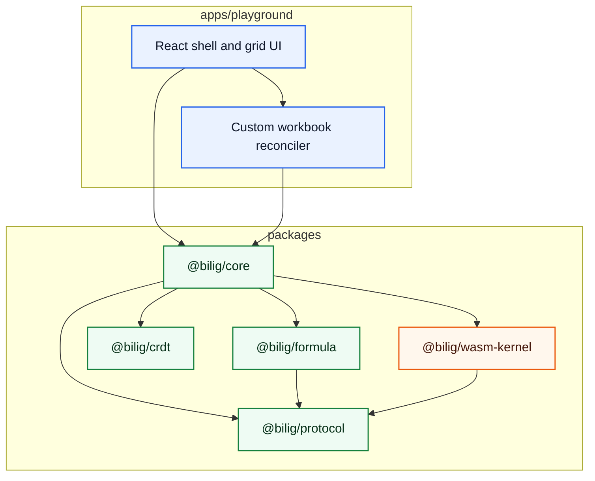

# Architecture

```mermaid
flowchart TB
  classDef react fill:#eaf2ff,stroke:#2563eb,color:#0f172a,stroke-width:1.5px
  classDef core fill:#eefbf3,stroke:#15803d,color:#052e16,stroke-width:1.5px
  classDef wasm fill:#fff7ed,stroke:#ea580c,color:#431407,stroke-width:1.5px

  subgraph PG["apps/playground"]
    UI["React shell and grid UI"]
    REC["Custom workbook reconciler"]
  end

  subgraph PKG["packages"]
    CORE["@bilig/core"]
    FORMULA["@bilig/formula"]
    CRDT["@bilig/crdt"]
    PROTOCOL["@bilig/protocol"]
    WASM["@bilig/wasm-kernel"]
  end

  UI --> CORE
  UI --> REC
  REC --> CORE
  CORE --> FORMULA
  CORE --> CRDT
  CORE --> PROTOCOL
  CORE --> WASM
  FORMULA --> PROTOCOL
  WASM --> PROTOCOL

  class UI,REC react
  class CORE,FORMULA,CRDT,PROTOCOL core
  class WASM wasm
```
