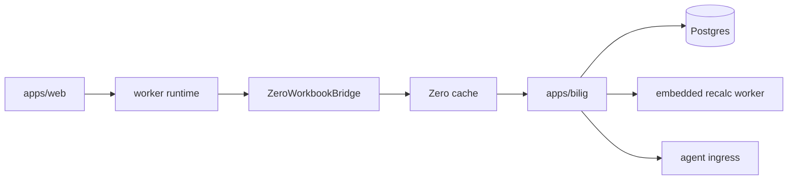

# Architecture

## Current architecture

The active production architecture is:

## Active seams

- `@bilig/core`
  - workbook state
  - transactions
  - metadata
  - formula/runtime execution
  - snapshot import/export
- `@bilig/workbook-domain`
  - transport-neutral workbook ops and txns
- `packages/zero-sync`
  - Zero schema
  - query registry
  - mutator definitions
  - runtime config
- `apps/web`
  - worker-first shell
  - Zero bridge
  - grid integration
- `apps/bilig`
  - session/auth boot
  - Zero query/mutate endpoints
  - authoritative write path
  - recalc/materialization
  - agent APIs

## Removed topology

The following are not current architecture anymore:

- standalone `apps/local-server`
- standalone `apps/sync-server`
- separate CRDT-first browser sync authority
- Redis on the correctness path

## Product rules

- authoritative workbook ordering happens on the server
- Zero syncs relational source/eval state rather than whole-workbook snapshots
- the UI consumes viewport patches, not raw engine internals
- snapshots remain warm-start artifacts, not the hot synced model

## Recommended next focus

1. keep reducing projection churn and render write amplification
2. keep tightening CI, rollout, and rebuild validation around the monolith path
3. keep closing the remaining non-production canonical formula rows
