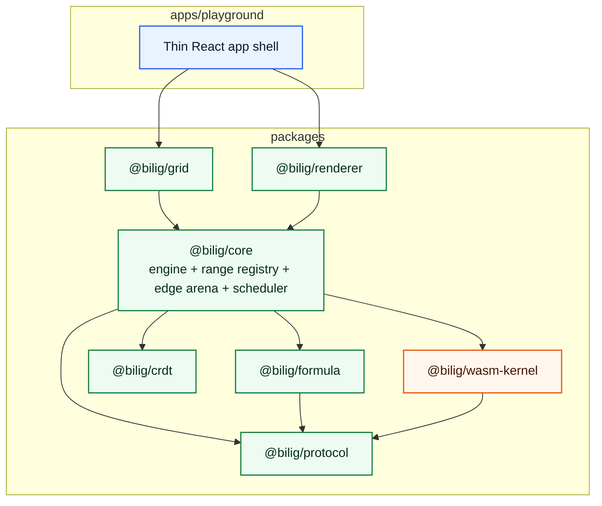
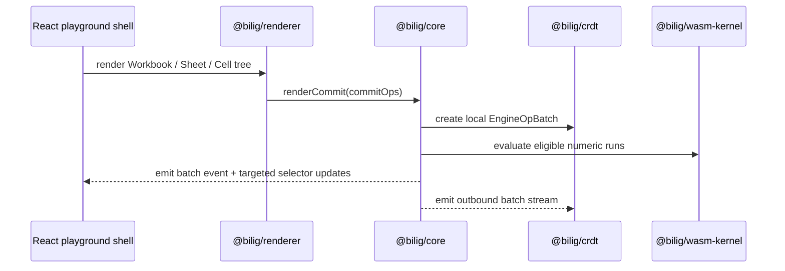

# Architecture

The TS protocol enums/opcodes and the AssemblyScript protocol mirror are generated together from `scripts/gen-protocol.mjs`. That keeps the JS/WASM contract deterministic and makes drift a CI failure instead of a runtime surprise.

Within `@bilig/core`, the runtime is no longer a single inline dependency map. The current production shape is:

- `WorkbookStore` for sheet metadata, sparse grids, and typed-array-backed cells
- `RangeRegistry` for interned range entities, a shared range-member pool, descriptor `membersOffset`/`membersLength`, and dynamic row/column membership tracking
- `EdgeArena` for forward and reverse graph slices
- `RecalcScheduler` for epoch-based dirty propagation and rank-bucket ordering
- `cycle-detection` for deterministic SCC grouping and `cycleGroupIds`, now backed by reusable typed-array Tarjan scratch state instead of per-run `Map`/`Set` allocations
- shared program/constant/range arenas in the engine so formula metadata matches the packed runtime/WASM contract instead of ad hoc per-formula blobs
- vectorized topo rebuild scratch state in the engine so rank assignment no longer depends on `Map`/`Set` queue construction in the hot topology path
- typed-array impacted-formula scratch in the engine so sheet deletion and formula rebinding no longer build recursive `Set` unions over the entity graph
- typed-array mutation-root buffers in the engine so snapshot import and op-batch application no longer allocate `Set` unions before recalculation
- typed-array rebound tracking in the engine so sheet rebinds and dynamic-range growth mark affected formulas directly instead of returning intermediate `Set` collections
- reusable WASM upload scratch in the engine/facade so fast-path program and range sync no longer rebuild filtered formula lists on every upload
- callback-based sheet scanning for dynamic ranges so the range registry no longer asks the engine to materialize throwaway `{ cellIndex, row, col }[]` snapshots just to discover members
- typed-array dynamic range materialization so callback-based sheet scans now fill packed `Uint32Array` member lists directly instead of boxing matches into `number[]` first

The UI does not subscribe through a single global revision for visible cells. `@bilig/core` maintains keyed cell listener routing so `useCell(...)` and viewport watchers wake only when one of their watched addresses changes. That keeps the grid aligned with the production requirement for localized rerenders rather than whole-viewport invalidation on every batch.
