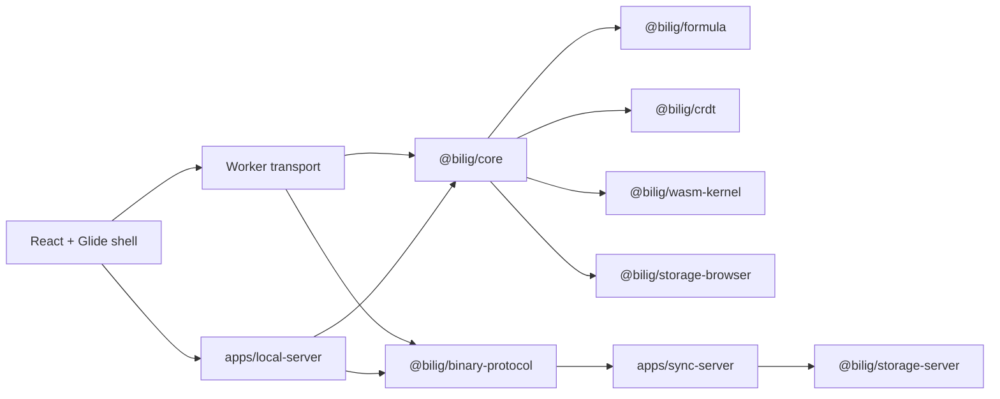

# Architecture

## Runtime layers

## Browser

- `@bilig/grid` renders the Excel-like shell.
- `@bilig/renderer` owns the declarative workbook DSL only.
- `@bilig/worker-transport` isolates the engine behind a worker boundary.
- `@bilig/storage-browser` persists snapshot, replica state, outbound queue, and cursor state in IndexedDB.
- `@bilig/binary-protocol` frames sync messages for the backend transport.
- `apps/web` is now the dedicated product app wrapper around the shipping browser shell.

## Semantic engine

- `@bilig/core` is the only semantic authority for workbook state.
- `@bilig/formula` defines parsing, binding, optimization, and JS oracle execution.
- `@bilig/wasm-kernel` is a fast-path compute accelerator, never the semantic source of truth.
- `@bilig/crdt` defines deterministic LWW batch ordering and replay rules.

## Backend

- `apps/local-server` is the authoritative localhost workbook-session host for the local-first agent loop.
- `apps/sync-server` is the realtime ingress and remote-agent control plane.
- `@bilig/storage-server` abstracts durable log, snapshot, presence, and ownership state.
- The full production backend target is binary websocket ingress plus durable append-before-ack semantics.
- The current repo tranche includes a typed local session host plus a typed remote service skeleton so both runtime layers are executable in-repo.

## Argo deployment target

- The standalone product app lives in `/Users/gregkonush/github.com/lab/argocd/applications/bilig`.
- It is registered in `/Users/gregkonush/github.com/lab/argocd/applicationsets/product.yaml`.
- Default hosts are `bilig.proompteng.ai` and `api.bilig.proompteng.ai`.

## Current tranche status

The current repo shape now matches the package and app layout of the production design. The missing work is deeper implementation fidelity: worker-first browser wiring, chat-driven local agent orchestration, durable remote websocket sync, full Excel parity, and Argo promotion hardening.
