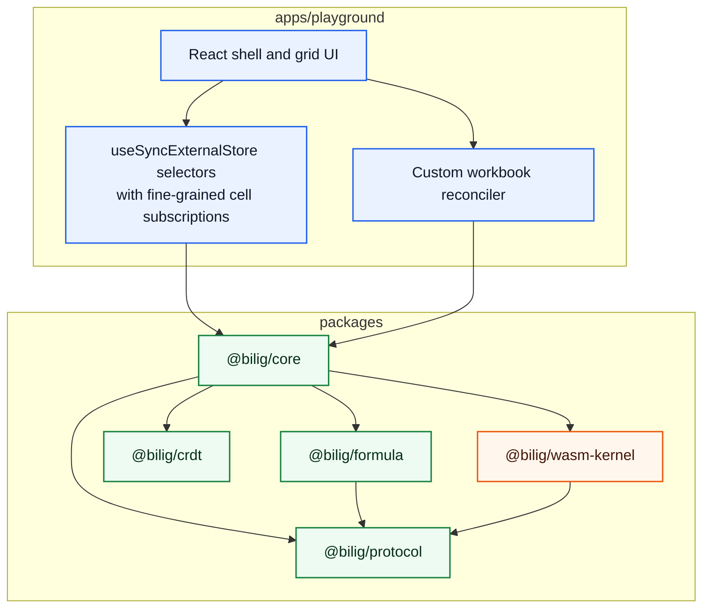
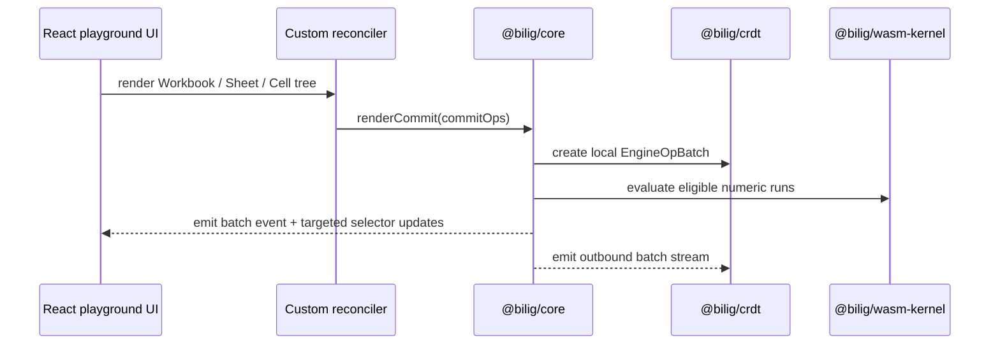

# Architecture

The TS protocol enums/opcodes and the AssemblyScript protocol mirror are generated together from `scripts/gen-protocol.mjs`. That keeps the JS/WASM contract deterministic and makes drift a CI failure instead of a runtime surprise.

The UI does not subscribe through a single global revision for visible cells. `@bilig/core` maintains keyed cell listener routing so `useCell(...)` and viewport watchers wake only when one of their watched addresses changes. That keeps the grid aligned with the production requirement for localized rerenders rather than whole-viewport invalidation on every batch.
