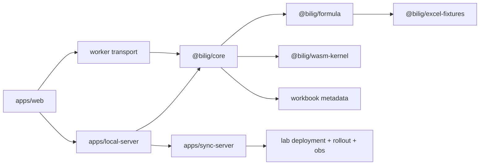

# Architecture

## Current reading

The current codebase state is:

- `@bilig/core` owns workbook state, transactions, dependency graph, snapshots, metadata, selection state, sync state, and render commits
- `@bilig/formula` is the semantic formula layer and JS oracle
- `@bilig/wasm-kernel` is a selective accelerator for the formula families that have closed
- `apps/web` is worker-first by default and consumes viewport patches
- `apps/local-server` is the live worksheet authority for browser and agent sessions
- `apps/sync-server` stores batches and snapshots, but most remote worksheet operations are not wired by default
- agent and viewport payloads use JSON inside binary envelopes

The current unresolved architecture items are:

- `9` canonical rows are not `implemented-wasm-production`
- `@bilig/crdt` does not yet model rename sheet, reorder sheets, explicit range ops, or explicit structured-reference and spill-owner ops
- `apps/web` no longer depends on playground CSS or TS sources
- `packages/storage-server` is in-memory only

## Runtime layers

## Current architecture seams

- `@bilig/core` and `packages/core/src/workbook-store.ts` carry defined names, tables, spills, pivots, row and column metadata, freeze panes, filters, sorts, and volatile context.
- `@bilig/crdt` carries ops for workbook metadata, row and column structure, freeze panes, filters, sorts, names, tables, spills, pivots, calc settings, and volatile context.
- Missing op families are `renameSheet`, `reorderSheets`, first-class range ops, explicit structured-reference binding ops, and explicit spill-owner ops.
- `@bilig/agent-api` uses binary framing around JSON payloads.
- `apps/local-server` is a live worksheet host with range read/write/fill/copy/paste, export/import, and subscription support.
- `apps/sync-server` returns `NOT_IMPLEMENTED` for most remote worksheet requests unless a worksheet executor is injected.
- `apps/web` no longer depends on playground source or styling in its TS config.
- viewport patch payloads are JSON inside a `Uint8Array` rather than a dedicated typed binary channel.

## Formula architecture

- `@bilig/formula` owns grammar, binding, optimization, translation, compatibility registry, JS oracle evaluation, and metadata-aware JS fallback behavior
- `@bilig/wasm-kernel` owns production formula execution for closed families
- `@bilig/core` owns workbook context, dependency scheduling, execution routing, spill materialization, and metadata-backed formula resolution
- `@bilig/excel-fixtures` owns checked-in oracle cases and capture metadata

## Canonical corpus execution rule

- every formula family lands in JS first
- fixtures prove Excel for the web parity
- WASM mirrors the same semantics in shadow or production depending on maturity
- production routing flips only after differential parity is green

## Metadata dependencies

The canonical rows that depend on metadata closure are:

- `names:defined-name-range`
- `tables:table-total-row-sum`
- `structured-reference:table-column-ref`

## Package planes

Target package planes:

- protocol plane
  - `@bilig/protocol`
  - `@bilig/binary-protocol`
  - `@bilig/crdt` as authoritative workbook ops, ordering, and compaction
  - a future typed binary agent protocol layer
- calc plane
  - workbook model and metadata store
  - transaction execution and authoritative op application
  - dependency graph, scheduler, and formula routing
  - JS semantics in `@bilig/formula` and acceleration in `@bilig/wasm-kernel`
- runtime plane
  - browser runtime and worker host/client
  - persistence restore and replay
  - local daemon connectivity
  - remote sync and catch-up
- view plane
  - `@bilig/renderer` as declarative authoring and commit translation
  - `@bilig/grid` as UI shell
  - viewport and render-patch surfaces
- product plane
  - document catalog, multi-file routing, collaboration metadata, and sharing semantics above the single-workbook engine

## Recommended phase order

Next work in code order:

1. close the remaining canonical rows: `FILTER`, `UNIQUE`, `LET`, `LAMBDA`, `MAP`, `BYROW`, reference-valued names, tables, and structured references
2. add `renameSheet`, `reorderSheets`, first-class range ops where needed, and explicit metadata-binding ops
3. replace in-memory-only remote storage and partial remote worksheet execution with a closed sync-server path
4. replace JSON-in-binary-envelope viewport and agent payloads with typed codecs
5. retire the deprecated playground shell from active product flows
6. finish remaining product-shell grid parity such as row resize, hide/unhide, context menus, and frozen-pane UX

## Repo boundary

- `bilig` docs define product and runtime contracts
- `lab` docs define deployment and runtime operation contracts

See:

- [bilig-lab-contract.md](/Users/gregkonush/github.com/bilig/docs/bilig-lab-contract.md)
- [formula-canonical-program.md](/Users/gregkonush/github.com/bilig/docs/formula-canonical-program.md)
- [wasm-runtime-contract.md](/Users/gregkonush/github.com/bilig/docs/wasm-runtime-contract.md)
- [authoritative-workbook-op-model-rfc.md](/Users/gregkonush/github.com/bilig/docs/authoritative-workbook-op-model-rfc.md)
- [workbook-metadata-runtime-rfc.md](/Users/gregkonush/github.com/bilig/docs/workbook-metadata-runtime-rfc.md)
- [worker-runtime-and-viewport-patches-rfc.md](/Users/gregkonush/github.com/bilig/docs/worker-runtime-and-viewport-patches-rfc.md)
- [durable-multiplayer-replication-rfc.md](/Users/gregkonush/github.com/bilig/docs/durable-multiplayer-replication-rfc.md)
- [typed-agent-protocol-rfc.md](/Users/gregkonush/github.com/bilig/docs/typed-agent-protocol-rfc.md)
