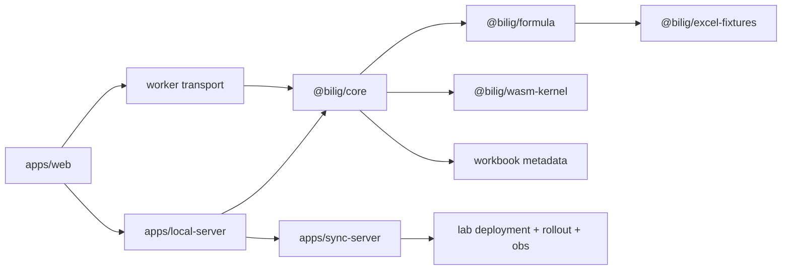

# Architecture

## Runtime layers

## Formula architecture

- `@bilig/formula` owns grammar, binding, optimization, translation, compatibility registry, and JS oracle evaluation
- `@bilig/wasm-kernel` owns production formula execution for closed families
- `@bilig/core` owns workbook context, dependency scheduling, metrics, and execution routing
- `@bilig/excel-fixtures` owns checked-in oracle cases and capture metadata

## Canonical Corpus Execution Rule

- every formula family lands in JS first
- fixtures prove Excel for the web parity
- WASM mirrors the same semantics in shadow mode
- production routing flips only after differential parity is green

## Metadata dependencies

The canonical formula corpus depends on workbook-scoped metadata becoming first-class:

- defined names
- tables and structured references
- spill ownership and blocking
- volatile epoch context

## Repo boundary

- `bilig` docs define product/runtime contracts
- `lab` docs define deployment/runtime operation contracts

See:

- [bilig-lab-contract.md](/Users/gregkonush/github.com/bilig/docs/bilig-lab-contract.md)
- [formula-canonical-program.md](/Users/gregkonush/github.com/bilig/docs/formula-canonical-program.md)
- [wasm-runtime-contract.md](/Users/gregkonush/github.com/bilig/docs/wasm-runtime-contract.md)
