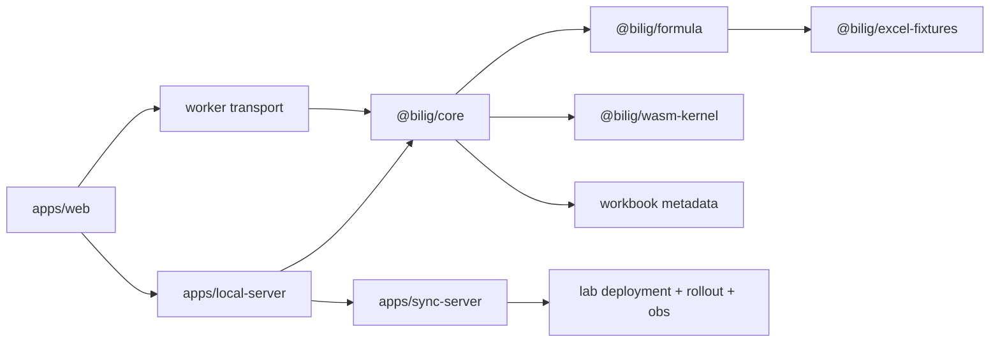

# Architecture

## Current reading

`bilig` already has the shape of a real spreadsheet system, not a toy demo. The codebase is strongest in the local engine/runtime layer and the formula execution split:

- `@bilig/core` already owns a substantial workbook engine, transaction surface, dependency graph, snapshots, selection state, sync state, and render commits
- `@bilig/formula` is the semantic formula layer and JS oracle
- `@bilig/wasm-kernel` is already positioned correctly as a selective accelerator rather than the semantic source of truth
- `apps/local-server` already acts as a meaningful local workbook authority for browser and agent sessions

The weakest seam is the one between the local engine surface and the replicated system model. The local engine can represent more workbook state than the current authoritative replicated op family can express. That seam should drive the next major architecture phase.

## Runtime layers

## Current architecture seams

- `@bilig/core` and `packages/core/src/workbook-store.ts` already carry workbook metadata such as defined names, spills, and pivots, but `@bilig/crdt` still models a much narrower op family centered on workbook, sheet, cell, format, clear, and pivot upsert operations.
- The binary sync protocol is real and already good enough to carry ordered workbook batches and snapshots, but it does not by itself solve the broader workbook-model gap.
- `@bilig/agent-api` currently uses binary framing around JSON payloads. It is an important foundation, but it is not yet a fully typed binary agent schema.
- `apps/local-server` is a live session host with a workbook engine in memory; `apps/sync-server` is still closer to a durability and relay surface than a complete remote worksheet host.
- `apps/web` still imports `apps/playground` source, so the browser-runtime boundary is not yet fully packageized.
- The browser runtime is not worker-first by default yet, so the engine/runtime seam is still stronger locally than it is in the shipping product shell.

## Formula architecture

- `@bilig/formula` owns grammar, binding, optimization, translation, compatibility registry, JS oracle evaluation, and the external function adapter boundary for non-worksheet surfaces
- `@bilig/wasm-kernel` owns production formula execution for closed families
- `@bilig/core` owns workbook context, dependency scheduling, metrics, and execution routing
- `@bilig/excel-fixtures` owns checked-in oracle cases and capture metadata

## Canonical Corpus Execution Rule

- every formula family lands in JS first
- fixtures prove Excel for the web parity
- WASM mirrors the same semantics in shadow mode
- production routing flips only after differential parity is green

## Metadata dependencies

The canonical formula corpus depends on workbook-scoped metadata becoming first-class:

- defined names
- tables and structured references
- spill ownership and blocking
- volatile epoch context

## Package planes

The clearest target architecture is to separate the repo into package planes more explicitly:

- protocol plane
  - `@bilig/protocol`
  - `@bilig/binary-protocol`
  - the current `@bilig/crdt` package, likely reframed conceptually toward authoritative workbook ops, ordering, and compaction
  - a future typed binary agent protocol layer
- calc plane
  - workbook model and metadata store
  - transaction execution and authoritative op application
  - dependency graph, scheduler, and formula routing
  - JS semantics in `@bilig/formula` and acceleration in `@bilig/wasm-kernel`
- runtime plane
  - browser runtime and worker host/client
  - persistence restore and replay
  - local daemon connectivity
  - remote sync and catch-up
- view plane
  - `@bilig/renderer` as declarative authoring/commit translation
  - `@bilig/grid` as UI shell
  - future derived viewport/render patch surfaces
- product plane
  - document catalog, multi-file routing, collaboration metadata, and sharing semantics above the single-workbook engine

## Recommended phase order

The next major steps should land in this order:

1. make the authoritative workbook op model exhaustive enough to match the local engine surface
2. finish the workbook metadata model, especially names, tables, structured references, and spill ownership
3. move the browser to a worker-first runtime and introduce derived viewport/render patches
4. harden local-first multiplayer around durable logs, snapshots, and catch-up
5. continue formula parity and WASM promotion family by family
6. replace JSON-in-binary-envelope agent payloads with a typed binary protocol

The important principle is that runtime, UI, and agent work should consume the authoritative workbook model instead of inventing bespoke parallel state paths.

## Repo boundary

- `bilig` docs define product/runtime contracts
- `lab` docs define deployment/runtime operation contracts

See:

- [bilig-lab-contract.md](/Users/gregkonush/github.com/bilig/docs/bilig-lab-contract.md)
- [formula-canonical-program.md](/Users/gregkonush/github.com/bilig/docs/formula-canonical-program.md)
- [wasm-runtime-contract.md](/Users/gregkonush/github.com/bilig/docs/wasm-runtime-contract.md)
- [authoritative-workbook-op-model-rfc.md](/Users/gregkonush/github.com/bilig/docs/authoritative-workbook-op-model-rfc.md)
- [workbook-metadata-runtime-rfc.md](/Users/gregkonush/github.com/bilig/docs/workbook-metadata-runtime-rfc.md)
- [worker-runtime-and-viewport-patches-rfc.md](/Users/gregkonush/github.com/bilig/docs/worker-runtime-and-viewport-patches-rfc.md)
- [durable-multiplayer-replication-rfc.md](/Users/gregkonush/github.com/bilig/docs/durable-multiplayer-replication-rfc.md)
- [typed-agent-protocol-rfc.md](/Users/gregkonush/github.com/bilig/docs/typed-agent-protocol-rfc.md)
