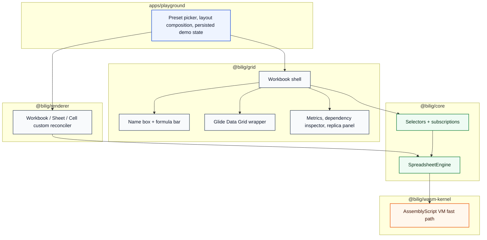
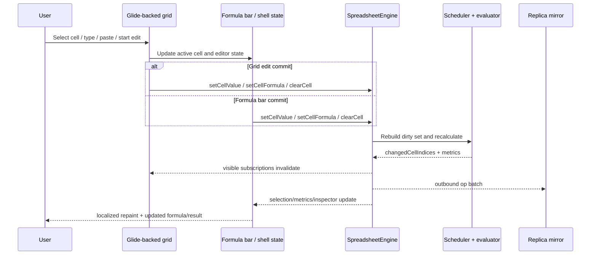

# Playground Excel Shell RFC

## Summary

This RFC rebuilds the playground from a demo-oriented dashboard into a spreadsheet-first shell that feels closer to Excel while preserving the existing `@bilig/core`, `@bilig/crdt`, and `@bilig/renderer` semantics. The new shell uses **Glide Data Grid** as the production grid foundation, keeps the formula bar directly above the sheet, makes cell editing first-class, and exposes the full spreadsheet address space while loading heavy materialized examples on demand.

The playground remains a thin app shell over reusable packages:

- `@bilig/core` keeps workbook state, recalculation, CRDT replication, and WASM integration
- `@bilig/renderer` keeps the custom workbook reconciler
- `@bilig/grid` becomes the Glide-backed spreadsheet UI package
- `apps/playground` stays the product demo shell that composes packages and presets

## Goals

- Deliver an Excel-like interaction model for the playground.
- Make direct cell editing work reliably from both the grid and the formula bar.
- Show that the engine can navigate the full `1,048,576 x 16,384` surface.
- Expose realistic stress presets based on the benchmark generators.
- Keep visible-cell rendering localized and fast.
- Preserve the current engine, CRDT, and renderer contracts.

## Non-Goals

- Pixel-cloning Excel.
- Changing spreadsheet semantics in `@bilig/core`.
- Moving business logic into the grid package.
- Making heavy presets load by default on initial app start.
- Replacing the existing reconciler or CRDT model.

## Why Glide Data Grid

### Chosen option

Use `@glideapps/glide-data-grid` as the production grid foundation.

### Why

- It is purpose-built for spreadsheet-like interaction rather than general data tables.
- It is designed for canvas-backed rendering with lazy visible-region drawing.
- It supports large row counts, keyboard navigation, selection, paste, and editing hooks that match this playground’s needs.
- It has a commercial-friendly MIT license.

### Rejected alternatives

- **Keep the custom DOM grid**: too much work to match spreadsheet-grade interaction and performance at million-row scale.
- **AG Grid Community**: extremely capable, but more table-first than spreadsheet-first and a weaker fit for the desired Excel mental model.

## UX Contract

### Layout

The workbook shell is spreadsheet-first:

1. Workbook/ribbon header
2. Name box and formula bar row
3. Main grid surface
4. Bottom sheet tabs and status strip
5. Secondary side panes for metrics, dependency inspection, and replica status

The formula bar is part of the workbook shell and sits directly above the active sheet. It is not a separate dashboard panel.

### Editing

- Single click selects a cell.
- Typing while a cell is selected starts replace-edit.
- `Enter`, `F2`, or double-click starts editing.
- The formula bar and grid editor stay synchronized.
- `Enter` commits.
- `Tab` commits and moves right.
- `Shift+Tab` commits and moves left.
- `Shift+Enter` commits and moves up.
- Blur commits.
- `Escape` cancels.
- Paste writes into the selected cell.

Input parsing stays aligned with the current engine behavior:

- leading `=` means formula
- empty string clears the cell
- `TRUE` and `FALSE` map to booleans
- numeric strings map to numbers
- everything else is stored as a string

### Scale presets

The playground exposes the full spreadsheet bounds immediately, but heavy materialization is preset-driven.

Presets:

- `Starter Demo`
- `100k Materialized`
- `250k Materialized`
- `10k Downstream Recalc`
- `Range Aggregates`
- `Million-Row Surface`

`Starter Demo` is the default load. Heavy presets are loaded on demand through snapshot import and present progress/loading state.

## Package Ownership

## Edit and Recalc Flow

## Performance Model

- `@bilig/grid` does not mirror workbook state into React.
- The grid wrapper reads cell data from the engine on demand.
- Visible-region changes drive targeted cell subscription updates.
- Grid refreshes use changed cell indices to invalidate only visible cells when possible.
- Heavy preset loads use async shell state transitions so loading chrome appears before import work begins.
- The full engine bounds are exposed, but heavy materialization remains explicit and preset-driven.

## Accessibility

- Formula input remains a normal labeled text input.
- Active cell address is always exposed in a name box and accessible label.
- Grid selection remains keyboard reachable.
- Editing shortcuts are mirrored by explicit visible controls where practical.
- Inspector and metrics panes remain navigable outside the grid.

## Rollout Plan

1. Add Glide dependency and RFC.
2. Replace the custom DOM grid with a Glide-backed wrapper in `@bilig/grid`.
3. Move the formula bar into the workbook shell and align editing state.
4. Add large presets and progress state in `apps/playground`.
5. Update browser smoke and package tests.
6. Update canonical docs once the implementation stabilizes.

## Acceptance Criteria

- Formula bar sits directly above the grid inside the workbook shell.
- Direct cell editing works from both the grid and the formula bar.
- The shell exposes the full spreadsheet address space.
- Heavy presets load on demand and remain usable.
- Existing engine/browser benchmark gates remain green.
- Browser smoke proves selection, editing, recalculation, sheet switching, and replica mirroring on the new shell.
