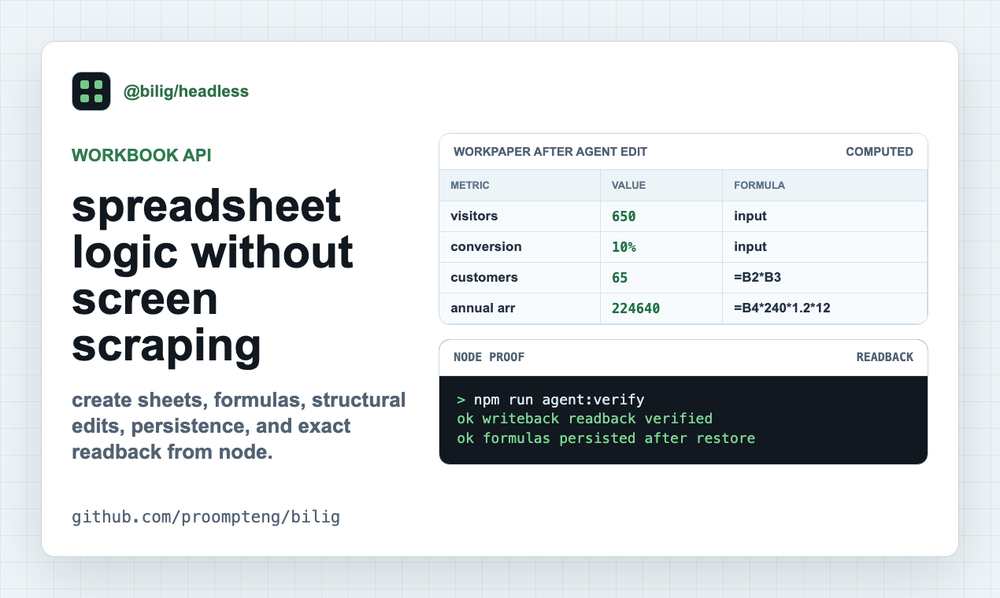
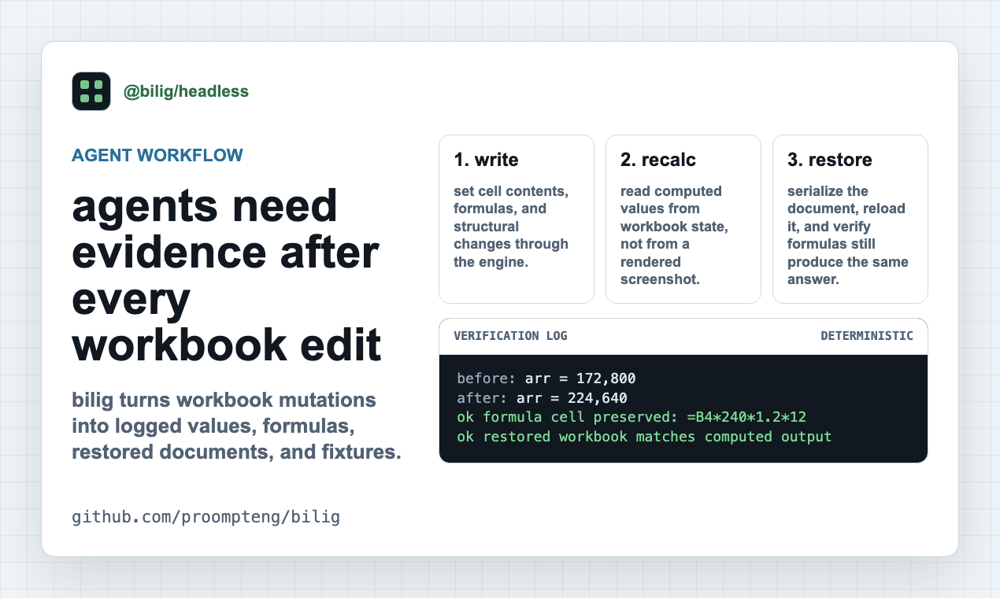
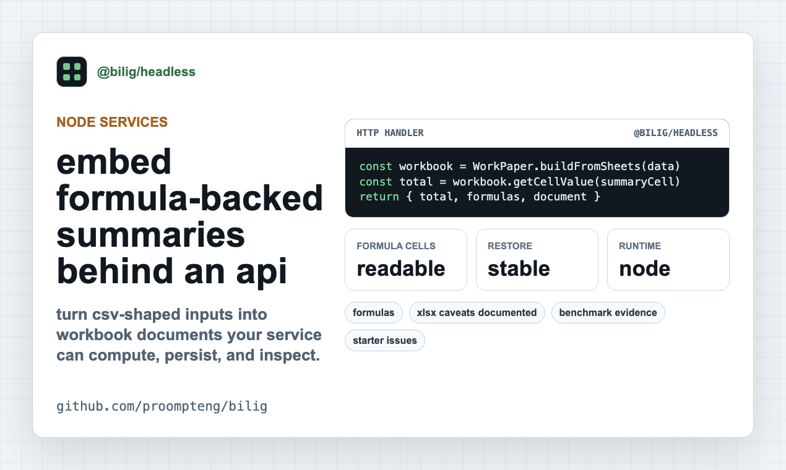

# Product Hunt Launch Kit For Bilig

Use this page when a launch surface needs the short version of what `bilig`
does, the proof links, and the assets in one place.

Do not launch with a vague "AI spreadsheet" pitch. The useful claim is smaller:
`@bilig/headless` runs workbook formulas from TypeScript, edits cells through an
API, reads the calculated value, and saves the WorkPaper as JSON.

## Product Copy

Name:

```text
bilig
```

Tagline:

```text
Workbook formulas for TypeScript services and agents.
```

Short description:

```text
bilig is a headless WorkPaper runtime for Node.js code that needs spreadsheet
formulas without opening a browser grid. Build sheets, write an input, read the
recalculated value, and save the workbook state as JSON.
```

First comment:

```text
I maintain bilig. The shortest way to judge it is the npm-only smoke test:
start from an empty Node project, install @bilig/headless, run eval.ts, edit an
input, read the recalculated value, save WorkPaper JSON, restore it, and check
the value again.

It is for backend and agent workflows where formulas are product logic, not for
manual spreadsheet editing. The benchmark and compatibility gaps are public:
78/100 comparable mean-latency rows are faster in the checked WorkPaper vs
HyperFormula artifact, the worst p95 holdout is named, and UI rendering
is out of scope.

Useful feedback would be concrete: which formula family, persistence shape, MCP
client, or import/export path would block you from trying this in a real
service?
```

## Links

- Homepage: <https://proompteng.github.io/bilig/>
- npm smoke test: <https://proompteng.github.io/bilig/try-bilig-headless-in-node.html>
- Repository: <https://github.com/proompteng/bilig>
- npm package: <https://www.npmjs.com/package/@bilig/headless>
- Benchmark notes: <https://proompteng.github.io/bilig/what-workpaper-benchmark-proves.html>
- Compatibility gaps: <https://proompteng.github.io/bilig/where-bilig-is-not-excel-compatible-yet.html>
- MCP setup: <https://proompteng.github.io/bilig/mcp-client-setup.html>
- Starter issues:
  <https://github.com/proompteng/bilig/issues?q=is%3Aissue%20state%3Aopen%20label%3Afirst-timers-only>

## Assets

Thumbnail:


Gallery:







Video:

<video controls src="assets/product-hunt-demo.webm" title="bilig Product Hunt launch demo"></video>

The WebM is for this docs page and social previews. Product Hunt accepts video
as a YouTube link, so upload the demo to YouTube first if the launch needs
video in the Product Hunt gallery.

## Product Hunt Fit Check

These checks follow Product Hunt's own launch prep guidance:
<https://www.producthunt.com/launch/preparing-for-launch> and
<https://www.producthunt.com/launch/>.

- Availability: the npm smoke test is public and runnable before launch:
  <https://proompteng.github.io/bilig/try-bilig-headless-in-node.html>.
- Account: submit from a personal maker account, not a company account.
- Timing: a Product Hunt launch day starts at midnight PST.
- Ask: invite people to check it out and leave feedback. Do not ask for
  upvotes.
- Tagline: `53 / 60` characters.
- Description: `214 / 500` characters.
- Thumbnail: `240x240`, 8.6 KB, below Product Hunt's 2 MB image limit.
- Gallery images: `1270x760`, all below Product Hunt's 5 MB image limit.
- Video: use a YouTube link in Product Hunt. The local
  `assets/product-hunt-demo.webm` is not the launch-form video field.

## Proof To Lead With

- The smoke test installs from npm and does not clone the monorepo.
- The example is TypeScript: `eval.ts` is maintained in
  `examples/headless-workpaper/npm-eval.ts`.
- The output must show `verified: true` after save and restore.
- The public benchmark page documents the narrow `78/100` comparable mean-row
  claim and the slower single-formula-edit-recalc p95 caveat.
- The compatibility page says what is not Excel-compatible yet before a user
  tries to import a real workbook.

## Launch Checklist

1. Link to the npm smoke test, not only the repository.
2. Upload the thumbnail and three gallery images.
3. Use a YouTube link only if the demo has been uploaded there; otherwise omit
   video from the Product Hunt form.
4. Submit from a personal maker account.
5. Pin the first comment above.
6. Ask for feedback, not upvotes.
7. Stay online to answer questions about Excel compatibility, XLSX import,
   MCP setup, and benchmark scope.
8. If somebody asks for a missing workflow, turn it into a small
   `first-timers-only` issue or a focused example.
