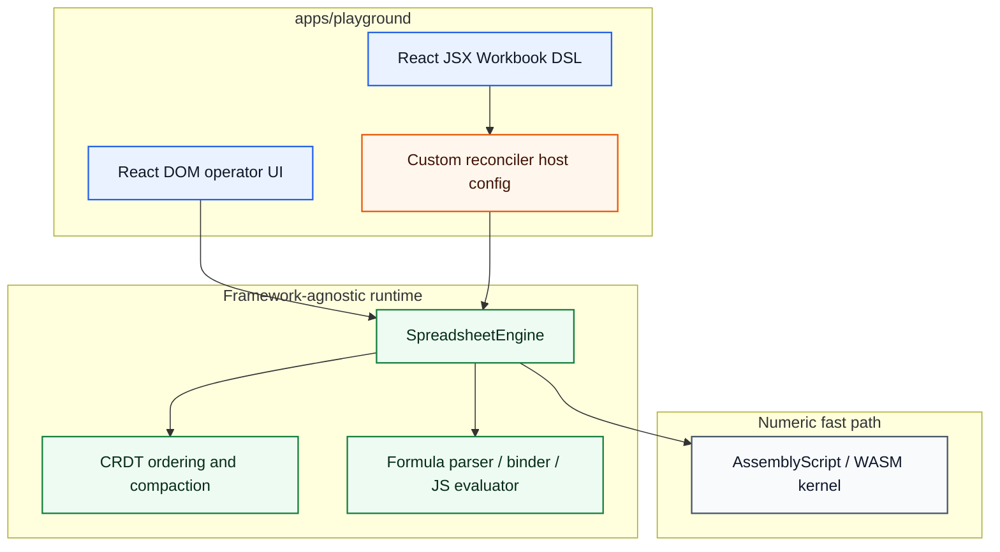
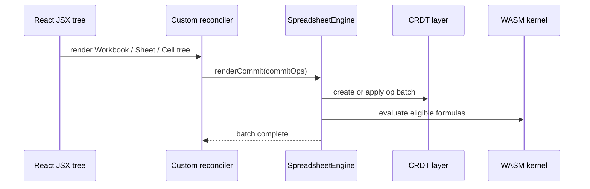

# Reconciler Layering

React is playground-only. The custom workbook reconciler is not a DOM renderer and does not own spreadsheet state.

Rules:

- no engine mutation in `createInstance`
- descriptors are inert until commit
- one engine batch per React commit
- shared packages remain React-free
- React is a declarative authoring surface and operator UI only; the spreadsheet graph lives in `@bilig/core`
- the reconciler may translate tree diffs into semantic workbook ops, but it never owns formula, dependency, or CRDT semantics
