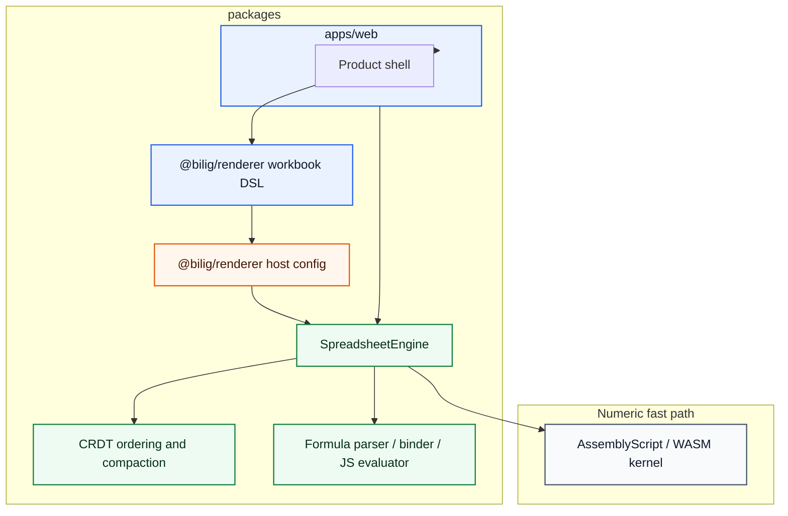
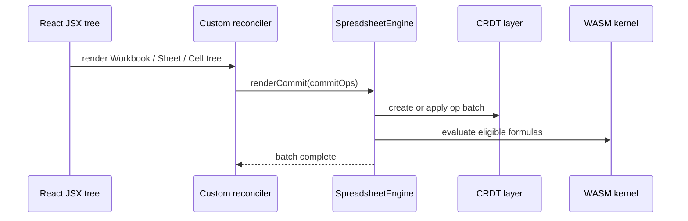

# Reconciler Layering

The custom workbook reconciler is package-based, not app-local. It is not a DOM renderer and does not own spreadsheet state.

Rules:

- no engine mutation in `createInstance`
- descriptors are inert until commit
- one engine batch per React commit
- the reconciler does not keep a parallel workbook shadow model; it validates the descriptor tree directly and flushes semantic commit ops into the engine
- root creation and `updateContainer` calls are isolated behind a small compat layer so `react-reconciler` version drift stays contained
- React-specific code is isolated to `@bilig/renderer`, `@bilig/grid`, and the product shell
- React is a declarative authoring surface and operator UI only; the spreadsheet graph lives in `@bilig/core`
- the reconciler may translate tree diffs into semantic workbook ops, but it never owns formula, dependency, or CRDT semantics

What this means in practice:

- React should not become the canonical workbook runtime state
- React fiber/tree state should not be used as the hot-path source of truth for cells, dependency edges, history, or multiplayer merges
- the normalized engine IR remains the canonical workbook state
- a future render-patch layer should stay separate from both the JSX descriptor tree and the core workbook graph
