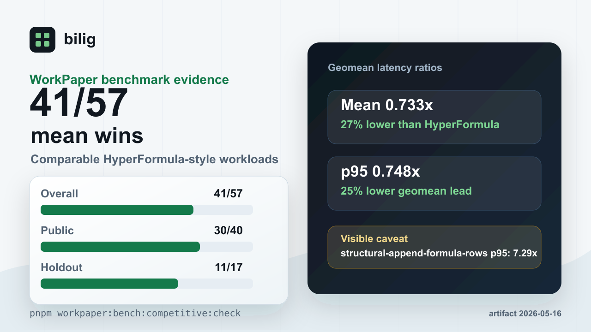

# What The WorkPaper Benchmark Proves

Status: public benchmark explainer for `@bilig/headless`

This page is the short, shareable version of the WorkPaper benchmark claim. It
turns the checked-in artifact into a plain-English evaluation guide without
inflating what the benchmark can prove.



## The Claim

The current checked-in WorkPaper-vs-HyperFormula artifact records WorkPaper
`41/57` mean-latency wins on scorecard-eligible comparable workloads. This is a
scoped lead with visible holdouts, not a blanket fastest-engine claim:

| Lane    | Comparable Workloads | WorkPaper Mean Wins | HyperFormula Mean Wins |
| ------- | -------------------: | ------------------: | ---------------------: |
| Overall |                 `57` |                `41` |                   `16` |
| Public  |                 `40` |                `30` |                   `10` |
| Holdout |                 `17` |                 `11` |                    `6` |

The artifact is
[`packages/benchmarks/baselines/workpaper-vs-hyperformula.json`](../packages/benchmarks/baselines/workpaper-vs-hyperformula.json),
generated at `2026-05-16T03:00:53.477Z`.

The overall directional mean-ratio geomean is `0.7329705059606954`, and the
overall directional p95-ratio geomean is `0.7480495502999938`. Ratios below
`1.0` mean WorkPaper is faster on that metric.

## What It Proves

It proves that the checked-in WorkPaper runtime is faster on mean latency for
most rows in the current scorecard of directly comparable headless
spreadsheet-engine workloads, with an aggregate mean and p95 geomean lead.

The covered families include workbook build and rebuild paths, runtime restore
from snapshot, sheet lifecycle, named expressions, dirty execution, batch edits,
structural row and column edits, range reads, aggregations, conditional
aggregation, and lookup workloads.

It also proves that the benchmark claim is auditable from the repository. The
expected scorecard shape is checked by:

```bash
pnpm workpaper:bench:competitive:check
```

## What It Does Not Prove

It does not prove that bilig is a complete Excel clone.

It does not prove full formula parity with Excel, Google Sheets, or
HyperFormula.

It does not prove that every p95 row is faster. The current headless leadership
scorecard records `38/57` workloads winning both mean and p95. The worst p95
holdout is `structural-append-formula-rows`, where the current WorkPaper-to-HyperFormula
p95 ratio is `7.2895644426100725`. The honest claim is `41/57` mean wins plus an
overall p95 geomean lead, not "faster on every row."

It does not prove that browser-grid rendering, import/export, collaboration, or
every user workload is faster. This benchmark is about the headless WorkPaper
runtime path.

It does not prove future results. If the artifact is regenerated and the
scorecard changes, the public claim must change with it.

## Why Mean And p95 Both Matter

Mean latency answers: "what is the normal cost of this workload?"

p95 latency answers: "what happens near the slow end of this workload's sample
set?"

A workload can win on mean while losing one p95 row when a small number of
slower samples move the tail. That is why bilig keeps both the headline mean
claim and the p95 caveat visible.

## How To Evaluate It

For the benchmark evidence, start with:

- [`docs/headless-workpaper-benchmark-evidence.md`](headless-workpaper-benchmark-evidence.md)
- [`packages/benchmarks/baselines/workpaper-vs-hyperformula.json`](../packages/benchmarks/baselines/workpaper-vs-hyperformula.json)
- [`docs/assets/workpaper-benchmark-card.png`](assets/workpaper-benchmark-card.png)
- [benchmark critique discussion](https://github.com/proompteng/bilig/discussions/340)

For the API surface, run the published package or maintained example:

```bash
pnpm add @bilig/headless
```

```bash
cd examples/headless-workpaper
npm install
npm start
```

## Shareable Copy

Short:

> bilig's WorkPaper benchmark currently records `41/57` mean wins against
> HyperFormula-style headless workloads, with the p95 caveat documented instead
> of hidden.

Reply-sized:

> the useful part is the audit trail: a checked-in benchmark artifact, a verify
> command, and an explicit p95 caveat. the claim is `41/57` mean wins for the
> current comparable headless WorkPaper workloads, not "we are faster at
> everything."
