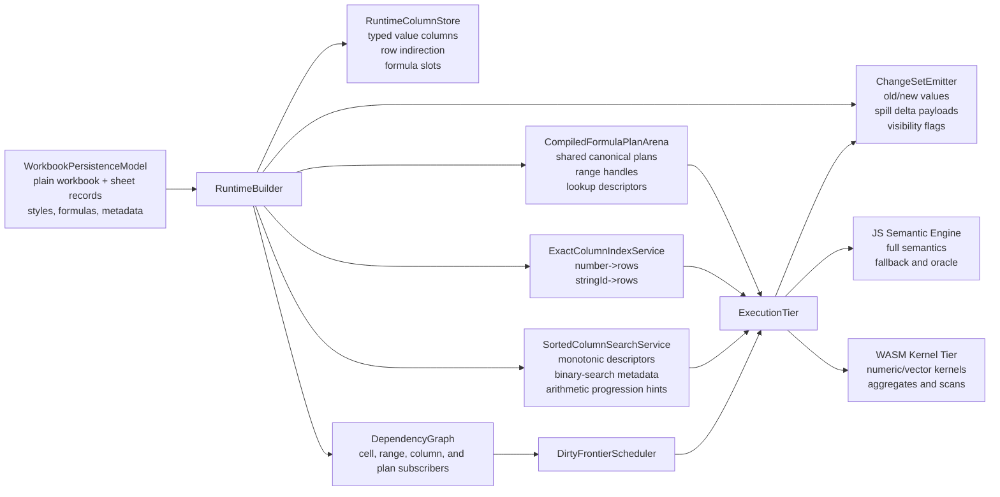
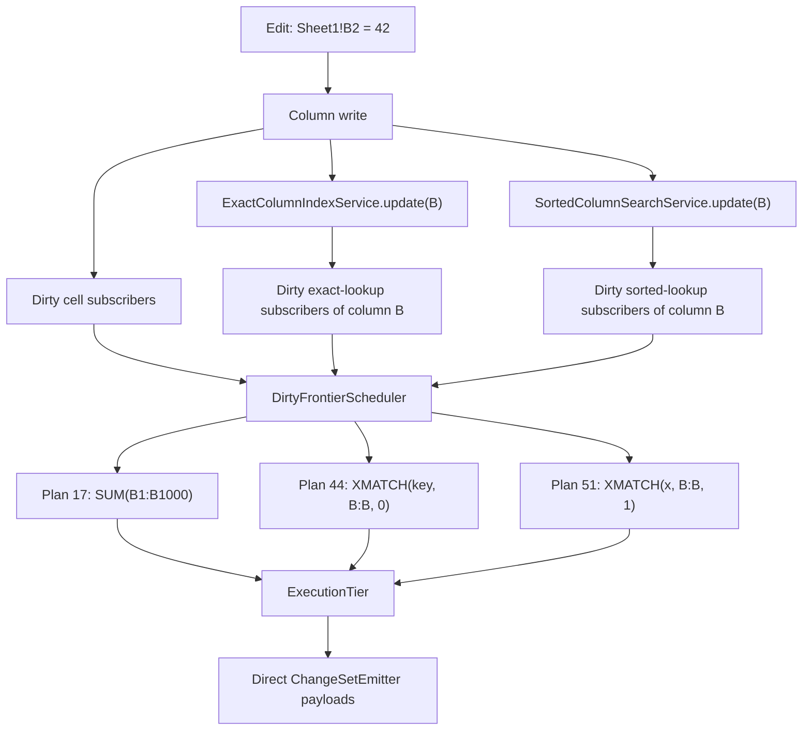
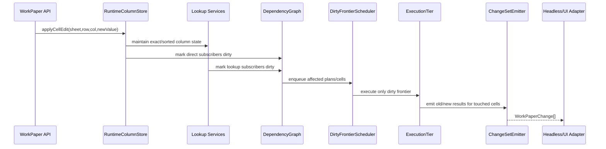
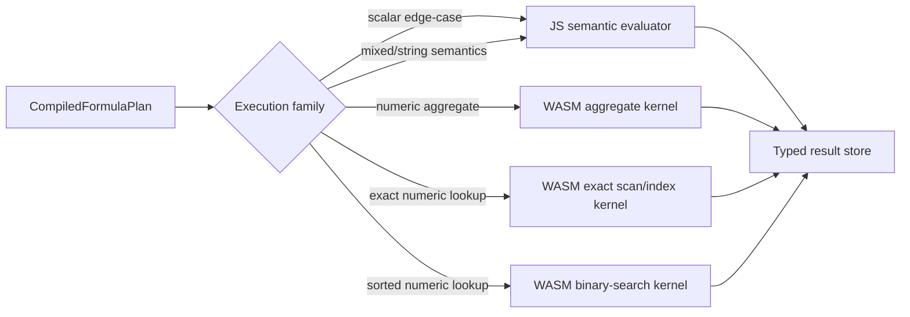
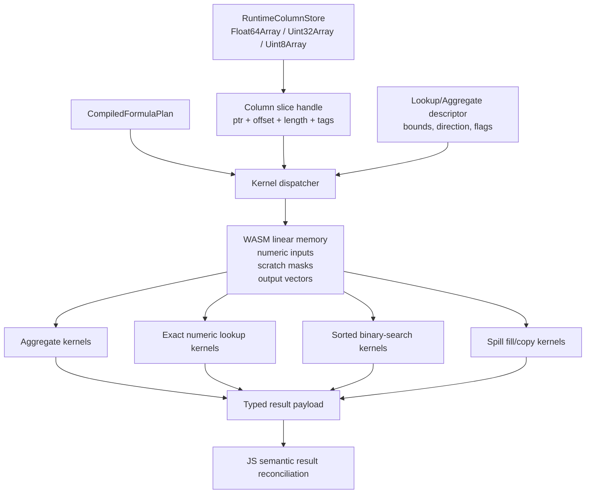

# WorkPaper Ultra-Performance Engine Architecture

Date: `2026-04-12`

Status: `design target`

Related documents:

- `/Users/gregkonush/github.com/bilig2/docs/workpaper-ultra-performance-engine-delivery-2026-04-12.md`
- `/Users/gregkonush/github.com/bilig2/docs/workpaper-hyperformula-prior-art-audit-2026-04-12.md`
- `/Users/gregkonush/github.com/bilig2/docs/workpaper-hyperformula-closeout-plan-2026-04-12.md`
- `/Users/gregkonush/github.com/bilig2/docs/workpaper-engine-leadership-program.md`
- `/Users/gregkonush/github.com/bilig2/docs/workpaper-performance-acceleration-plan.md`

## Purpose

This document describes the engine architecture that can put `WorkPaper` decisively ahead of
HyperFormula and other current spreadsheet engines.

The target is not a cosmetic micro-optimization pass. The target is to remove entire classes of
avoidable work:

- no formula-local primary lookup caches
- no first-query setup after workbook build
- no snapshot diffing to describe engine changes
- no recursive dependency evaluation on the hot path
- no object-heavy cell storage for dense or mixed-content sheets

The phrase `10x-50x` is used narrowly and honestly here.

It is realistic for:

- first-mutation setup cost
- change-materialization overhead
- exact lookup overhead above the raw index hit
- approximate lookup overhead above the raw ordered search
- range materialization overhead for vector-style formulas

It is not realistic to promise `10x-50x` on an already warmed `0.05ms` lookup unless we eliminate
whole layers of work. This architecture is designed to do exactly that.

## Design Outcome

The engine should have four properties:

1. workbook build fully finishes interactive runtime state
2. single-cell edits execute as store write -> index maintenance -> narrow dirty propagation ->
   direct change emission
3. exact and approximate lookup are separate engine subsystems, both owned by mutation paths
4. WASM accelerates closed numeric/vector kernels without becoming the semantic source of truth

## Lessons From Prior Art

### HyperFormula

The HyperFormula audit shows the right ownership boundaries:

- search is chosen once during engine build
- exact indexed lookup is persistent engine-owned column state
- approximate sorted lookup is a separate ordered-search mechanism
- mutation paths maintain search structures
- fresh build front-loads graph and search construction

That architecture is recorded in:

- `/Users/gregkonush/github.com/bilig2/docs/workpaper-hyperformula-prior-art-audit-2026-04-12.md`

### IronCalc

IronCalc is useful for what to copy selectively:

- cache formula results directly near cell storage
- deduplicate formulas structurally
- intern strings aggressively
- keep the persistence model plain and serializable

It is not the model to copy for maximum runtime performance because it still relies on:

- nested hash-map sheet storage
- recursive evaluation
- whole-model reevaluation
- lookup paths that materialize vectors on demand

## Non-Negotiable Rules

1. JavaScript remains the semantic source of truth for formula meaning and conformance.
2. The hot runtime model may differ from the persistence model.
3. Exact lookup and approximate sorted lookup must not share the same primary abstraction.
4. Mutation code owns invalidation and maintenance of search state.
5. The engine emits direct changed-cell payloads; outer layers do not reconstruct them by diffing.
6. WASM only accelerates closed, deterministic kernels with proven JS parity.

## Runtime Layers

The runtime is split into six layers.

1. `WorkbookPersistenceModel`
   - plain workbook, sheet, style, formula, metadata structures
   - optimized for I/O, import/export, and determinism
2. `RuntimeColumnStore`
   - typed hot-path storage used by the engine
   - optimized for scans, binary search, and low-allocation edits
3. `EngineServices`
   - exact lookup index
   - sorted lookup descriptor service
   - dependency graph
   - dirty-frontier scheduler
   - change-set emitter
4. `CompiledFormulaPlanArena`
   - canonicalized shared plans with typed execution metadata
5. `ExecutionTier`
   - JS evaluator for full semantics
   - WASM kernels for numeric/vector hot loops
6. `Headless/UI Adapters`
   - consume already-materialized changes
   - never infer changes by rescanning the workbook

## Core Entity Model

## Hot Runtime Storage

### 1. Column-native value storage

Each sheet runtime uses column-oriented storage, not nested cell objects.

Per logical column:

- `Float64Array` for numeric payloads
- `Uint32Array` for interned string ids
- `Uint8Array` or bitsets for booleans and empties
- compact tag arrays for cell kind and error state
- optional sparse overlays for extremely sparse columns

Per sheet:

- row indirection map
- live row count
- visible row spans
- formula-slot table
- spill-region table

This shape improves:

- dense scans
- binary search
- exact index maintenance
- cache locality
- WASM memory transfer

### 2. Formula-slot storage

Formula cells do not store heavyweight evaluator state inline. They store:

- `formulaSlotId`
- `currentValueKind`
- `currentValuePayload`
- `spillRegionId | 0`
- `dirtyGeneration`
- `lastCalculatedGeneration`

The slot points into a shared plan arena.

### 3. Shared strings and canonical formulas

Adopt the best IronCalc ideas here:

- intern strings once at runtime
- canonicalize formulas to a normalized plan key
- store one compiled plan for each canonical formula shape
- specialize relative addressing through lightweight binding records, not duplicated ASTs

## Formula Plan Arena

Each compiled plan contains:

- canonical expression opcodes
- referenced cell handles
- referenced range handles
- optional exact lookup binding
- optional sorted lookup binding
- execution family classification
  - scalar
  - vector
  - aggregate
  - lookup-exact
  - lookup-sorted
  - spill-producing
- preferred execution tier
  - `js-only`
  - `js-with-wasm-kernel`
  - `wasm-first`

The arena is append-mostly and shareable across sheets and workbooks with matching formula shapes.

## Search Architecture

### ExactColumnIndexService

The exact-match index is mutation-owned persistent column state.

Per `(sheetId, columnId)`:

- numeric map: `number -> sorted row ids`
- string map: `stringId -> sorted row ids`
- optional boolean buckets
- column generation
- row-transform generation

This service serves:

- `MATCH(..., 0)`
- `XMATCH(..., 0, ...)`
- exact `XLOOKUP`
- exact `VLOOKUP` / `HLOOKUP`

It is built during workbook load and maintained on:

- literal writes
- formula result changes
- clear operations
- row insert/remove/move
- column insert/remove/move

### SortedColumnSearchService

Approximate sorted lookup is not built on the exact index.

Per `(sheetId, columnId)`:

- monotonic direction
- dominant type family
- contiguous valid range spans
- arithmetic progression descriptor where applicable
- direct column value handle
- generation counters for structural vs value changes

This service serves:

- `MATCH(..., 1)`
- `MATCH(..., -1)`
- `XMATCH(..., 1 | -1, ...)`
- approximate `XLOOKUP`

Its hot path is:

- arithmetic answer if progression descriptor applies
- otherwise one binary search over the runtime column
- otherwise controlled fallback to JS semantic path

## Dependency Model

The dependency graph is not cell-only. It supports four subscriber classes:

- cell subscribers
- range subscribers
- column-service subscribers
- plan subscribers

That lets the engine represent:

- direct cell dependencies
- aggregate range dependencies
- exact lookup dependency on a column index
- sorted lookup dependency on a sorted column descriptor

This avoids waking more formulas than necessary on a single edit.

## Dirty-Frontier Scheduler

The scheduler owns recalculation order and scratch storage.

It should use:

- preallocated typed queues for dirty cell ids
- preallocated typed queues for dirty plan ids
- generation-based dedupe instead of `Set`
- spill-aware dependency invalidation
- stable topological segments for unchanged graph regions

The common single-edit path should allocate nothing.

## Change Emission

The engine must emit direct change payloads.

A tracked mutation result should already contain:

- changed cell ids
- old value tags/payloads
- new value tags/payloads
- spill added/removed regions
- explicit vs recalculated cause flags
- visibility flags where relevant

That removes the need for headless or UI layers to:

- walk snapshots
- read old/current visibility maps
- format coordinates to infer what changed

## Execution Tier

### JS semantic tier

JS remains the semantic oracle and always owns:

- parsing
- canonicalization
- edge-case semantics
- type coercion correctness
- error propagation
- fallback for unsupported WASM kernels

### WASM kernel tier

WASM owns only closed, deterministic kernels that benefit from typed contiguous memory.

Examples:

- vector aggregates over numeric ranges
- exact numeric scans and predicate masks
- approximate ordered numeric binary search
- arithmetic progression detection
- numeric text-to-number normalization batches
- spill fill/copy kernels for dense numeric outputs

WASM should not own:

- general string semantics
- workbook mutation orchestration
- dependency graph logic
- Excel-compatibility edge cases with broad object interactions

In this repo, that means `packages/wasm-kernel` is a compute tier, not a second spreadsheet engine.

### JS/WASM contract

The contract is typed and boring.

Inputs:

- memory pointer to numeric column or scratch vector
- row bounds
- normalized lookup key
- descriptor flags
- execution opcode

Outputs:

- row index or `-1`
- aggregate scalar
- mask/vector length
- error code enum

No dynamic object marshaling is allowed on the hot path.

### WASM memory topology

The WASM tier should consume stable typed buffers with explicit ownership.

- JS owns workbook orchestration and chooses kernels
- runtime column storage exposes stable slices or copied scratch segments
- WASM operates on numeric columns, masks, and output buffers only
- results come back as scalars, row ids, or typed output spans

### Kernel families

The initial kernel set should be deliberately small and high-value.

1. `aggregate_numeric_contiguous`
   - `SUM`, `AVERAGE`, `MIN`, `MAX`, and closed numeric reductions
2. `lookup_exact_numeric`
   - exact key hit over numeric column buckets or scan masks
3. `lookup_sorted_numeric`
   - monotonic numeric binary search and progression solve
4. `vector_compare_numeric`
   - predicate masks used by `FILTER`-adjacent and spill-producing numeric paths
5. `spill_copy_numeric`
   - dense numeric output materialization

Each kernel family must have:

- JS oracle parity tests
- deterministic input/output fixtures
- benchmark evidence that marshaling cost does not erase the gain

## Build Pipeline

Fresh build must finish all interactive state up front.

### Stage 1. Persistence ingest

- workbook model loaded
- strings interned
- sheet metadata normalized

### Stage 2. Runtime column build

- literal values loaded into typed columns
- formula slots allocated
- row indirection initialized

### Stage 3. Plan build

- formulas canonicalized
- shared compiled plans created
- range and cell handles bound
- execution families classified

### Stage 4. Service build

- exact indexes built for eligible columns
- sorted descriptors built for eligible columns
- dependency graph edges finalized

### Stage 5. Initial calculation

- initial dirty frontier evaluated
- direct change payload buffers prepared

There must be no missing setup left for the first interactive mutation.

## How High-Performance Calculation Works

### Exact lookup

For `XMATCH(key, B:B, 0)`:

1. formula plan resolves to `lookup-exact`
2. plan references `ExactColumnIndexService(sheet=B)`
3. mutation path maintains the B index on every relevant write
4. execution path does:
   - normalize `key`
   - direct bucket lookup
   - select first/last row in bounds
   - write scalar result

No range scan, no formula-local descriptor rebuild, no generic evaluator walk.

### Approximate sorted lookup

For `XMATCH(x, B:B, 1)`:

1. formula plan resolves to `lookup-sorted`
2. plan references `SortedColumnSearchService(sheet=B)`
3. mutation path maintains monotonic metadata and progression hints
4. execution path does:
   - progression solve if valid
   - otherwise binary search over the typed runtime column
   - write scalar result

No exact-index detour, no range materialization.

### Aggregate formula

For `SUM(B1:B100000)`:

1. plan resolves to `aggregate`
2. range dependency points at the B-column storage span
3. if numeric-homogeneous, WASM aggregate kernel runs directly over typed memory
4. scalar result writes back into the formula slot

### Single-cell edit

For `B2 = 42`:

1. write into runtime column
2. update exact and sorted services for column B
3. dirty only subscribers of B2 and column B services
4. scheduler evaluates affected plans
5. emitter returns direct old/new payloads

The hot path should look like a database index update plus a tiny incremental compute frontier.

## Why This Can Beat HyperFormula

HyperFormula already gets one thing right: search is engine-owned.

This architecture goes further by adding:

- hotter runtime storage than cell/object-centric models
- separate exact and sorted lookup services
- direct changed-cell payloads instead of outer diffing
- plan sharing with typed execution-family dispatch
- WASM kernels fed by contiguous typed memory

That combination is where the order-of-magnitude surplus-overhead wins come from.

## Why This Should Not Copy IronCalc

IronCalc is useful for:

- inline cached formula results
- formula dedup
- string interning
- persistence simplicity

It is not useful as the primary runtime blueprint because:

- nested hash maps destroy scan and search locality
- recursive evaluation inflates call and hash overhead
- whole-model reevaluation is wrong for interactive edits
- lookup paths that materialize arrays cannot win against engine-owned search services

## Migration Plan

1. introduce `RuntimeColumnStore` alongside current runtime state
2. move exact lookup to a shared `ExactColumnIndexService`
3. move approximate lookup to a separate `SortedColumnSearchService`
4. change tracked mutation results to emit direct old/new payloads
5. move eligible aggregate and lookup kernels into WASM
6. shift formula binding to shared plan arena ids instead of per-formula prepared descriptors
7. retire formula-local primary lookup descriptors

## Acceptance Criteria

The architecture is not done until all of the following are true:

1. first mutation after build pays no lookup-state setup cost
2. `lookup-with-column-index` resolves through engine-owned exact index state only
3. `lookup-approximate-sorted` resolves through engine-owned sorted-search state only
4. headless applies engine-emitted `WorkPaperChange[]` without workbook diff reconstruction
5. numeric aggregate and ordered numeric lookup hot loops have JS/WASM parity tests
6. benchmark wins survive reruns, not just one lucky artifact

## Benchmark Expectations

Expected areas for `10x-50x` improvement over the current `bilig` architecture:

- first-mutation exact lookup overhead above the raw search
- first-mutation approximate lookup overhead above the raw search
- event-to-change translation
- range materialization for numeric aggregate and lookup paths

Expected areas for smaller but still meaningful wins:

- warmed indexed lookup
- warmed approximate sorted lookup
- formula-edit recalculation
- mixed-content build

The realistic target is:

- consistent overall lead on directly comparable benchmarks
- much larger lead on the avoidable-overhead layers beneath those benchmarks

That is the architecture with the highest probability of creating a durable performance lead rather
than another short-lived microbenchmark bump.
