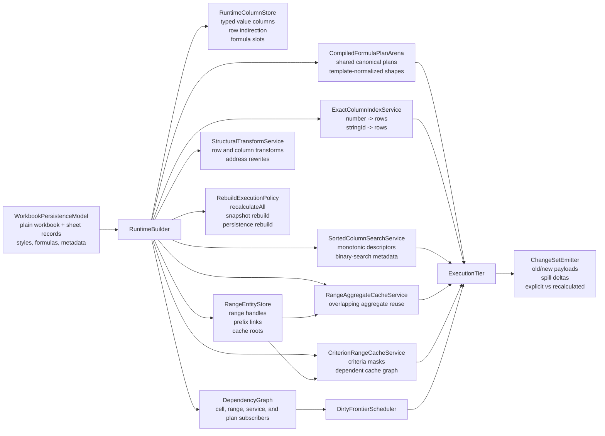

# WorkPaper Ultra-Performance Engine Architecture

Date: `2026-04-12`

Status: `design target, revised against current benchmark reality`

Related documents:

- `/Users/gregkonush/github.com/bilig2/docs/workpaper-ultra-performance-engine-delivery-2026-04-12.md`
- `/Users/gregkonush/github.com/bilig2/docs/workpaper-hyperformula-prior-art-audit-2026-04-12.md`
- `/Users/gregkonush/github.com/bilig2/docs/workpaper-hyperformula-closeout-plan-2026-04-12.md`
- `/Users/gregkonush/github.com/bilig2/docs/workpaper-engine-leadership-program.md`
- `/Users/gregkonush/github.com/bilig2/docs/workpaper-performance-acceleration-plan.md`

## Purpose

This document defines the engine architecture that can beat HyperFormula across the full expanded
competitive suite in this repo.

This is not a generic “go faster” document. It is tied to the current measured losses and the
specific ownership mistakes that still create them.

The target is to remove whole classes of avoidable work:

- no evaluator-owned primary lookup state
- no per-formula criteria rescans over reused ranges
- no structural row or column edits implemented as large ordinary cell-mutation loops
- no rebuild path that goes through public-sheet serialization when a snapshot rebuild is valid
- no headless workbook diff reconstruction on ordinary edits
- no WASM kernels fed by already-materialized JS objects

The phrase `10x-50x` is used narrowly and honestly here.

It is realistic on the current surplus-overhead classes that still dominate the red lanes:

- conditional aggregation over reused ranges
- structural insert or move transforms
- post-write lookup maintenance overhead
- wrong rebuild mode selection
- repeated row-template formula compilation

It is not realistic to promise `10x-50x` on already warm `0.05ms` lookup math unless entire layers
of orchestration disappear.

## Current Benchmark Reality

Latest local expanded artifact: `/tmp/workpaper-expanded-current.json`

Current position on that artifact:

- `WorkPaper` wins `13/24` directly comparable workloads
- `HyperFormula` wins `11/24`
- overall geometric mean is still `1.193x` slower for `WorkPaper`

The remaining red lanes are these:

| Workload | WorkPaper mean | HyperFormula mean | Primary owner that must change | Real issue |
| --- | ---: | ---: | --- | --- |
| `build-mixed-content` | `21.340667 ms` | `16.372333 ms` | `FormulaTemplateNormalizationService` | too much per-formula bind and compile work during mixed build |
| `build-parser-cache-row-templates` | `108.853292 ms` | `50.341541 ms` | `FormulaTemplateNormalizationService` | repeated row-shifted formulas are still compiled too expensively |
| `rebuild-config-toggle` | `33.938125 ms` | `14.454667 ms` | `RebuildExecutionPolicy` | wrong rebuild mode and too much runtime reconstruction |
| `partial-recompute-mixed-frontier` | `5.098167 ms` | `4.714833 ms` | `DirtyFrontierScheduler` | frontier is still slightly broader than necessary |
| `batch-edit-multi-column` | `1.241833 ms` | `1.133042 ms` | `SuspendedBulkMutationLane` | batch mutation still pays too much general transaction machinery |
| `batch-suspended-multi-column` | `1.061250 ms` | `0.799417 ms` | `SuspendedBulkMutationLane` | suspended edits are improved but not yet the cheapest valid path |
| `structural-insert-rows` | `70.896209 ms` | `6.222416 ms` | `StructuralTransformService` | structural edits still behave too much like ordinary cell mutation |
| `aggregate-overlapping-ranges` | `4.290542 ms` | `3.015083 ms` | `RangeAggregateCacheService` | overlapping ranges do not reuse enough range-owned state |
| `conditional-aggregation-reused-ranges` | `17.697083 ms` | `1.188792 ms` | `CriterionRangeCacheService` | repeated `COUNTIF` and `SUMIFS` shapes rescan instead of reusing one shared cache |
| `lookup-with-column-index-after-column-write` | `1.899959 ms` | `0.098500 ms` | `ExactColumnIndexService` | post-write lookup maintenance still pays broader mutation or refresh work than the raw index update |
| `lookup-approximate-sorted-after-column-write` | `0.526209 ms` | `0.116708 ms` | `SortedColumnSearchService` | sorted descriptor maintenance and post-write query ownership are still too broad |

This architecture exists to flip those exact lanes. If a subsystem does not map to a red workload,
it is not a first-order priority.

## Design Outcome

The engine should have six properties:

1. workbook build fully finishes interactive runtime state and formula-template normalization
2. rebuild uses the cheapest valid mode instead of one generic reconstruction path
3. single-cell edits execute as store write -> service maintenance -> narrow dirty frontier ->
   direct change emission
4. exact lookup, approximate sorted lookup, and criteria aggregation are separate mutation-owned
   engine services
5. structural row and column edits execute through a transformer service, not through large generic
   cell loops
6. WASM accelerates closed numeric and mask kernels without becoming the semantic source of truth

## Lessons From Prior Art

### HyperFormula

The HyperFormula audit identifies the ownership boundaries that actually matter:

- search strategy is chosen once during engine construction
- exact indexed lookup is persistent engine-owned column state
- approximate sorted lookup is a different engine service, not an extension of exact indexing
- criteria functions reuse range-owned caches through `RangeVertex` and dependent-cache invalidation
- structural row and column operations are dedicated graph and address transforms in `Operations`

That audit is recorded in:

- `/Users/gregkonush/github.com/bilig2/docs/workpaper-hyperformula-prior-art-audit-2026-04-12.md`

### IronCalc

IronCalc is useful for what to copy selectively:

- cache formula results close to cell storage
- deduplicate formulas structurally
- intern strings aggressively
- keep the persistence model plain and serializable

It is not the runtime model to copy for maximum performance because it still relies on:

- nested hash-map sheet storage
- recursive evaluation
- whole-model reevaluation
- lookup paths that materialize vectors on demand

## Non-Negotiable Rules

1. JavaScript remains the semantic source of truth for formula meaning and conformance.
2. The hot runtime model may differ from the persistence model.
3. Exact lookup and approximate sorted lookup must not share the same primary abstraction.
4. Criteria-function reuse must be range-owned, not formula-owned.
5. Structural edits must not use large ordinary cell-mutation loops on the hot path.
6. Rebuild modes must be explicit and selected by policy.
7. The engine emits direct changed-cell payloads; outer layers do not reconstruct them by diffing.
8. WASM only accelerates closed, deterministic kernels with proven JS parity.
9. Public-surface rebuild and serialization paths are correctness fallbacks, not primary hot paths.
10. No phase is complete if the benchmark win depends on permanent dual ownership.

## Runtime Layers

The runtime is split into seven layers.

1. `WorkbookPersistenceModel`
   - plain workbook, sheet, style, formula, and metadata structures
   - optimized for import, export, determinism, and compatibility
2. `RuntimeColumnStore`
   - typed hot-path column storage
   - optimized for contiguous scans, binary search, and low-allocation writes
3. `RangeEntityStore`
   - canonical range handles
   - prefix links for overlapping ranges
   - cache roots for aggregates and criteria functions
4. `CompiledFormulaPlanArena`
   - canonicalized shared plans
   - template-normalized repeated row and column shapes
   - typed execution metadata
5. `EngineServices`
   - `ExactColumnIndexService`
   - `SortedColumnSearchService`
   - `RangeAggregateCacheService`
   - `CriterionRangeCacheService`
   - `StructuralTransformService`
   - `DirtyFrontierScheduler`
   - `ChangeSetEmitter`
   - `RebuildExecutionPolicy`
6. `ExecutionTier`
   - JS evaluator for full semantics
   - WASM kernels for closed numeric and mask-heavy hot loops
7. `Headless` and `UI Adapters`
   - consume already-materialized changes
   - never infer changes by rescanning workbook state

## Core Entity Model



## Hot Runtime Storage

### RuntimeColumnStore

Each sheet runtime uses column-oriented storage, not nested cell objects.

Per logical column:

- `Float64Array` for numeric payloads
- `Uint32Array` for interned string ids
- `Uint8Array` or bitsets for booleans and empties
- compact tag arrays for cell kind and error state
- optional sparse overlays only for genuinely sparse columns

Per sheet:

- row indirection map
- live row count
- visible row spans
- formula-slot table
- spill-region table

This shape improves:

- dense scans
- exact and sorted lookup maintenance
- criteria mask generation
- cache locality
- WASM dispatch without object marshaling

### Formula slots

Formula cells do not own heavyweight evaluator state inline. They store:

- `formulaSlotId`
- `planId`
- `currentValueKind`
- `currentValuePayload`
- `spillRegionId | 0`
- `dirtyGeneration`
- `lastCalculatedGeneration`

The slot points into a shared plan arena.

### RangeEntityStore

Ranges are first-class engine entities.

Each range entity stores:

- `rangeHandle`
- sheet and bounds
- optional prefix link to a smaller overlapping range
- aggregate cache roots
- criterion cache roots
- dependent cache handles for invalidation

This is where `WorkPaper` must match and surpass HyperFormula’s `RangeVertex` idea.

## Formula Plan Arena

Each compiled plan contains:

- canonical expression opcodes
- template-normalized relative addressing shape
- referenced cell handles
- referenced range handles
- optional exact lookup binding
- optional sorted lookup binding
- optional criterion cache binding
- execution family classification
  - scalar
  - vector
  - aggregate
  - criteria-aggregate
  - lookup-exact
  - lookup-sorted
  - spill-producing
- preferred execution tier
  - `js-only`
  - `js-with-wasm-kernel`
  - `wasm-first`

The arena is append-mostly and shared across equivalent formula shapes.

Repeated row-template formulas must normalize to one shared compiled plan body plus lightweight
binding records. That is the direct fix for `build-parser-cache-row-templates`.

## Engine-Owned Services

### ExactColumnIndexService

The exact-match index is mutation-owned persistent column state.

Per `(sheetId, columnId)`:

- numeric map: `number -> sorted row ids`
- string map: `stringId -> sorted row ids`
- optional boolean buckets
- column generation
- row-transform generation

This service serves:

- `MATCH(..., 0)`
- `XMATCH(..., 0, ...)`
- exact `XLOOKUP`
- exact `VLOOKUP` and `HLOOKUP`

It is maintained on:

- literal writes
- formula result changes
- clear operations
- row insert, remove, and move
- column insert, remove, and move

### SortedColumnSearchService

Approximate sorted lookup is not built on the exact index.

Per `(sheetId, columnId)`:

- monotonic direction
- dominant type family
- contiguous valid range spans
- arithmetic progression descriptor where applicable
- direct column value handle
- generation counters for structural vs value changes

This service serves:

- `MATCH(..., 1)`
- `MATCH(..., -1)`
- `XMATCH(..., 1 | -1, ...)`
- approximate `XLOOKUP`

Its hot path is:

- arithmetic answer if the progression descriptor applies
- otherwise one binary search over the typed runtime column
- otherwise controlled fallback to JS semantic path

### RangeAggregateCacheService

This service owns reusable results for overlapping aggregate ranges.

Per range handle:

- aggregate family
- cached scalar or vector summary
- prefix-range parent
- tail delta metadata
- dependency generation

This service exists to flip `aggregate-overlapping-ranges`.

### CriterionRangeCacheService

This service owns reusable caches for:

- `COUNTIF`
- `COUNTIFS`
- `SUMIF`
- `SUMIFS`
- `AVERAGEIF`
- `AVERAGEIFS`
- `MINIFS`
- `MAXIFS`

Each cache key includes:

- values range handle
- criteria range handles
- normalized criterion text
- aggregate family
- coercion mode

Each cache value contains:

- a reusable match mask or matching row list
- optional prefix-cache parent
- tail delta metadata
- dependent-cache handles for invalidation

Invalidation flows from base range entities to dependent caches. This is mandatory. If the
criterion cache is formula-owned instead of range-owned, `WorkPaper` will keep losing
`conditional-aggregation-reused-ranges`.

### StructuralTransformService

This service owns:

- row insert
- row remove
- row move
- column insert
- column remove
- column move

It updates:

- row indirection
- range handles
- formula address rewrites
- exact and sorted lookup services
- criteria and aggregate cache generations
- dependency graph generations

The hot path must not behave like “apply 10,000 generic cell mutations”.

### RebuildExecutionPolicy

Rebuild must have three explicit modes:

1. `recalculateAll`
   - same engine and same runtime model
   - mark all formulas dirty
   - full recalc only
2. `rebuildRuntimeFromSnapshot`
   - config change requires a fresh runtime
   - current engine snapshot can be imported directly
   - no public-sheet serialization
3. `rebuildFromPersistence`
   - only when the runtime model itself must be reconstructed from persistence data

This is the direct architectural answer to `rebuild-config-toggle`.

## Dependency Model

The dependency graph is not cell-only. It supports six subscriber classes:

- cell subscribers
- range subscribers
- exact-column-service subscribers
- sorted-column-service subscribers
- criterion-range-service subscribers
- plan subscribers

That lets the engine represent:

- direct cell dependencies
- aggregate range dependencies
- exact lookup dependency on a column index
- sorted lookup dependency on a sorted descriptor
- criteria-family dependency on one or more reusable range caches

```mermaid
flowchart TD
  E["Edit: Sheet1!B2 = 42"] --> CW["Column write"]
  CW --> EXU["ExactColumnIndexService.update(B)"]
  CW --> SSU["SortedColumnSearchService.update(B)"]
  CW --> CRU["CriterionRangeCacheService.invalidate(B-related ranges)"]
  CW --> DS1["Dirty direct cell subscribers"]
  EXU --> DS2["Dirty exact-lookup subscribers of column B"]
  SSU --> DS3["Dirty sorted-lookup subscribers of column B"]
  CRU --> DS4["Dirty criteria-cache subscribers of affected ranges"]
  DS1 --> Q["DirtyFrontierScheduler"]
  DS2 --> Q
  DS3 --> Q
  DS4 --> Q
  Q --> P1["Plan: SUM(B1:B1000)"]
  Q --> P2["Plan: XMATCH(key, B:B, 0)"]
  Q --> P3["Plan: XMATCH(x, B:B, 1)"]
  Q --> P4["Plan: SUMIFS(V:V, B:B, \">0\")"]
  P1 --> EX["ExecutionTier"]
  P2 --> EX
  P3 --> EX
  P4 --> EX
  EX --> OUT["Direct ChangeSetEmitter payloads"]
```

## DirtyFrontierScheduler

The scheduler owns recalculation order and scratch storage.

It should use:

- preallocated typed queues for dirty cell ids
- preallocated typed queues for dirty plan ids
- generation-based dedupe instead of `Set`
- spill-aware dependency invalidation
- stable topological segments for unchanged graph regions
- a true suspended bulk mutation lane for multi-edit batches

The common single-edit path should allocate nothing.

## Change Emission

The engine must emit direct change payloads.

A tracked mutation result should already contain:

- changed cell ids
- old value tags and payloads
- new value tags and payloads
- spill added and removed regions
- explicit vs recalculated cause flags
- visibility flags where relevant

That removes the need for headless or UI layers to:

- walk snapshots
- read old and current visibility maps
- reformat coordinates to infer what changed

## Execution Tier

### JS semantic tier

JS remains the semantic oracle and always owns:

- parsing
- canonicalization
- edge-case semantics
- type coercion correctness
- criterion parsing and wildcard semantics
- error propagation
- fallback for unsupported WASM kernels

### WASM kernel tier

WASM owns only closed, deterministic kernels that benefit from typed contiguous memory.

Examples:

- vector aggregates over numeric ranges
- exact numeric scans and predicate masks
- approximate ordered numeric binary search
- arithmetic progression detection
- criteria mask generation over numeric columns and interned string-id columns
- spill fill and copy kernels for dense numeric outputs

WASM should not own:

- workbook mutation orchestration
- dependency graph logic
- string wildcard semantics
- general Excel-compatibility edge cases

In this repo, `packages/wasm-kernel` is a compute tier, not a second spreadsheet engine.

### JS/WASM contract

Inputs:

- memory pointer to numeric column or scratch vector
- optional pointer to interned string-id vector
- row bounds
- normalized lookup key or normalized criterion descriptor
- descriptor flags
- execution opcode

Outputs:

- row index or `-1`
- aggregate scalar
- mask length and mask pointer
- error code enum

No dynamic object marshaling is allowed on the hot path.

### Kernel families

The initial kernel set should be deliberately small and tied to real red workloads.

1. `aggregate_numeric_contiguous`
   - `SUM`, `AVERAGE`, `MIN`, `MAX`, and closed numeric reductions
2. `criteria_mask_numeric`
   - reusable mask generation for numeric criteria functions
3. `criteria_mask_string_id`
   - reusable mask generation for equality and direct-string criteria over interned ids
4. `lookup_exact_numeric`
   - exact key hit over numeric column buckets or scan masks
5. `lookup_sorted_numeric`
   - monotonic numeric binary search and progression solve
6. `spill_copy_numeric`
   - dense numeric output materialization

Each kernel family must have:

- JS oracle parity tests
- deterministic input and output fixtures
- benchmark evidence that marshaling cost does not erase the gain

## Build And Rebuild Pipeline

### Fresh build stages

1. persistence ingest
   - workbook model loaded
   - strings interned
   - sheet metadata normalized
2. runtime column build
   - literal values loaded into typed columns
   - formula slots allocated
   - row indirection initialized
3. plan and range build
   - formulas canonicalized
   - repeated row and column templates normalized
   - shared compiled plans created
   - range entities created
4. service build
   - exact indexes built for eligible columns
   - sorted descriptors built for eligible columns
   - range aggregate roots built
   - criteria cache roots prepared
   - dependency graph edges finalized
5. initial calculation
   - initial dirty frontier evaluated
   - direct change payload buffers prepared

There must be no missing setup left for the first interactive mutation.

### Rebuild modes

1. `recalculateAll`
   - use for same-config full recompute
   - no engine reconstruction
2. `rebuildRuntimeFromSnapshot`
   - use when config changes but function and language surface still permit snapshot import
3. `rebuildFromPersistence`
   - use only when snapshot reuse is semantically invalid

## Workload Ownership Matrix

| Workload | Primary subsystem | What must be true when done |
| --- | --- | --- |
| `build-mixed-content` | `FormulaTemplateNormalizationService` | mixed build does not repeatedly recompile identical relative shapes |
| `build-parser-cache-row-templates` | `FormulaTemplateNormalizationService` | repeated row templates normalize to one compiled plan family |
| `rebuild-config-toggle` | `RebuildExecutionPolicy` | config toggle chooses snapshot rebuild when valid and persistence rebuild only when required |
| `partial-recompute-mixed-frontier` | `DirtyFrontierScheduler` | range and service subscribers wake only relevant plans |
| `batch-edit-multi-column` | `SuspendedBulkMutationLane` | multi-edit batches pay one frontier setup and one change emission |
| `batch-suspended-multi-column` | `SuspendedBulkMutationLane` | suspended edits are a true deferred local batch |
| `structural-insert-rows` | `StructuralTransformService` | row insert updates engine state without generic cell-mutation loops |
| `aggregate-overlapping-ranges` | `RangeAggregateCacheService` | overlapping aggregates reuse prefix-range state |
| `conditional-aggregation-reused-ranges` | `CriterionRangeCacheService` | repeated criteria formulas share one range-owned cache |
| `lookup-with-column-index-after-column-write` | `ExactColumnIndexService` | post-write exact lookup is just index maintenance plus narrow frontier |
| `lookup-approximate-sorted-after-column-write` | `SortedColumnSearchService` | post-write approximate lookup is descriptor maintenance plus one search |

## How High-Performance Calculation Works

### Exact lookup after a write

For `XMATCH(key, B:B, 0)` after `B2 = 42`:

1. write into the typed runtime column
2. update `ExactColumnIndexService(B)` in place
3. dirty only direct cell subscribers plus exact-lookup subscribers of `B`
4. scheduler evaluates only affected plans
5. emitter returns direct old and new payloads

No range scan, no evaluator refresh pass, no formula-local descriptor rebuild.

### Approximate sorted lookup after a write

For `XMATCH(x, B:B, 1)` after `B2 = 42`:

1. write into the typed runtime column
2. update `SortedColumnSearchService(B)` metadata in place
3. dirty only sorted-lookup subscribers of `B`
4. answer by arithmetic solve or one binary search over typed storage

No exact-index detour, no vector materialization, no broad recalc frontier.

### Conditional aggregation over reused ranges

For `SUMIFS(V:V, B:B, \">0\", C:C, \"x\")` copied down many rows:

1. plan resolves to `criteria-aggregate`
2. plan references range handles for `V`, `B`, and `C`
3. `CriterionRangeCacheService` looks for a cache entry keyed by:
   - values range handle
   - criteria range handles
   - normalized criterion text
   - aggregate family
4. if present, reuse the cached mask or matching row list
5. if not present, build it once, store it on the range cache root, and link dependents
6. aggregate via WASM if the mask and values lane are eligible

This is the direct architectural answer to the current `14.9x` loss on
`conditional-aggregation-reused-ranges`.

### Structural row insert

For `insertRows(500, 10)` on a formula-heavy sheet:

1. `StructuralTransformService` updates row indirection
2. range handles and formula address bindings are rewritten as engine entities
3. exact and sorted lookup services apply the row transform
4. criteria and aggregate cache generations are invalidated narrowly
5. dependency graph generations advance once
6. scheduler recalculates only the affected frontier

No giant loop of generic cell rewrites.

### Rebuild after config change

For a config toggle:

1. `RebuildExecutionPolicy` inspects the requested config change
2. if semantics permit, use `recalculateAll`
3. otherwise, if function and language surface still permit, use `rebuildRuntimeFromSnapshot`
4. only then use `rebuildFromPersistence`

This prevents the hot path from paying the most expensive rebuild mode by default.

## Disallowed Fallbacks

These are explicitly forbidden as primary architecture:

- evaluator-owned primary lookup descriptors
- evaluator-owned primary criteria caches
- per-formula criteria rescans over reused identical ranges
- structural row or column edits implemented as large ordinary cell-mutation loops
- rebuild paths that serialize sheets through the public surface when snapshot import is valid
- headless before and after workbook diff reconstruction on ordinary edits
- WASM kernels invoked only after JS already materialized the full vector into object form

## Why This Can Beat HyperFormula

HyperFormula already gets two important things right:

- search is engine-owned
- criteria caches are range-owned

This architecture goes further by combining:

- hotter runtime storage than cell-object-centric models
- explicit rebuild mode policy
- separate exact, sorted, aggregate, and criteria services
- direct changed-cell payloads instead of outer diffing
- template-normalized plan sharing
- structural transforms as engine-owned operations
- WASM kernels fed by contiguous typed memory

That combination is where the order-of-magnitude wins on the current red lanes can come from.

## Why This Should Not Copy IronCalc

IronCalc is useful for:

- inline cached formula results
- formula dedup
- string interning
- persistence simplicity

It is not useful as the primary runtime blueprint because:

- nested hash maps destroy scan and search locality
- recursive evaluation inflates call and hash overhead
- whole-model reevaluation is wrong for interactive edits
- lookup and criteria paths that materialize arrays cannot win against engine-owned services

## Migration Plan

1. direct change payload substrate
2. compiled plan arena and formula slots
3. rebuild execution policy split
4. formula template normalization service
5. true suspended bulk mutation lane
6. criterion and overlapping-range caches
7. structural transform service
8. post-write lookup maintenance cutover
9. runtime column store authority
10. WASM criteria and search kernels
11. delete displaced paths

## Acceptance Criteria

The architecture is not done until all of the following are true:

1. `WorkPaper` wins all directly comparable workloads in the expanded benchmark suite
2. `conditional-aggregation-reused-ranges` is served by a range-owned reusable criterion cache
3. `structural-insert-rows` is served by `StructuralTransformService`
4. `lookup-with-column-index-after-column-write` resolves through mutation-owned exact index state
5. `lookup-approximate-sorted-after-column-write` resolves through mutation-owned sorted descriptor state
6. rebuild uses explicit policy and does not default to persistence reconstruction
7. headless applies engine-emitted `WorkPaperChange[]` without workbook diff reconstruction
8. numeric aggregate, criteria-mask, and ordered-search hot loops have JS and WASM parity tests
9. benchmark wins survive reruns on a clean committed tree, not one lucky artifact

## Benchmark Expectations

Expected areas for `10x-50x` improvement over the current `WorkPaper` architecture:

- conditional aggregation over reused ranges
- structural insert and move transforms
- post-write exact lookup overhead above the raw index update
- wrong rebuild mode selection

Expected areas for smaller but still meaningful wins:

- mixed-content build
- parser-cache row templates
- partial recompute mixed frontier
- batch multi-column suspended edits

The realistic target is blunt:

- `24/24` comparable workload wins on the expanded suite
- no remaining architecture-owned red lane
- no victory that depends on hidden fallback paths
