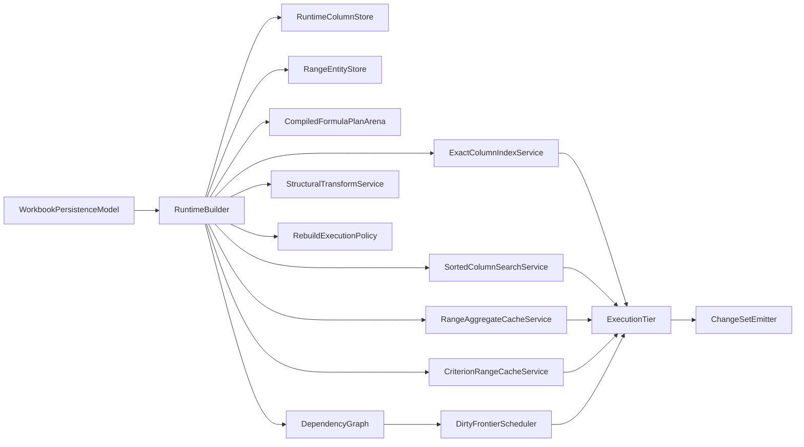

# WorkPaper Ultra-Performance Engine Architecture

Date: `2026-04-12`

Status: `executing architecture, revised against current expanded-suite reality on main`

Related documents:

- `/Users/gregkonush/github.com/bilig2/docs/workpaper-ultra-performance-engine-delivery-2026-04-12.md`
- `/Users/gregkonush/github.com/bilig2/docs/workpaper-hyperformula-prior-art-audit-2026-04-12.md`
- `/Users/gregkonush/github.com/bilig2/docs/workpaper-hyperformula-targeted-reread-2026-04-13.md`
- `/Users/gregkonush/github.com/bilig2/docs/workpaper-engine-leadership-program.md`
- `/Users/gregkonush/github.com/bilig2/docs/workpaper-performance-acceleration-plan.md`

## Purpose

This document defines the engine architecture that can beat HyperFormula across the full expanded
competitive suite in this repo without fallback-first sludge, temporary hacks, or benchmark-only
special cases.

Several major ownership cuts are already in the tree, but the current broader suite says
WorkPaper is not leader right now. This document now serves two jobs:

1. record the architecture cuts that actually survived implementation
2. define the remaining ownership work required to recover performance leadership on the current
   broader suite

The standard remains strict:

- no evaluator-owned primary lookup state
- no per-formula criteria rescans over reused ranges
- no structural row or column edits implemented as broad generic mutation loops
- no rebuild path that goes through public-sheet serialization when snapshot rebuild is valid
- no hidden legacy hot path under a benchmark-only fast path
- no WASM kernel fed by already-materialized JS object graphs

## Current Benchmark Reality

Current decision-driving artifact on `main`:

- `/tmp/workpaper-vs-hf-current-sample2.json`

Current position on that broader artifact:

- `WorkPaper` wins `12/35` directly comparable workloads
- `HyperFormula` wins `23/35`
- `WorkPaper` retains `1` leadership-only workload that HyperFormula does not support

The older `sample-count 5` leadership artifact is now historical only. It no longer describes the
broader suite or the current tree well enough to drive architecture decisions.

The remaining red lanes are not “cleanup.” They are the current engine story:

| Workload | WorkPaper mean | HyperFormula mean | Primary owner that still must change | Real issue |
| --- | ---: | ---: | --- | --- |
| `structural-insert-columns` | `28.460542 ms` | `0.472729 ms` | `StructuralTransformService` | column insert is still routed through far too much generic transform and rebind work |
| `structural-insert-rows` | `87.243625 ms` | `4.599000 ms` | `StructuralTransformService` | row insert still rebuilds too much range and dependency state |
| `structural-delete-rows` | `90.903167 ms` | `5.498417 ms` | `StructuralTransformService` | structural delete still pays broad transform bookkeeping |
| `structural-move-rows` | `97.645687 ms` | `9.541813 ms` | `StructuralTransformService` | row move is still far from a narrow transform-owned operation |
| `lookup-approximate-sorted-after-column-write` | `0.532750 ms` | `0.052083 ms` | `SortedColumnSearchService` | approximate post-write path still wakes far too much surrounding work |
| `structural-delete-columns` | `44.231937 ms` | `8.920687 ms` | `StructuralTransformService` | column delete still broadens transform work instead of updating ownership in place |
| `build-parser-cache-row-templates` | `156.698667 ms` | `34.312834 ms` | `FormulaTemplateNormalizationService` | repeated row-template families still bind too much unique per-cell structure |
| `partial-recompute-mixed-frontier` | `13.216562 ms` | `3.930520 ms` | `DirtyFrontier` and `RangeAggregateCacheService` | recalculation still over-wakes through mixed range and formula paths |
| `batch-edit-single-column-with-undo` | `3.913437 ms` | `1.428584 ms` | `SuspendedBulkMutationLane` | batch plus history still pays too much transaction scaffolding |
| `aggregate-overlapping-sliding-window` | `0.248979 ms` | `0.091479 ms` | `RangeAggregateCacheService` | aggregate reuse exists, but sliding-window extension semantics are still weaker |
| `structural-move-columns` | `18.526750 ms` | `7.899146 ms` | `StructuralTransformService` | column move still behaves like a broad mutation instead of a narrow transform |
| `lookup-with-column-index-after-column-write` | `0.150729 ms` | `0.072020 ms` | `ExactColumnIndexService` | exact after-write invalidation is still broader than the raw bucket update |
| `build-parser-cache-mixed-templates` | `142.403709 ms` | `73.411562 ms` | `FormulaTemplateNormalizationService` | mixed template families still over-materialize bindings after compile reuse |
| `rebuild-runtime-from-snapshot` | `70.406521 ms` | `39.959250 ms` | `RebuildExecutionPolicy` | snapshot rebuild still rebuilds too much runtime and plan state |
| `build-mixed-content` | `21.588395 ms` | `12.914250 ms` | `FormulaTemplateNormalizationService` | mixed build still does too much per-formula dependency materialization |
| `lookup-with-column-index-after-batch-write` | `1.086792 ms` | `0.661750 ms` | `ExactColumnIndexService` | exact batched writes still rebuild or wake more than necessary |
| `batch-suspended-single-column` | `0.982688 ms` | `0.622895 ms` | `SuspendedBulkMutationLane` | suspended single-column path is still paying extra wrapper overhead |

The architecture only matters insofar as it flips those lanes without turning current greens red.

## Architecture Already In Tree

These are not aspirational. They are already implemented, benchmarked, and retained:

### `CriterionRangeCacheService`

Range-owned criteria cache reuse exists and already flipped the worst criteria lane.

Delivered effect:

- `conditional-aggregation-reused-ranges` is green
- `conditional-aggregation-criteria-cell-edit` is green

The architecture cut was correct: repeated criteria evaluation moved out of formula-local rescans
and into engine-owned range cache state.

### `RangeAggregateCacheService`

Engine-owned aggregate reuse now exists for direct aggregate families.

Delivered effect:

- `aggregate-overlapping-ranges` is still green

Not yet complete:

- `aggregate-overlapping-sliding-window` is still red because the current cache does not yet extend
  smaller cached windows as aggressively as HyperFormula’s range reuse model

### `FormulaTemplateNormalizationService`

Template-family detection and astless translated-family reuse are in the tree.

Delivered effect:

- the design direction is still correct, but the current broader suite says both parser-template
  build lanes are red again on `main`

Not yet complete:

- `build-parser-cache-row-templates` is still red
- `build-mixed-content` is still red
- `build-parser-cache-mixed-templates` is red again on the current broader suite

That means template normalization is real, but prepared binding family reuse is not complete.

### Live `useColumnIndex` Runtime Policy

`useColumnIndex` is now a live runtime policy instead of a rebuild-only construction choice.

Delivered effect:

- `rebuild-config-toggle` is green by a huge margin

This confirmed the architectural point: config-toggle did not need a generic rebuild hot path.

### Mutation-Owned Lookup Dirtying

Exact and approximate lookup formulas now wake through mutation-owned service ownership rather than
through broad literal-cell reverse edges.

Delivered effect:

- `lookup-with-column-index` is green
- `lookup-no-column-index` is green

Not yet complete:

- exact after-write lanes are still red
- approximate sorted steady-state is slightly red again on the current broader suite
- approximate sorted after-write is still badly red

### Descriptor-Owned Structural Impact Tracking

Structural impact collection now understands direct aggregate, direct criteria, and direct lookup
dependencies. Structural edits no longer blindly force the same formula teardown they used to.

Delivered effect:

- structural ownership got materially cleaner than the original full-rebind design

Not yet complete:

- structural rows are catastrophic again on the broader suite
- structural columns are now one of the worst losses in the entire benchmark

### Suspended-Eval Literal Fast Queue

Headless suspended literal edits now bypass the normal per-call mutation wrapper and go directly
into the deferred queue.

Delivered effect:

- batch lanes got closer

Not yet complete:

- all batch lanes are still red

## HyperFormula Prior-Art Takeaways

The local reread in `/Users/gregkonush/github.com/hyperformula` still drives the correct remaining
order.

### Structural transforms are first-class engine operations

HyperFormula treats row and column add, remove, and move as dedicated graph, address, range, and
search transforms, not as large generic mutation loops. Its address-mapping layer is also a
first-class strategy subsystem.

Implication for WorkPaper:

- `StructuralTransformService` must own in-place range retargeting, address-mapping updates,
  transform-scoped dependency maintenance, and structural undo or redo on the same model

### Exact and approximate lookup are different systems

HyperFormula’s exact indexed lookup and approximate sorted lookup are not one shared abstraction.

Implication for WorkPaper:

- `ExactColumnIndexService` and `SortedColumnSearchService` must continue to evolve independently
- approximate-after-write should get narrower, not “more indexed”

### Parser caching is relative-template-aware

HyperFormula’s parser cache is centered on normalized token streams relative to base address.

Implication for WorkPaper:

- `FormulaTemplateNormalizationService` must finish the prepared binding family problem, not merely
  deduplicate compiled plans after expensive binding has already happened

### Range reuse is explicit and incremental

HyperFormula’s `RangeVertex` and aggregation code reuse smaller cached ranges instead of rescanning
overlapping windows from scratch.

Implication for WorkPaper:

- `RangeAggregateCacheService` needs smaller-range extension semantics for sliding windows

## Rejected Approaches

These were tried and are intentionally not part of the architecture anymore:

- direct-aggregate structural astless rewrite
  - regressed the suite and was removed
- cross-sheet mixed-sheet initialization batching
  - regressed mixed-sheet initialization and was removed
- prepared lookup refresh reuse shortcut
  - regressed the suite and was removed

These should stay dead unless new evidence proves a different design.

## Non-Negotiable Rules

1. JavaScript remains the semantic source of truth for formula meaning and correctness.
2. Exact lookup and approximate sorted lookup must not collapse into one shared primary service.
3. Criteria and aggregate reuse must be range-owned, not formula-owned.
4. Structural edits must not route through large generic cell-mutation loops on the hot path.
5. Rebuild modes must be explicit and selected by policy.
6. Headless and UI layers consume engine-emitted changes instead of diffing workbook state.
7. WASM accelerates closed deterministic kernels only after JS parity is already proven.
8. No benchmark win counts if the old path is still the common hot path.
9. No phase is complete if it introduces semantic drift, flaky invalidation, or cleanup debt.

## Performance Correctness Invariants

These are now hard architecture rules, not “test cleanup” details:

1. Formula-result writes must invalidate column versions, lookup freshness, and range caches the
   same way literal writes do.
2. Direct formulas must never evaluate against workbook state that is still sitting in a pending
   WASM batch.
3. Versioned explicit empty cells are real workbook state and must not be pruned as if they were
   dependency-only placeholders.
4. When a cell flips between literal and formula, dependent range topology must refresh narrowly
   and correctly.
5. Snapshot import, replica replay, undo or redo, and live local mutation must converge to the same
   visible workbook state.

## Runtime Layers

The runtime is still the same seven-layer design, but the ownership boundaries matter more than the
names:

1. `WorkbookPersistenceModel`
   - serializable workbook representation
2. `RuntimeColumnStore`
   - typed hot-path value storage and formula-result invalidation authority
3. `RangeEntityStore`
   - canonical range handles, prefix links, cache roots, and range-member topology
4. `CompiledFormulaPlanArena`
   - shared compiled plans and template families
5. `EngineServices`
   - exact lookup, sorted lookup, aggregate reuse, criteria reuse, structural transforms, rebuild
     policy, dirty frontier, and change emission
6. `ExecutionTier`
   - JS semantic tier with selective WASM acceleration
7. `Headless` and `UI Adapters`
   - consumers of already-materialized engine changes

## Workload Ownership Matrix

| Workload | Primary subsystem | What must be true when done |
| --- | --- | --- |
| `build-mixed-content` | `FormulaTemplateNormalizationService` | mixed builds reuse prepared binding families instead of rematerializing equivalent dependency state |
| `build-parser-cache-row-templates` | `FormulaTemplateNormalizationService` | repeated row templates normalize to one compiled and prepared family |
| `rebuild-config-toggle` | `RebuildExecutionPolicy` | live config policy avoids generic rebuild and keeps this lane green |
| `rebuild-runtime-from-snapshot` | `RebuildExecutionPolicy` | snapshot rebuild avoids broad runtime reconstruction and reuses normalized plan families |
| `batch-edit-single-column` | `SuspendedBulkMutationLane` | single-column batches pay one queue setup, one history record, and one emission pass |
| `batch-edit-multi-column` | `SuspendedBulkMutationLane` | multi-column batches stay on the same narrow lane |
| `batch-suspended-single-column` | `SuspendedBulkMutationLane` | suspended single-column edits are a true deferred batch, not repeated local wrappers |
| `batch-suspended-multi-column` | `SuspendedBulkMutationLane` | suspended multi-column edits stay on that same narrow lane |
| `structural-insert-rows` | `StructuralTransformService` | row insert retargets ranges and dependency state in place |
| `structural-delete-rows` | `StructuralTransformService` | row delete reuses the same transform-owned model and undo records |
| `structural-move-rows` | `StructuralTransformService` | row move is one transform sequence, not broad rebuild bookkeeping |
| `aggregate-overlapping-ranges` | `RangeAggregateCacheService` | overlapping prefix ranges reuse parent cache state |
| `aggregate-overlapping-sliding-window` | `RangeAggregateCacheService` | sliding windows extend smaller cached windows instead of rescanning |
| `conditional-aggregation-reused-ranges` | `CriterionRangeCacheService` | repeated criteria formulas share one range-owned cache root |
| `lookup-with-column-index-after-column-write` | `ExactColumnIndexService` | post-write exact lookup is raw bucket maintenance plus a narrow dirty frontier |
| `lookup-with-column-index-after-batch-write` | `ExactColumnIndexService` | batched writes do not rebuild broad exact-index state |
| `lookup-approximate-sorted-after-column-write` | `SortedColumnSearchService` | post-write approximate lookup is narrow descriptor maintenance plus one search |

## Remaining Execution Order

This is the remaining order that actually matches the current red lanes:

1. `StructuralTransformService`
   - in-place range retargeting
   - transform-owned dependency maintenance
   - structural undo or redo on the same model
2. `FormulaTemplateNormalizationService`
   - prepared binding family reuse for repeated row-shifted formulas
   - mixed-content build cleanup
3. `RebuildExecutionPolicy`
   - snapshot rebuild on top of cheaper normalized build machinery
4. `SortedColumnSearchService`
   - approximate-after-write narrowing
5. `ExactColumnIndexService`
   - after-write and batched-write cleanup
6. `SuspendedBulkMutationLane`
   - one queue, one history record, one emission pass
7. `RangeAggregateCacheService`
   - sliding-window smaller-range extension semantics
8. `RuntimeColumnStore` authority expansion
9. WASM kernels on the now-clean ownership boundaries
10. deletion of displaced paths

## Disallowed Fallbacks

These remain explicitly forbidden as primary architecture:

- evaluator-owned primary lookup descriptors
- evaluator-owned primary criteria or aggregate caches
- per-formula criteria rescans over reused identical ranges
- structural row or column edits implemented as large generic mutation loops
- rebuild paths that serialize sheets through the public surface when snapshot reuse is valid
- headless before-and-after workbook diff reconstruction on ordinary edits
- WASM kernels invoked only after JS already materialized object-heavy vectors

## Why This Can Beat HyperFormula Everywhere

WorkPaper is already ahead by stable workload count because the right architecture cuts were real:

- range-owned criteria reuse
- range-owned direct aggregate reuse
- template-family normalization
- live rebuild policy for `useColumnIndex`
- mutation-owned exact and approximate lookup dirtying
- deferred suspended literal queue

The remaining gaps are still architecture gaps, not “just optimize harder” gaps:

- structural transforms still rebuild too much range and dependency state
- row-template build still binds too much equivalent structure
- snapshot rebuild still reconstructs too much runtime
- approximate-after-write still wakes too much work
- sliding-window aggregate reuse is not yet incremental enough

If those are closed without regressions, the final all-green result does not require a different
engine, only completion of the current one.

## Acceptance Criteria

This architecture is not done until all of the following are true:

1. `WorkPaper` wins all directly comparable workloads in the expanded benchmark suite
2. `conditional-aggregation-reused-ranges` and `conditional-aggregation-criteria-cell-edit` stay
   green through range-owned criteria caches
3. `aggregate-overlapping-ranges` and `aggregate-overlapping-sliding-window` are both served by
   `RangeAggregateCacheService`
4. `structural-insert-rows`, `structural-delete-rows`, and `structural-move-rows` are all served
   by `StructuralTransformService` and are green
5. `structural-insert-columns`, `structural-delete-columns`, and
   `structural-move-columns` are all served by `StructuralTransformService` and are green
6. `lookup-with-column-index-after-column-write` and
   `lookup-with-column-index-after-batch-write` are exact-index-owned and green
7. `lookup-approximate-sorted-after-column-write` is sorted-service-owned and green
8. `build-parser-cache-row-templates`, `build-parser-cache-mixed-templates`, and
   `build-mixed-content` are template-normalization-owned and green
9. `rebuild-config-toggle` and `rebuild-runtime-from-snapshot` are rebuild-policy-owned and green
10. headless applies engine-emitted `WorkPaperChange[]` without workbook diff reconstruction
11. benchmark wins survive reruns on a clean committed tree

That is the bar: `35/35` comparable wins, one architecture, no benchmark-only cheats, and no
fallback-first leftovers.
