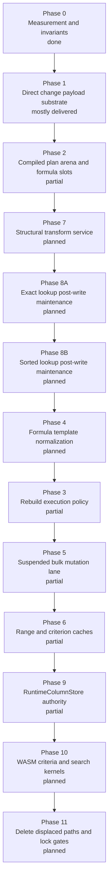
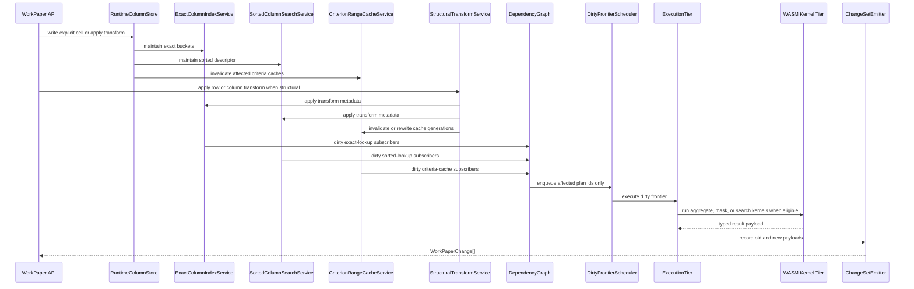

# WorkPaper Ultra-Performance Engine Delivery Plan

Date: `2026-04-12`

Status: `execution-grade, revised against current benchmark reality`

Related documents:

- `/Users/gregkonush/github.com/bilig2/docs/workpaper-ultra-performance-engine-architecture-2026-04-12.md`
- `/Users/gregkonush/github.com/bilig2/docs/workpaper-hyperformula-prior-art-audit-2026-04-12.md`
- `/Users/gregkonush/github.com/bilig2/docs/workpaper-hyperformula-closeout-plan-2026-04-12.md`
- `/Users/gregkonush/github.com/bilig2/docs/workpaper-engine-leadership-program.md`

## Purpose

This document turns the target architecture into a hard migration program for the current
`bilig2` codebase.

The standard is strict:

- no workarounds
- no fallback-first architecture
- no permanent dual ownership
- no “clean it up later”
- no benchmark win that depends on hidden legacy paths

The program must end with one primary engine architecture that beats HyperFormula across the full
expanded competitive suite in this repo.

## Current Benchmark Scoreboard

Latest local expanded smoke artifact: `/tmp/workpaper-vs-hf-expanded-smoke.json`

Current position:

- `WorkPaper` wins `13/31` directly comparable workloads
- `HyperFormula` wins `18/31`
- `WorkPaper` has `1` additional leadership-only workload that HyperFormula does not support
- overall geometric mean is still `1.296x` slower for `WorkPaper`

Current red workloads and their immediate owners:

| Workload | WorkPaper mean | HyperFormula mean | Primary owner |
| --- | ---: | ---: | --- |
| `build-mixed-content` | `43.252125 ms` | `29.092334 ms` | `FormulaTemplateNormalizationService` |
| `build-parser-cache-row-templates` | `139.724333 ms` | `58.085042 ms` | `FormulaTemplateNormalizationService` |
| `build-parser-cache-mixed-templates` | `160.053583 ms` | `91.431542 ms` | `FormulaTemplateNormalizationService` |
| `rebuild-config-toggle` | `33.676625 ms` | `23.042250 ms` | `RebuildExecutionPolicy` |
| `rebuild-runtime-from-snapshot` | `61.807833 ms` | `37.588708 ms` | `RebuildExecutionPolicy` |
| `batch-edit-multi-column` | `1.311875 ms` | `1.234583 ms` | `SuspendedBulkMutationLane` |
| `batch-suspended-single-column` | `1.321250 ms` | `1.215375 ms` | `SuspendedBulkMutationLane` |
| `batch-suspended-multi-column` | `1.176292 ms` | `0.914166 ms` | `SuspendedBulkMutationLane` |
| `structural-insert-rows` | `61.017250 ms` | `8.896625 ms` | `StructuralTransformService` |
| `structural-delete-rows` | `52.228375 ms` | `6.681292 ms` | `StructuralTransformService` |
| `structural-move-rows` | `45.420334 ms` | `10.171417 ms` | `StructuralTransformService` |
| `aggregate-overlapping-ranges` | `4.417125 ms` | `4.227167 ms` | `RangeAggregateCacheService` |
| `aggregate-overlapping-sliding-window` | `0.221334 ms` | `0.094083 ms` | `RangeAggregateCacheService` |
| `lookup-with-column-index-after-column-write` | `3.470084 ms` | `0.134000 ms` | `ExactColumnIndexService` |
| `lookup-with-column-index-after-batch-write` | `2.185792 ms` | `0.831083 ms` | `ExactColumnIndexService` |
| `lookup-approximate-sorted` | `0.103292 ms` | `0.073875 ms` | `SortedColumnSearchService` |
| `lookup-approximate-sorted-after-column-write` | `0.664334 ms` | `0.118333 ms` | `SortedColumnSearchService` |

This program is ordered to flip those lanes first. Any phase that does not map to a red workload
or a blocker for a red workload is not a top priority.

## Delivery Rules

1. JavaScript remains the semantic source of truth.
2. A new path may coexist with an old path only while a specific migration phase is actively
   cutting over.
3. Every phase ends with explicit deletion or hard displacement of the path it replaces.
4. No benchmark win counts if the displaced legacy path is still the common hot path.
5. No subsystem may have permanent mixed ownership between evaluator code and engine services.
6. Structural edits must not route through large ordinary cell-mutation loops after the structural
   transform phase lands.
7. Criteria-function reuse must not live on formulas after the criterion-cache phase lands.
8. Rebuild must not default to persistence reconstruction once rebuild policy is in place.
9. WASM is allowed only for closed kernels with JS oracle parity and typed-memory inputs.
10. No phase is complete if it introduces semantic drift, flaky invalidation, or new cleanup debt.

## Current Phase Status

This is the honest current repo status, not the aspirational one.

| Phase | Status | Reality |
| --- | --- | --- |
| `Phase 0: Measurement and invariants` | `done` | expanded benchmark exists and current red lanes are known |
| `Phase 1: Direct change payload substrate` | `mostly delivered` | direct changed-cell payloads exist and headless no longer depends on ordinary snapshot diffs |
| `Phase 2: Compiled plan arena and formula slots` | `partial` | plan separation exists, but formula-local ownership is not fully gone |
| `Phase 3: Rebuild execution policy` | `partial` | in-place `rebuildAndRecalculate` and snapshot rebuild path exist, but config-toggle is still red |
| `Phase 4: Formula template normalization` | `not delivered` | repeated row-template formulas are still too expensive |
| `Phase 5: Suspended bulk mutation lane` | `partial` | deferred local suspended batches improved, but both single- and multi-column batch lanes are still red |
| `Phase 6: Range and criterion caches` | `partial` | criterion reuse is now real enough to flip one major red lane, but overlapping aggregate reuse is still not delivered |
| `Phase 7: Structural transform service` | `not delivered` | structural insert, delete, and move still behave too much like generic mutation |
| `Phase 8: Post-write lookup maintenance cutover` | `not delivered` | steady-state and after-write exact and sorted lookup lanes are still too broad |
| `Phase 9: RuntimeColumnStore authority` | `partial` | runtime column store boundary exists, but it is not authoritative for all hot lanes |
| `Phase 10: WASM criteria and search kernels` | `not delivered` | WASM exists, but not yet for the remaining red criteria/search ownership problem |
| `Phase 11: Delete displaced paths and lock gates` | `not delivered` | legacy ownership still exists in multiple hot paths |

## HyperFormula Reread Implications

The targeted HyperFormula reread changes the remaining execution order and the definition of done for
the remaining phases.

The important conclusions are:

1. `StructuralTransformService` is the highest-priority remaining subsystem.
   HyperFormula treats row and column insert, remove, and move as dedicated graph, address, range,
   and search transforms, and our structural benchmarks now expose the same missing ownership on our
   side.
2. post-write lookup maintenance stays split.
   `ExactColumnIndexService` and `SortedColumnSearchService` must land as distinct remaining cuts.
   Exact indexed lookup is mutation-owned bucket maintenance. Approximate sorted lookup should remain
   mostly a narrow descriptor plus one search.
3. `FormulaTemplateNormalizationService` must be parser-hash-aware.
   The target is canonical token or template reuse for repeated row-shifted and mixed-template
   formulas, not generic post-bind dedup alone.
4. structural undo and redo are part of the structural phase.
   A structural service that only handles forward transforms is incomplete.

From this point on, the remaining execution order is not “next numeric phase wins.” It is the
priority order below.

## Program Outcome

At the end of this program:

- workbook build precomputes all interactive lookup, range, and criteria state
- rebuild uses explicit mode selection instead of one generic expensive path
- formulas execute through shared compiled plans and template-normalized bindings
- criteria and aggregate reuse is range-owned, not formula-owned
- structural edits are transformer operations, not generic mutation loops
- post-write lookup maintenance is mutation-owned and narrow
- headless consumes direct engine change payloads
- numeric and mask-heavy hot loops run through WASM only where the typed-memory contract is clean

## Phase Graph



## Current Files And Target Ownership

### Files that will be reshaped further

- `/Users/gregkonush/github.com/bilig2/packages/core/src/engine/runtime-state.ts`
- `/Users/gregkonush/github.com/bilig2/packages/core/src/engine/live.ts`
- `/Users/gregkonush/github.com/bilig2/packages/core/src/engine/services/formula-binding-service.ts`
- `/Users/gregkonush/github.com/bilig2/packages/core/src/engine/services/formula-evaluation-service.ts`
- `/Users/gregkonush/github.com/bilig2/packages/core/src/engine/services/lookup-service.ts`
- `/Users/gregkonush/github.com/bilig2/packages/core/src/engine/services/mutation-service.ts`
- `/Users/gregkonush/github.com/bilig2/packages/core/src/engine/services/mutation-support-service.ts`
- `/Users/gregkonush/github.com/bilig2/packages/core/src/engine/services/operation-service.ts`
- `/Users/gregkonush/github.com/bilig2/packages/core/src/engine/services/recalc-service.ts`
- `/Users/gregkonush/github.com/bilig2/packages/core/src/engine/services/read-service.ts`
- `/Users/gregkonush/github.com/bilig2/packages/headless/src/work-paper-runtime.ts`
- `/Users/gregkonush/github.com/bilig2/packages/headless/src/tracked-engine-event-refs.ts`
- `/Users/gregkonush/github.com/bilig2/packages/headless/src/initial-sheet-load.ts`

### New engine modules that must exist

- `/Users/gregkonush/github.com/bilig2/packages/core/src/engine/services/formula-template-normalization-service.ts`
- `/Users/gregkonush/github.com/bilig2/packages/core/src/engine/services/range-aggregate-cache-service.ts`
- `/Users/gregkonush/github.com/bilig2/packages/core/src/engine/services/criterion-range-cache-service.ts`
- `/Users/gregkonush/github.com/bilig2/packages/core/src/engine/services/structural-transform-service.ts`
- `/Users/gregkonush/github.com/bilig2/packages/core/src/engine/services/rebuild-execution-policy-service.ts`
- `/Users/gregkonush/github.com/bilig2/packages/core/src/engine/services/suspended-bulk-mutation-service.ts`

### Existing new modules that must become sole owners

- `/Users/gregkonush/github.com/bilig2/packages/core/src/engine/services/exact-column-index-service.ts`
- `/Users/gregkonush/github.com/bilig2/packages/core/src/engine/services/sorted-column-search-service.ts`
- `/Users/gregkonush/github.com/bilig2/packages/core/src/engine/services/compiled-plan-service.ts`
- `/Users/gregkonush/github.com/bilig2/packages/core/src/engine/services/change-set-emitter-service.ts`
- `/Users/gregkonush/github.com/bilig2/packages/core/src/engine/services/runtime-column-store-service.ts`
- `/Users/gregkonush/github.com/bilig2/packages/core/src/engine/services/dirty-frontier-scheduler-service.ts`

### New WASM-facing modules that must exist

- `/Users/gregkonush/github.com/bilig2/packages/core/src/engine/services/wasm-kernel-dispatch-service.ts`
- `/Users/gregkonush/github.com/bilig2/packages/wasm-kernel/assembly/dispatch-criteria-mask-numeric.ts`
- `/Users/gregkonush/github.com/bilig2/packages/wasm-kernel/assembly/dispatch-criteria-mask-string-id.ts`
- `/Users/gregkonush/github.com/bilig2/packages/wasm-kernel/assembly/dispatch-aggregate-numeric-contiguous.ts`
- `/Users/gregkonush/github.com/bilig2/packages/wasm-kernel/assembly/dispatch-lookup-exact-column.ts`
- `/Users/gregkonush/github.com/bilig2/packages/wasm-kernel/assembly/dispatch-lookup-sorted-column.ts`

## Core Interfaces

These interfaces should be created early and stabilized. They are intentionally boring.

```ts
export interface FormulaTemplateNormalizationService {
  internTemplate(boundFormula: BoundFormulaShape): TemplateBinding;
  resolvePlan(template: TemplateBinding): PlanId;
}

export interface RebuildExecutionPolicyService {
  chooseMode(request: RebuildRequest): "recalculateAll" | "rebuildRuntimeFromSnapshot" | "rebuildFromPersistence";
}

export interface SuspendedBulkMutationService {
  beginBatch(kind: "local" | "undoable"): void;
  recordCellMutation(mutation: DeferredCellMutation): void;
  flushBatch(): readonly WorkPaperChange[];
}

export interface RangeAggregateCacheService {
  getOrBuild(request: AggregateCacheRequest): AggregateCacheHandle;
  invalidateRange(rangeHandle: RangeHandle): void;
}

export interface CriterionRangeCacheService {
  getOrBuild(request: CriterionCacheRequest): CriterionCacheHandle;
  invalidateRange(rangeHandle: RangeHandle): void;
}

export interface StructuralTransformService {
  insertRows(request: InsertRowsRequest): TransformResult;
  removeRows(request: RemoveRowsRequest): TransformResult;
  moveRows(request: MoveRowsRequest): TransformResult;
  insertColumns(request: InsertColumnsRequest): TransformResult;
  removeColumns(request: RemoveColumnsRequest): TransformResult;
  moveColumns(request: MoveColumnsRequest): TransformResult;
}
```

## Phase 0: Measurement And Invariants

### Goal

Freeze the semantic and performance guardrails before deeper storage and ownership changes.

### Work

- keep the expanded benchmark artifact runnable and reproducible
- keep workload-specific correctness tests around:
  - exact indexed lookup after column write
  - approximate sorted lookup after column write
  - criteria-function correctness on reused ranges
  - structural row insert and move correctness
  - rebuild-config equivalence

### Exit gate

- benchmark artifacts are stable enough to compare before and after phase results
- invariants tests cover every workload that the remaining red lanes exercise

## Phase 1: Direct Change Payload Substrate

### Goal

Keep ordinary change ownership in the engine so headless never reconstructs it by diffing state.

### Benchmark proof gate

- single explicit plus recalculated change emission remains green and faster than the old snapshot
  diff route

### Delete target

- any remaining ordinary headless before and after workbook diff logic

### Exit gate

- `WorkPaper` ordinary edit flows consume engine-emitted `WorkPaperChange[]` directly

## Phase 2: Compiled Plan Arena And Formula Slots

### Goal

Make shared compiled plans the primary runtime unit instead of heavyweight formula-local state.

### Work

- finish moving formula runtime identity to `planId` plus lightweight binding records
- stop storing primary lookup and criteria ownership on formula instances

### Benchmark proof gate

- no regression on current green build, recalc, and lookup workloads

### Delete target

- formula-local primary lookup and criteria ownership fields once their engine services are ready

### Exit gate

- identical repeated shapes resolve to shared compiled plans and lightweight bindings only

## Phase 3: Rebuild Execution Policy

### Goal

Make rebuild choose the cheapest valid mode and delete the generic expensive default.

### Reread note

This phase remains necessary, but it no longer comes first among the remaining red lanes.
The HyperFormula reread shows they still win rebuild lanes while doing real rebuilds, which means
our first win condition is to remove more expensive structural and post-write ownership mistakes
before trying to squeeze rebuild policy alone.

### Work

- formalize `recalculateAll`, `rebuildRuntimeFromSnapshot`, and `rebuildFromPersistence`
- keep in-place full recalc as the primary path for rebuild-and-recalculate
- keep snapshot import as the primary path when config changes preserve function and language surface

### Files

- `/Users/gregkonush/github.com/bilig2/packages/headless/src/work-paper-runtime.ts`
- `/Users/gregkonush/github.com/bilig2/packages/core/src/engine/services/rebuild-execution-policy-service.ts`

### Benchmark proof gate

- `rebuild-config-toggle` must flip green against the current HyperFormula reference on the same
  harness
- `rebuild-runtime-from-snapshot` must also flip green once that workload is in the expanded suite
- current references from the latest smoke artifact are `21.965958 ms` and `36.413625 ms`

### Delete target

- generic persistence reconstruction as the default config-toggle rebuild path

### Exit gate

- rebuild mode selection is explicit, covered by tests, and the old default path is no longer hot

## Phase 4: Formula Template Normalization Service

### Goal

Normalize repeated row and column template formulas so mixed build and parser-cache workloads stop
paying per-cell compile cost.

### Work

- create `formula-template-normalization-service.ts`
- canonicalize repeated row-shifted and column-shifted formula shapes
- canonicalize parser-hash-equivalent token or AST families, not just already-bound formulas
- make `CompiledPlanService` intern by template family plus lightweight offset bindings
- build mixed-content sheets through template-normalized plan creation instead of repeated compile

### Files

- `/Users/gregkonush/github.com/bilig2/packages/core/src/engine/services/formula-template-normalization-service.ts`
- `/Users/gregkonush/github.com/bilig2/packages/core/src/engine/services/formula-binding-service.ts`
- `/Users/gregkonush/github.com/bilig2/packages/core/src/engine/services/compiled-plan-service.ts`
- `/Users/gregkonush/github.com/bilig2/packages/headless/src/initial-sheet-load.ts`

### Benchmark proof gate

- `build-parser-cache-row-templates` must flip green against the current HyperFormula reference
- `build-parser-cache-mixed-templates` must also flip green
- `build-mixed-content` must also flip green
- current references from the latest smoke artifact are `46.068834 ms`, `83.035584 ms`, and
  `17.289583 ms`

### Delete target

- repeated per-cell compilation of identical relative formula shapes in build and rebuild paths

### Exit gate

- mixed-content build and row-template parser-cache workloads are green and stable on rerun

## Phase 5: Suspended Bulk Mutation Lane

### Goal

Make suspended and ordinary multi-edit batches pay one mutation frontier and one emission pass.

### Work

- promote deferred suspended cell mutation batching into a first-class engine service
- make multi-column batches use one transaction scaffold, one dirty-frontier setup, and one change
  emission
- remove per-edit transaction or history scaffolding from the hot suspended path

### Files

- `/Users/gregkonush/github.com/bilig2/packages/core/src/engine/services/suspended-bulk-mutation-service.ts`
- `/Users/gregkonush/github.com/bilig2/packages/core/src/engine/services/mutation-service.ts`
- `/Users/gregkonush/github.com/bilig2/packages/core/src/engine/services/operation-service.ts`
- `/Users/gregkonush/github.com/bilig2/packages/headless/src/work-paper-runtime.ts`

### Benchmark proof gate

- `batch-edit-single-column` must flip green
- `batch-edit-multi-column` must flip green
- `batch-suspended-single-column` must flip green
- `batch-suspended-multi-column` must flip green
- current references are `1.462292 ms`, `1.182917 ms`, `1.014958 ms`, and `0.900708 ms`

### Delete target

- per-edit transaction scaffolding on the suspended and batched multi-column hot path

### Exit gate

- batch and suspended single- and multi-column edits are green and the old per-edit hot path is
  displaced

## Phase 6: Range And Criterion Caches

### Goal

Finish the criterion-cache ownership cut and add overlapping aggregate reuse.

### Work

- create `range-aggregate-cache-service.ts`
- create `criterion-range-cache-service.ts`
- create range cache roots in the `RangeEntityStore`
- support prefix-cache reuse and dependent-cache invalidation
- cut `COUNTIF`, `COUNTIFS`, `SUMIF`, `SUMIFS`, `AVERAGEIF`, and `AVERAGEIFS` over to the new
  service
- keep criterion invalidation range-owned; do not move supported criteria shapes back into
  formula-local refresh logic

### Files

- `/Users/gregkonush/github.com/bilig2/packages/core/src/engine/services/range-aggregate-cache-service.ts`
- `/Users/gregkonush/github.com/bilig2/packages/core/src/engine/services/criterion-range-cache-service.ts`
- `/Users/gregkonush/github.com/bilig2/packages/core/src/engine/services/formula-evaluation-service.ts`
- `/Users/gregkonush/github.com/bilig2/packages/core/src/engine/services/formula-binding-service.ts`

### Benchmark proof gate

- `aggregate-overlapping-ranges` must flip green
- `aggregate-overlapping-sliding-window` must flip green
- `conditional-aggregation-reused-ranges` must stay green on reruns
- `conditional-aggregation-criteria-cell-edit` must stay green once added to the expanded suite
- current references are `2.784167 ms`, `0.097750 ms`, `1.110750 ms`, and `1.800375 ms`

### Delete target

- repeated evaluator-time aggregate rescans on overlapping ranges
- repeated evaluator-time criteria rescans over reused identical ranges

### Exit gate

- aggregate and criteria reuse is range-owned and the old per-formula rescan path is gone for the
  supported shapes

## Phase 7: Structural Transform Service

### Goal

Make row and column insert, remove, and move operations dedicated engine transforms.

### Work

- create `structural-transform-service.ts`
- move row and column insert, delete, and move logic out of generic mutation loops
- make structural undo and redo reuse the same transform model and transform history
- update:
  - row indirection
  - range handles
  - formula address rewrites
  - exact and sorted lookup services
  - range and criterion caches
  - dependency graph generations

### Files

- `/Users/gregkonush/github.com/bilig2/packages/core/src/engine/services/structural-transform-service.ts`
- `/Users/gregkonush/github.com/bilig2/packages/core/src/engine/services/operation-service.ts`
- `/Users/gregkonush/github.com/bilig2/packages/core/src/engine/services/mutation-service.ts`
- `/Users/gregkonush/github.com/bilig2/packages/core/src/engine/services/formula-binding-service.ts`

### Benchmark proof gate

- `structural-insert-rows` must flip green
- `structural-delete-rows` must flip green
- `structural-move-rows` must flip green
- current references are `5.767042 ms`, `8.096500 ms`, and `8.801333 ms`

### Delete target

- structural insert or move implemented as large ordinary cell-mutation loops

### Exit gate

- structural row and column operations are transformer-owned, structural undo and redo use the same
  service, and the old generic loop path is gone

## Phase 8: Post-Write Lookup Maintenance Cutover

### Goal

Make post-write exact and approximate lookup maintenance fully mutation-owned and narrow.

### Work

- phase `8A`: make `ExactColumnIndexService` the sole owner for post-write exact lookup maintenance
- phase `8B`: make `SortedColumnSearchService` the sole owner for post-write approximate lookup
  maintenance
- stop paying evaluator refresh, rebinding, or broad invalidation on simple column writes
- narrow dirty-frontier wakeups to direct lookup subscribers

### Files

- `/Users/gregkonush/github.com/bilig2/packages/core/src/engine/services/exact-column-index-service.ts`
- `/Users/gregkonush/github.com/bilig2/packages/core/src/engine/services/sorted-column-search-service.ts`
- `/Users/gregkonush/github.com/bilig2/packages/core/src/engine/services/operation-service.ts`
- `/Users/gregkonush/github.com/bilig2/packages/core/src/engine/services/formula-evaluation-service.ts`
- `/Users/gregkonush/github.com/bilig2/packages/core/src/engine/services/lookup-service.ts`

### Benchmark proof gate

- `lookup-with-column-index-after-column-write` must flip green
- `lookup-with-column-index-after-batch-write` must flip green
- `lookup-with-column-index` must also flip green
- `lookup-approximate-sorted` must also flip green
- `lookup-approximate-sorted-after-column-write` must flip green
- current references are `0.160166 ms`, `0.104417 ms`, `0.831625 ms`, `0.054875 ms`, and
  `0.072333 ms`

### Delete target

- evaluator-owned or formula-owned post-write lookup refresh logic
- broad column-write invalidation on the exact and sorted lookup hot path

### Exit gate

- after-write exact and sorted lookup workloads are green, exact and sorted cuts landed in that
  order, the steady-state lookup lanes are also green, and the old mixed-ownership path is gone

## Phase 9: RuntimeColumnStore Authority

### Goal

Make typed runtime storage authoritative for all hot-path lookup, criteria, and aggregate reads.

### Work

- complete migration of hot-path reads and writes onto typed column-native storage
- make criteria mask generation and aggregate reuse consume typed slices directly
- displace cell-object-centric hot reads from all competitive workloads

### Benchmark proof gate

- no regression on newly green lookup, criteria, aggregate, or structural lanes

### Delete target

- cell-object-centric hot reads for lookup, criteria, and aggregate workloads

### Exit gate

- typed runtime storage is the sole hot-path storage for the competitive workloads

## Phase 10: WASM Criteria And Search Kernels

### Goal

Push closed numeric and criteria-mask kernels into `packages/wasm-kernel` only after ownership is
correct.

### Work

- create kernels for:
  - numeric aggregate
  - numeric criteria mask generation
  - string-id criteria mask generation
  - exact numeric lookup
  - sorted numeric lookup
- feed kernels typed slices and explicit descriptors only
- keep criterion parsing and string wildcard semantics in JS

### Files

- `/Users/gregkonush/github.com/bilig2/packages/core/src/engine/services/wasm-kernel-dispatch-service.ts`
- `/Users/gregkonush/github.com/bilig2/packages/core/src/engine/services/formula-evaluation-service.ts`
- `/Users/gregkonush/github.com/bilig2/packages/wasm-kernel/assembly/dispatch-criteria-mask-numeric.ts`
- `/Users/gregkonush/github.com/bilig2/packages/wasm-kernel/assembly/dispatch-criteria-mask-string-id.ts`
- `/Users/gregkonush/github.com/bilig2/packages/wasm-kernel/assembly/dispatch-aggregate-numeric-contiguous.ts`
- `/Users/gregkonush/github.com/bilig2/packages/wasm-kernel/assembly/dispatch-lookup-exact-column.ts`
- `/Users/gregkonush/github.com/bilig2/packages/wasm-kernel/assembly/dispatch-lookup-sorted-column.ts`

### Benchmark proof gate

- criteria, aggregate, and lookup workloads remain green after kernel dispatch
- marshaling cost does not erase the gain on the target lanes

### Delete target

- JS object materialization before criteria, aggregate, or search kernel dispatch

### Exit gate

- WASM kernels accelerate the intended lanes without semantic regressions or fake wins

## Phase 11: Delete Displaced Paths And Lock Gates

### Goal

End with one clean architecture.

### Work

- delete formula-local primary lookup ownership
- delete formula-local primary criteria ownership
- delete public-surface rebuild as a default hot path
- delete structural edit implementation through generic mutation loops
- delete remaining lookup and criteria fallback ownership from evaluator hot paths
- tighten CI and benchmark gates so the new architecture is defended

### Benchmark proof gate

- `31/31` directly comparable workload wins on the expanded suite on a clean committed tree
- rerun on the same machine with `--sample-count 3 --warmup-count 1`

### Required repo gates

- `pnpm run ci`
- focused engine, headless, and WASM suites for touched subsystems
- expanded benchmark rerun on the committed tree

### Exit gate

- there is one primary runtime architecture, not two
- every red workload from the current scoreboard is green
- deleted paths are not still present for convenience

## Detailed Runtime Flow



## Benchmarks And Test Gates

### Required tests

- exact lookup correctness after column writes
- approximate lookup correctness after column writes
- criteria-function correctness with reused range caches
- structural row and column transform correctness
- rebuild-config equivalence
- JS and WASM parity for every new kernel

### Required benchmark command

`pnpm exec tsx packages/benchmarks/src/benchmark-workpaper-vs-hyperformula-expanded.ts --sample-count 3 --warmup-count 1`

### Required benchmark rule

No phase is done if it wins only its target workload while turning a previously green workload red.

## Stop Conditions

The program must stop and correct course if any phase produces one of these outcomes:

- benchmark win with semantic drift
- benchmark win that still routes common hot work through the legacy path
- persistent mixed ownership between evaluator code and an engine service
- WASM kernel whose marshaling cost erases the gain
- structural transform phase that still leaves generic mutation loops on the hot path
- criterion cache phase that still leaves per-formula criteria rescans for supported shapes

These are not acceptable tradeoffs.

## Delivery Sequence

The execution order is fixed:

1. direct change payload substrate
2. compiled plan arena and formula slots
3. structural transform service
4. exact lookup post-write maintenance
5. sorted lookup post-write maintenance
6. formula template normalization
7. rebuild execution policy
8. suspended bulk mutation lane
9. range and criterion caches
10. runtime column store authority
11. WASM criteria and search kernels
12. delete displaced paths

This order matters because:

- structural transforms are the clearest remaining ownership mismatch against HyperFormula and now
  dominate the structural red family
- exact indexed lookup after writes must land before sorted lookup after writes because the two
  services have different ownership and invalidation costs
- template normalization comes before rebuild policy because rebuild speed will stay red while build
  still recompiles repeated row-shifted and mixed-template formulas
- rebuild policy comes after template normalization because it should choose among already-cheaper
  rebuild modes
- suspended bulk mutation remains important, but it is no longer ahead of structural and post-write
  ownership cuts
- range and criterion caches come after the structural and lookup cuts because one major criterion
  lane is already green and the remaining aggregate work depends on stable range ownership
- WASM is last because it amplifies the right architecture; it does not rescue the wrong one

## Done Definition

This delivery program is complete only when all of the following are true:

1. `WorkPaper` wins all directly comparable workloads in the expanded benchmark suite
2. `conditional-aggregation-reused-ranges` is range-cache-owned and green
3. `structural-insert-rows`, `structural-delete-rows`, and `structural-move-rows` are
   transformer-owned and green
4. `lookup-with-column-index-after-column-write` and
   `lookup-with-column-index-after-batch-write` are exact-index-owned and green
5. `lookup-approximate-sorted-after-column-write` is sorted-service-owned and green
6. `build-parser-cache-row-templates`, `build-parser-cache-mixed-templates`, and
   `build-mixed-content` are template-normalization-owned and green
7. `rebuild-config-toggle` and `rebuild-runtime-from-snapshot` are rebuild-policy-owned and green
8. structural undo and redo share the same transform model as forward structural edits
9. displaced legacy paths are deleted

That is the bar. Not “faster in some cases.” Not “cleaner but still red.” Green across the full
competitive suite, with one architecture and no fallback-first sludge.
