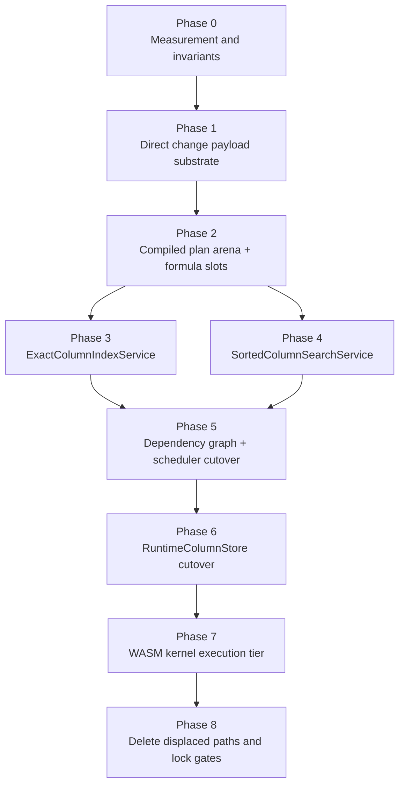
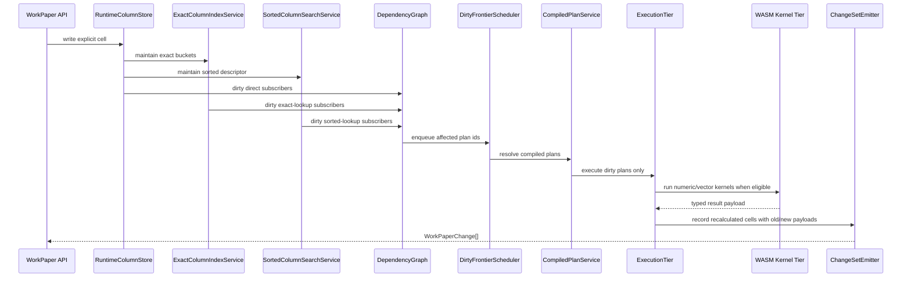

# WorkPaper Ultra-Performance Engine Delivery Plan

Date: `2026-04-12`

Status: `execution-grade`

Related documents:

- `/Users/gregkonush/github.com/bilig2/docs/workpaper-ultra-performance-engine-architecture-2026-04-12.md`
- `/Users/gregkonush/github.com/bilig2/docs/workpaper-hyperformula-prior-art-audit-2026-04-12.md`
- `/Users/gregkonush/github.com/bilig2/docs/workpaper-hyperformula-closeout-plan-2026-04-12.md`
- `/Users/gregkonush/github.com/bilig2/docs/workpaper-engine-leadership-program.md`

## Purpose

This document turns the target architecture into an implementation program that can be executed
inside the current `bilig2` codebase without hacks, temporary ownership confusion, or “clean it up
later” phases.

The standard is strict:

- high performance
- high correctness
- deterministic behavior
- narrow ownership boundaries
- measurable benchmark improvement
- no compatibility sludge as the primary architecture

This plan assumes the current repo layout and current engine files in:

- `/Users/gregkonush/github.com/bilig2/packages/core/src/engine`
- `/Users/gregkonush/github.com/bilig2/packages/headless/src`
- `/Users/gregkonush/github.com/bilig2/packages/wasm-kernel`

## Delivery Rules

1. JavaScript remains the semantic source of truth.
2. New hot-path storage and services may coexist with old runtime state only while a phase is
   actively migrating.
3. Each phase must end with a real cutover, not a permanent dual-path architecture.
4. Mutation-owned search maintenance is mandatory.
5. Headless change emission must move to engine-emitted old/new payloads before the end of the
   program.
6. WASM acceleration is allowed only for closed kernels with JS oracle parity.
7. No phase is complete if benchmark wins come with new semantic drift.

## Program Outcome

At the end of this program:

- workbook build precomputes all interactive lookup state
- exact indexed lookup is served by an engine-owned exact index service
- approximate sorted lookup is served by a separate engine-owned sorted search service
- formulas execute through shared compiled plan records rather than formula-local primary caches
- headless consumes direct engine change payloads
- numeric/vector hot loops run through WASM kernels fed by typed runtime storage

## Phase Graph



## Current Files And Target Ownership

### Files that will be reshaped

- `/Users/gregkonush/github.com/bilig2/packages/core/src/engine/runtime-state.ts`
- `/Users/gregkonush/github.com/bilig2/packages/core/src/engine/live.ts`
- `/Users/gregkonush/github.com/bilig2/packages/core/src/engine/services/formula-binding-service.ts`
- `/Users/gregkonush/github.com/bilig2/packages/core/src/engine/services/formula-evaluation-service.ts`
- `/Users/gregkonush/github.com/bilig2/packages/core/src/engine/services/lookup-service.ts`
- `/Users/gregkonush/github.com/bilig2/packages/core/src/engine/services/mutation-service.ts`
- `/Users/gregkonush/github.com/bilig2/packages/core/src/engine/services/mutation-support-service.ts`
- `/Users/gregkonush/github.com/bilig2/packages/core/src/engine/services/operation-service.ts`
- `/Users/gregkonush/github.com/bilig2/packages/core/src/engine/services/recalc-service.ts`
- `/Users/gregkonush/github.com/bilig2/packages/core/src/engine/services/event-service.ts`
- `/Users/gregkonush/github.com/bilig2/packages/headless/src/work-paper-runtime.ts`
- `/Users/gregkonush/github.com/bilig2/packages/headless/src/tracked-engine-event-refs.ts`
- `/Users/gregkonush/github.com/bilig2/packages/headless/src/initial-sheet-load.ts`

### New engine modules to add

- `/Users/gregkonush/github.com/bilig2/packages/core/src/engine/services/exact-column-index-service.ts`
- `/Users/gregkonush/github.com/bilig2/packages/core/src/engine/services/sorted-column-search-service.ts`
- `/Users/gregkonush/github.com/bilig2/packages/core/src/engine/services/compiled-plan-service.ts`
- `/Users/gregkonush/github.com/bilig2/packages/core/src/engine/services/change-set-emitter-service.ts`
- `/Users/gregkonush/github.com/bilig2/packages/core/src/engine/services/runtime-column-store-service.ts`
- `/Users/gregkonush/github.com/bilig2/packages/core/src/engine/services/dirty-frontier-scheduler-service.ts`

### New WASM-facing modules to add

- `/Users/gregkonush/github.com/bilig2/packages/core/src/engine/services/wasm-kernel-dispatch-service.ts`
- `/Users/gregkonush/github.com/bilig2/packages/wasm-kernel/assembly/dispatch-lookup-exact-column.ts`
- `/Users/gregkonush/github.com/bilig2/packages/wasm-kernel/assembly/dispatch-lookup-sorted-column.ts`
- `/Users/gregkonush/github.com/bilig2/packages/wasm-kernel/assembly/dispatch-aggregate-numeric-contiguous.ts`
- `/Users/gregkonush/github.com/bilig2/packages/wasm-kernel/assembly/dispatch-spill-copy-numeric.ts`

## Core Interfaces

The following interfaces should be created early and then stabilized.

```ts
export interface RuntimeColumnSlice {
  readonly sheetId: number;
  readonly columnId: number;
  readonly rowStart: number;
  readonly rowEndExclusive: number;
  readonly kind: "number" | "string" | "boolean" | "mixed";
  readonly values: Float64Array | Uint32Array | Uint8Array;
  readonly tags: Uint8Array;
}

export interface ExactColumnIndexService {
  buildForSheet(sheetId: number): void;
  applyLiteralWrite(change: CellValueChange): void;
  applyFormulaResultChange(change: CellValueChange): void;
  applyStructureChange(change: StructureMutation): void;
  findFirst(request: ExactLookupRequest): ExactLookupResult;
  findLast(request: ExactLookupRequest): ExactLookupResult;
}

export interface SortedColumnSearchService {
  buildForSheet(sheetId: number): void;
  applyLiteralWrite(change: CellValueChange): void;
  applyFormulaResultChange(change: CellValueChange): void;
  applyStructureChange(change: StructureMutation): void;
  findFloor(request: SortedLookupRequest): SortedLookupResult;
  findCeiling(request: SortedLookupRequest): SortedLookupResult;
}

export interface CompiledPlanService {
  intern(boundFormula: BoundFormulaShape): PlanId;
  get(planId: PlanId): CompiledFormulaPlan;
}

export interface ChangeSetEmitterService {
  beginMutation(): void;
  recordExplicitCell(change: CellValueChange): void;
  recordRecalculatedCell(change: CellValueChange): void;
  finishMutation(): readonly WorkPaperChange[];
}
```

These interfaces are intentionally boring. They are designed to keep:

- formula binding out of mutation maintenance
- search ownership out of the evaluator
- change emission out of headless reconstruction

## Phase 0: Measurement And Invariants

### Goal

Freeze the semantic and performance guardrails before moving core storage and ownership.

### Work

- keep current benchmark artifacts runnable and reproducible
- add dedicated benchmark fixtures for:
  - exact indexed lookup on fresh build
  - exact indexed lookup on warmed build
  - approximate sorted lookup on fresh build
  - approximate sorted lookup on warmed build
  - headless change emission on single explicit plus one recalculated cell
- add explicit engine invariants tests for:
  - exact lookup correctness over mixed numeric/string columns
  - approximate lookup correctness over ascending and descending ranges
  - structural edit correctness for row insert/remove/move

### Files

- `/Users/gregkonush/github.com/bilig2/packages/benchmarks/src`
- `/Users/gregkonush/github.com/bilig2/packages/core/src/__tests__`
- `/Users/gregkonush/github.com/bilig2/packages/headless/src/__tests__`

### Exit Gate

- benchmarks are stable enough to compare before/after phase results
- invariants tests cover all target lookup semantics that the new services will own

## Phase 1: Direct Change Payload Substrate

### Goal

Move change ownership into the engine so headless no longer reconstructs changes by diffing state.

### Work

- create `change-set-emitter-service.ts`
- extend engine mutation events to carry:
  - changed cell id
  - old tag/payload
  - new tag/payload
  - explicit vs recalculated cause
  - spill region add/remove metadata
- change tracked event capture to preserve those direct payloads
- cut `WorkPaper.captureChanges(...)` over to engine-emitted `WorkPaperChange[]`

### Files

- `/Users/gregkonush/github.com/bilig2/packages/core/src/engine/services/event-service.ts`
- `/Users/gregkonush/github.com/bilig2/packages/core/src/engine/services/mutation-support-service.ts`
- `/Users/gregkonush/github.com/bilig2/packages/core/src/engine/services/change-set-emitter-service.ts`
- `/Users/gregkonush/github.com/bilig2/packages/headless/src/tracked-engine-event-refs.ts`
- `/Users/gregkonush/github.com/bilig2/packages/headless/src/work-paper-runtime.ts`

### Rules

- no visibility snapshot diffing on the ordinary mutation path after this phase
- structural invalidation may still emit broad ranges, but only from engine-owned data

### Exit Gate

- `WorkPaper` no longer computes ordinary changes by comparing before/after workbook state
- single-edit change emission benchmark is materially faster and semantically identical

## Phase 2: Compiled Plan Arena And Formula Slots

### Goal

Make formulas share compiled runtime plans and reduce formula-local primary state.

### Work

- create `compiled-plan-service.ts`
- move canonical formula shape interning out of per-formula binding records
- add `formulaSlotId` to runtime cells
- change `runtime-state.ts` so formula cells store slot ids and result payloads, not heavyweight
  prepared search ownership
- make `formula-binding-service.ts` bind plan ids plus lightweight relative bindings

### Files

- `/Users/gregkonush/github.com/bilig2/packages/core/src/engine/runtime-state.ts`
- `/Users/gregkonush/github.com/bilig2/packages/core/src/engine/services/compiled-plan-service.ts`
- `/Users/gregkonush/github.com/bilig2/packages/core/src/engine/services/formula-binding-service.ts`
- `/Users/gregkonush/github.com/bilig2/packages/core/src/engine/services/formula-evaluation-service.ts`

### Exit Gate

- identical formulas on equivalent shapes share one compiled plan body
- formula runtime state becomes smaller and lookup ownership starts moving out of formulas

## Phase 3: ExactColumnIndexService

### Goal

Make exact lookup a first-class mutation-owned engine service.

### Work

- create `exact-column-index-service.ts`
- maintain per-column buckets for:
  - numeric values
  - interned string ids
  - optional boolean buckets
- build exact indexes during workbook build
- update exact indexes on:
  - literal writes
  - formula result changes
  - clear operations
  - row/column structural edits
- cut `MATCH(...,0)`, exact `XMATCH`, exact `XLOOKUP`, and exact vertical/horizontal lookup
  families over to this service

### Files

- `/Users/gregkonush/github.com/bilig2/packages/core/src/engine/services/exact-column-index-service.ts`
- `/Users/gregkonush/github.com/bilig2/packages/core/src/engine/services/lookup-service.ts`
- `/Users/gregkonush/github.com/bilig2/packages/core/src/engine/services/mutation-service.ts`
- `/Users/gregkonush/github.com/bilig2/packages/core/src/engine/services/operation-service.ts`
- `/Users/gregkonush/github.com/bilig2/packages/core/src/engine/services/formula-evaluation-service.ts`
- `/Users/gregkonush/github.com/bilig2/packages/headless/src/initial-sheet-load.ts`

### Rules

- formula-local exact lookup descriptors stop being the primary source of truth
- exact lookup queries must be satisfied from the engine service directly

### Exit Gate

- `lookup-with-column-index` no longer depends on formula-owned prepared descriptors
- fresh-build exact lookup benchmark stops paying first-mutation setup cost

## Phase 4: SortedColumnSearchService

### Goal

Make approximate sorted lookup a separate engine service, not an extension of exact indexing.

### Work

- create `sorted-column-search-service.ts`
- maintain monotonic descriptors and type-family descriptors per column
- add arithmetic progression hints where the runtime column permits it
- build sorted descriptors during workbook build
- update sorted descriptors on:
  - literal writes
  - formula result changes
  - structural edits
- cut approximate `MATCH`, approximate `XMATCH`, and approximate `XLOOKUP` over to this service

### Files

- `/Users/gregkonush/github.com/bilig2/packages/core/src/engine/services/sorted-column-search-service.ts`
- `/Users/gregkonush/github.com/bilig2/packages/core/src/engine/services/lookup-service.ts`
- `/Users/gregkonush/github.com/bilig2/packages/core/src/engine/services/mutation-service.ts`
- `/Users/gregkonush/github.com/bilig2/packages/core/src/engine/services/operation-service.ts`
- `/Users/gregkonush/github.com/bilig2/packages/core/src/engine/services/formula-evaluation-service.ts`

### Rules

- approximate sorted lookup must not route through exact index machinery
- approximate sorted lookup must not materialize generic JS vectors on the hot path

### Exit Gate

- `lookup-approximate-sorted` is served entirely by the sorted search service
- sorted search queries are bounded to arithmetic solve or one binary search over runtime storage

## Phase 5: Dependency Graph And Scheduler Cutover

### Goal

Make the dirty frontier precise enough that lookup and aggregate plans wake only when relevant
column or range services change.

### Work

- add column-service subscriber edges
- add range-service subscriber edges
- create `dirty-frontier-scheduler-service.ts`
- move away from generic event unions and broad subscriber wakeups
- preallocate dirty queues and use generation-based dedupe

### Files

- `/Users/gregkonush/github.com/bilig2/packages/core/src/engine/services/formula-graph-service.ts`
- `/Users/gregkonush/github.com/bilig2/packages/core/src/engine/services/recalc-service.ts`
- `/Users/gregkonush/github.com/bilig2/packages/core/src/engine/services/dirty-frontier-scheduler-service.ts`
- `/Users/gregkonush/github.com/bilig2/packages/core/src/engine/services/mutation-support-service.ts`

### Exit Gate

- exact and sorted lookup plans subscribe to engine services, not generic cell-by-cell wakeups
- single-edit-chain and batch-edit recalculation become narrower and more stable

## Phase 6: RuntimeColumnStore Cutover

### Goal

Move hot runtime reads and writes onto typed column-native storage.

### Work

- create `runtime-column-store-service.ts`
- add typed runtime columns:
  - `Float64Array`
  - `Uint32Array`
  - `Uint8Array`
  - tag arrays
- add row indirection support
- wire literal writes and formula result writes into the column store
- make exact and sorted services read from the new runtime storage
- make aggregate range reads use column slices

### Files

- `/Users/gregkonush/github.com/bilig2/packages/core/src/engine/services/runtime-column-store-service.ts`
- `/Users/gregkonush/github.com/bilig2/packages/core/src/engine/runtime-state.ts`
- `/Users/gregkonush/github.com/bilig2/packages/core/src/engine/services/read-service.ts`
- `/Users/gregkonush/github.com/bilig2/packages/core/src/engine/services/cell-state-service.ts`
- `/Users/gregkonush/github.com/bilig2/packages/core/src/engine/services/formula-evaluation-service.ts`

### Rules

- new runtime storage must be authoritative for hot-path numeric and lookup reads
- persistence model remains plain and serializable

### Exit Gate

- exact lookup, sorted lookup, and aggregate range access use typed runtime storage directly
- cell-object-centric hot-path reads are displaced from competitive workloads

## Phase 7: WASM Kernel Execution Tier

### Goal

Push closed numeric/vector hot loops into `packages/wasm-kernel` with strict JS oracle parity.

### Work

- create `wasm-kernel-dispatch-service.ts`
- add kernels for:
  - contiguous numeric aggregates
  - exact numeric lookup
  - sorted numeric lookup
  - vector compare masks
  - dense numeric spill copy
- feed kernels typed slices and explicit descriptors only
- reconcile WASM outputs through JS semantic result shaping

### Files

- `/Users/gregkonush/github.com/bilig2/packages/core/src/engine/services/wasm-kernel-dispatch-service.ts`
- `/Users/gregkonush/github.com/bilig2/packages/core/src/engine/services/formula-evaluation-service.ts`
- `/Users/gregkonush/github.com/bilig2/packages/wasm-kernel/assembly/dispatch-aggregate-numeric-contiguous.ts`
- `/Users/gregkonush/github.com/bilig2/packages/wasm-kernel/assembly/dispatch-lookup-exact-column.ts`
- `/Users/gregkonush/github.com/bilig2/packages/wasm-kernel/assembly/dispatch-lookup-sorted-column.ts`
- `/Users/gregkonush/github.com/bilig2/packages/wasm-kernel/assembly/dispatch-spill-copy-numeric.ts`
- `/Users/gregkonush/github.com/bilig2/packages/wasm-kernel/src/__tests__`

### Rules

- no dynamic object marshaling into WASM kernels
- no mixed string/object semantics delegated to WASM
- every kernel has differential tests against JS

### Exit Gate

- numeric/vector hot loops show real gains after marshaling cost
- no semantic regressions against JS oracle suites

## Phase 8: Delete Displaced Paths And Lock Gates

### Goal

End the migration with one clean architecture.

### Work

- remove formula-local primary lookup descriptor ownership
- remove headless before/after diff reconstruction on the ordinary path
- remove displaced range-materialization lookup paths where the new services now own them
- collapse transitional dual-storage reads once runtime column store is authoritative
- tighten CI and benchmark gates so the new architecture is defended

### Exit Gate

- there is one primary runtime architecture, not two
- all targeted workloads run through the intended services
- deleted paths are not still carried for convenience

## Detailed Runtime Flow



## Benchmarks And Test Gates

### Required tests

- engine invariants for exact lookup
- engine invariants for sorted lookup
- structural edit tests for index and sorted descriptor maintenance
- differential JS/WASM parity tests for every new kernel
- headless change emission tests proving no before/after diff dependence

### Required benchmarks

- fresh-build exact lookup mutation
- warmed exact lookup mutation
- fresh-build approximate lookup mutation
- warmed approximate lookup mutation
- single explicit plus one recalculated change emission
- large contiguous numeric aggregate

### Required repo gates

- `pnpm typecheck`
- focused engine/headless/wasm Vitest suites
- competitive benchmark regeneration on the touched workloads before final merge

## Stop Conditions

The program must stop and correct course if any phase produces one of these outcomes:

- benchmark win with semantic drift
- persistent dual-ownership between evaluator and engine service for the same lookup family
- WASM kernel whose marshaling cost erases the runtime gain
- headless regression that reintroduces state reconstruction

These are not acceptable tradeoffs.

## Delivery Sequence

The execution order is fixed:

1. direct change payload substrate
2. compiled plan arena and formula slots
3. exact column index service
4. sorted column search service
5. dependency graph and scheduler cutover
6. runtime column store cutover
7. WASM kernel execution tier
8. delete displaced paths

This order matters because:

- Phase 1 removes facade overhead that can hide real engine wins
- Phases 3 and 4 move lookup ownership to the correct layer before runtime storage changes
- Phase 6 gives WASM the typed memory topology it actually needs
- Phase 8 is where the architecture becomes clean enough to defend long-term

## Done Definition

This delivery program is complete only when all of the following are true:

1. exact lookup is engine-owned, mutation-maintained, and benchmark-leading
2. approximate sorted lookup is engine-owned, mutation-maintained, and benchmark-leading
3. first mutation after build pays no lookup-state initialization cost
4. headless change emission no longer reconstructs ordinary changes from workbook snapshots
5. typed runtime storage is authoritative for hot-path lookup and aggregate reads
6. WASM accelerates the intended numeric/vector kernels with JS parity proof
7. displaced legacy paths are deleted

That is the bar for a high-quality, high-performance, reliable engine architecture in this repo.
